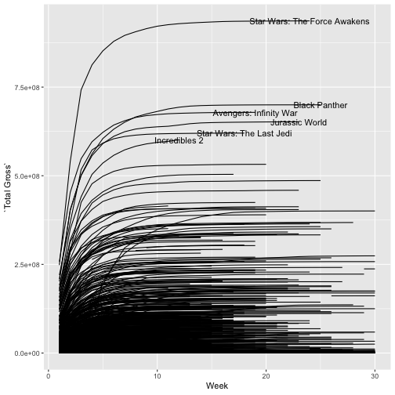
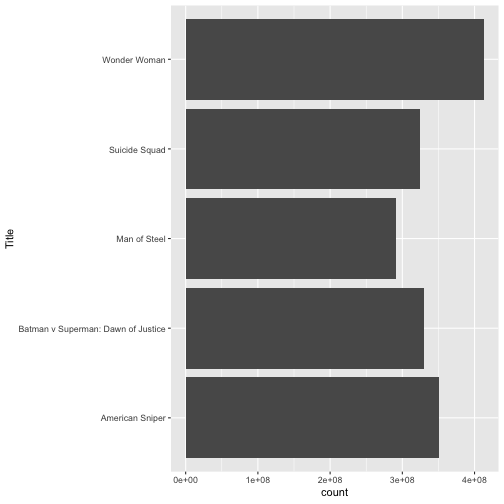

1. **Which (base R) functions do you know that support the split-apply-combine strategy? In your opinion, are these sufficient - state why or why not?**. 

It is a little hard for me to think of using base functions without plyr functions, as I learned R having starting with plyr and plyr functions. One of the most common uses is the  aggregate function. This function works to group data by common values of a factor and generate summary statistics/apply functions for those groups, while aggregate in base R can only apply a single named function to grouped data, the summarise function in dplyr allows for any number of functions to be specified, making it more readable, and easier to follow. I think that base R can be sufficient if you know coding well, or have a backround in using programs such as java or C, but if R is the only program that you know, I think plyr is a much better option to keep the coding clean looking and easier to read. 

2. **Using a dataset of your choice, show (by including the split-apply-combine command(s) in your answer) how you can use the split-apply-combine strategy for a part of the data analysis.**


library(tidyverse)



movie<-classdata::mojo
head(movie)



##   TW LW                         Title Studio Weekend Gross % Change
## 1  1  1             Crazy Rich Asians     WB      21964345    -11.5
## 2  2  2                       The Meg     WB      10535459    -17.8
## 3  3  4 Mission: Impossible - Fallout   Par.       7032499    -13.0
## 4  4 22                     Searching   SGem       6066463   1460.4
## 5  5 NA              Operation Finale    MGM       6022758       NA
## 6  6  6    Disney's Christopher Robin     BV       5277955    -15.7
##   Theater Count Theater Change Average Total Gross Budget (in Million)
## 1          3865            339    5683   110691733                  30
## 2          3761           -270    2801   120521875                 130
## 3          2639           -413    2665   204379028                 178
## 4          1207           1198    5026     6574943                  NA
## 5          1818             NA    3313     7749853                  24
## 6          2925           -469    1804    85686823                  NA
##   Week                     Weekend Year WeekNo
## 1    3 August 31-September 2, 2018 2018     35
## 2    4 August 31-September 2, 2018 2018     35
## 3    6 August 31-September 2, 2018 2018     35
## 4    2 August 31-September 2, 2018 2018     35
## 5    1 August 31-September 2, 2018 2018     35
## 6    5 August 31-September 2, 2018 2018     35


Using the commands in dply, we can see spefic movies and lable them, to see more specifics about your data set and individual movies or studios. 


labe<-movie%>%
  group_by(Title, Studio)%>%
  summarise(lastWeek=min(c(max(Week), 30)), Total=`Total Gross`[Week==lastWeek][1])

movie%>%
  ggplot(aes(x=Week,y=`Total Gross`))+
  geom_line(aes(group=Title))+
  geom_text(aes(x=lastWeek, y= Total, label= Title),data=labe%>%filter(Total>5.5*10^8))+
  xlim(c(1,30))



## Warning: Removed 2004 rows containing missing values (geom_path).



movie %>%
  filter(Studio == "WB") %>%
  group_by(Title) %>%
  top_n(1,`Total Gross`) %>%
  ungroup() %>%
  top_n(5,`Total Gross`) %>%
  ggplot(aes(x=Title,weight=`Total Gross`)) + geom_bar() + coord_flip()


