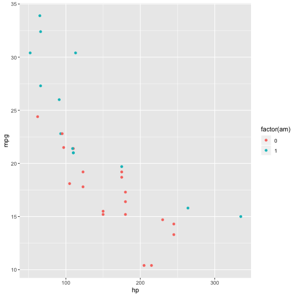

Write a blog post addressing the questions: 

1. **Which (base R) functions do you know that support the split-apply-combine strategy? In your opinion, are these sufficient - state why or why not?**. 

As far as I know, <tt>`split()`<tt> and <tt>`subset()`<tt> can do something for data splitting. The <tt>`apply()`<tt> family (<tt>`lapply()`<tt>, <tt>`sapply()`<tt>, etc) is also decent set of functions supporting the split-apply-combine strategy. As for dealing with dataframe, <tt>`aggregate()`<tt> can handle many variable value based splitting and analyzing problems.

In my opinion, these functions are not sufficient. I am not saying they are bad or not powerful. But sometimes using these functions we need more length of scripts to satisfy our needs. In this situation, our scripts are not concise and not easy to read especially when we have a group work. Furthermore, the output of some functions are not what we expect. For example, when we use <tt>`apply()`<tt> to a 3-d array, the dimension order could be changed which is not what we want. Although <tt>`aperm()`<tt> can helo with this issue, the output is still annoying.

2. **Using a dataset of your choice, show (by including the split-apply-combine command(s) in your answer) how you can use the split-apply-combine strategy for a part of the data analysis.**

The dataset I used is <tt>mtcars<tt>. First I want to calculate the mean mpg and hp for automatic and manual transmission cars separately.


mtcars %>% group_by(am) %>% summarise(m_hp=mean(hp),m_mpg=mean(mpg))



## # A tibble: 2 x 3
##      am  m_hp m_mpg
##   <dbl> <dbl> <dbl>
## 1     0  160.  17.1
## 2     1  127.  24.4


Then I want to plot mpg vs hp for different type of transmission


mtcars %>% ggplot(aes(hp,mpg)) + geom_point(aes(colour=factor(am)))


