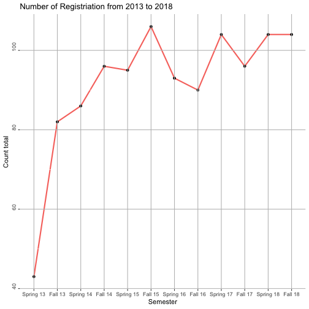

1. **Which (base R) functions do you know that support the split-apply-combine strategy? In your opinion, are these sufficient - state why or why not?**. 

As Hadley mentioned in his article, there are many other base function that support the split-apply-combine stragegy. Examples are apply(), sapply(), lapply() as an apply family and another one might be aggregate() function. In my opinion, these functions are sufficient and we can get our data cleaned with these functions. However, the issue with these base function might be their readability and efficience. dplyr() function is a great replacement with these functions that is a lot more efficient and easier to read. While the apply family functions are only applied to only one function, the dplyr() apply many functions in an arguement. More than that, this dplyr() function makes it a lot easier to read and understand the code.

2. **Using a dataset of your choice, show (by including the split-apply-combine command(s) in your answer) how you can use the split-apply-combine strategy for a part of the data analysis.**.

Below is a part of a shinyapp (https://earlhurstatistics.shinyapps.io/LAS_career/) from a STATCOM project. Liberal Arts and Science (LAS) Career Center requested us to summarise their data from people to people career fair. They were interested in how many companies attended to people to people career fair in each semester from 2013 to 2018. Moreover, they also wanted to see the trend of the number of registriation from 2013 to 2018. Using group_by() function, the data was grouped by the name of the companies. Using summarise() function, the number of registriation was computed easily.


p1 <- ggplot(data=summarise(group_by(ptp, sem_name), tot_reg = length(registriation)), 
                 aes(factor(sem_name, level = sem_order), 
                     tot_reg, text = paste("Semester: ", sem_name, " Number of Registriation: ", tot_reg))) + 
      geom_line(aes(group=1, color="red"), size=1) + 
      geom_point() +
      scale_x_discrete(breaks=sem_order,
                       labels=label) + #Ordering columns
      theme(panel.background = element_rect(fill = NA), 
            panel.grid.major = element_line(colour = "grey"), 
            panel.ontop = TRUE, 
            plot.title = element_text(hjust = 0),
            axis.text.y = element_text(angle = 90, hjust = .1), legend.position="none") + 
      labs(title = "Number of Registriation from 2013 to 2018", x = "Semester", y = "Count total", size = NULL, color = NULL)
 
p1   



#plotline <- ggplotly(p1, tooltip = "text", source = "lineplot")
#plotline

