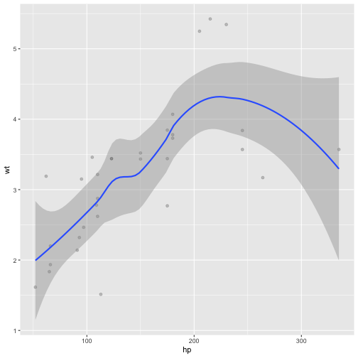

Write a blog post addressing the questions: 

1. **Which (base R) functions do you know that support the split-apply-combine strategy? In your opinion, are these sufficient - state why or why not?**. 

There are several R based functions that support split-apply-combine strategy. For instance, apply(),sapply(),lapply(), tapply() functions are the basic functions that allow us to divide the data frame by groups and implement the function to each of them separately.By using the apply family functions, we can improve the efficiency of the algorithm. On the other hand, it does not present the output in such a way that easy to read and understand. The plyr package has more appropriate tools to represent result and illuminate the important features of the computation. In addition, plyr avoid using the loops for the big datasets that reduce the speed of the computational process.   

2. **Using a dataset of your choice, show (by including the split-apply-combine command(s) in your answer) how you can use the split-apply-combine strategy for a part of the data analysis.**


#  The mtcars dataset is used to conduct the analysis. First of all, the dataset grouped by the size of the cylinder of the car and then applied function mean for each type of the size. In addition, plotted correlation between the horsepower and weight variables indicates the moderate relationship. As we can see that using the summarize function gave us more clear output from the computation.  

library(tidyverse)
library(ggplot2)

mtcars %>% group_by(cyl)%>%summarize(meanMA =mean(mpg))%>%head()



## # A tibble: 3 x 2
##     cyl meanMA
##   <dbl>  <dbl>
## 1     4   26.7
## 2     6   19.7
## 3     8   15.1



mtcars %>% ggplot(aes(x = hp, y = wt)) + 
  geom_point(alpha = 0.2) +
  geom_smooth()



## `geom_smooth()` using method = 'loess' and formula 'y ~ x'



# We can also find the mean by using the split-apply-combine-strategy based function. We have the same result as before, however, the result from the computation is not looking concise. Moreover, it takes more computation process in comparison with the plyr package.  

mtcars <- data.frame(mtcars, head=T)
head(mtcars)



##                    mpg cyl disp  hp drat    wt  qsec vs am gear carb head
## Mazda RX4         21.0   6  160 110 3.90 2.620 16.46  0  1    4    4 TRUE
## Mazda RX4 Wag     21.0   6  160 110 3.90 2.875 17.02  0  1    4    4 TRUE
## Datsun 710        22.8   4  108  93 3.85 2.320 18.61  1  1    4    1 TRUE
## Hornet 4 Drive    21.4   6  258 110 3.08 3.215 19.44  1  0    3    1 TRUE
## Hornet Sportabout 18.7   8  360 175 3.15 3.440 17.02  0  0    3    2 TRUE
## Valiant           18.1   6  225 105 2.76 3.460 20.22  1  0    3    1 TRUE



data4  <- mtcars[which(mtcars$cyl =='4'),]
data6  <- mtcars[which(mtcars$cyl =='6'),]
data8 <-  mtcars[which(mtcars$cyl =='8'),]
mean4 <- apply(data.frame(data4$mpg),2,mean)
mean4



## data4.mpg 
##  26.66364



mean6 <- apply(data.frame(data6$mpg),2,mean)
mean6



## data6.mpg 
##  19.74286



mean8 <- apply(data.frame(data8$mpg),2,mean)
mean8



## data8.mpg 
##      15.1



dataframe <- data.frame(c(mean4,mean6, mean8))
colnames(dataframe)<- c("mean")  
rownames(dataframe) <- c("4","6","8")
dataframe



##       mean
## 4 26.66364
## 6 19.74286
## 8 15.10000


