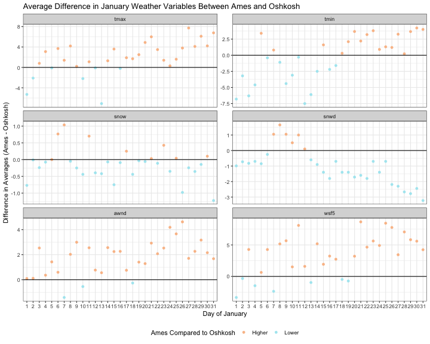
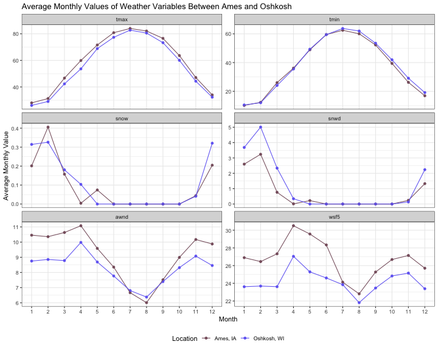

## Question 1

**Which (base R) functions do you know that support the split-apply-combine strategy? In your opinion, are these sufficient - state why or why not?**

As Hadley mentions in the paper, base R has for loops and the apply family of functions which support the split-apply-combine strategy. As to whether or not these are sufficient, I think that depends on what is considered to be sufficient. I think that they are sufficient in the sense that they can be used to get the job done. The code may not be pretty, easy to read, or fast (with loops), but they can be used to achieve the desired end product. However, it is desirable to have code that is easy to read, easy to use, and fast. In this sense, the base R functions are not sufficient.

I always forget how to use the apply family of functions no matter how many times I read through the documentation. With dplyr, once I understand a function, it is so straightforward that it is hard to forget how to use it. I have to admit that I like writing for loops. There is something satisfying about getting the indexing correct. However, they are often slow, it is annoying to create storage locations prior to the loop, and it can take a while to get the indexing correct. With the base functions, a lot of thought gets put into the coding aspect of the data analysis process. As a statistician, it is nice to have functions such as those provided in dplyr that can be used quickly and easily that allow one to focus on the analysis and not the coding.

## Question 2

**Using a dataset of your choice, show (by including the split-apply-combine command(s) in your answer) how you can use the split-apply-combine strategy for a part of the data analysis.**

Since it was a cold winter day while I was working on this blog, weather was on my mind. I was thinking about the weather in Ames compared to the weather in my home town of Green Lake, Wisconsin. I always tell people that I am use to colder temperatures and more snow in Wisconsin, but the wind is worse in Ames. I thought it would be interesting to look at some data to see if my statements are based on fact not just my beliefs.

### Data Overview 

I went to the [NOAA website for the National Centers for Environmental Information](https://www.ncdc.noaa.gov/) to obtain the data. I decided to focus on data from the last 10 years (January 2010 to January 2019). There were plenty of data from Ames, but there were not many data associated with Green Lake. This is probably due to the fact that it is a town with a population of around 1000. However, there were detailed data from the nearby city of Oshkosh, WI. I cleaned and joined the datasets. Both the datasets and my R code are stored in a GitHub repository of mine called [datafun](https://github.com/goodekat/datafun). Below I load the tidyverse and access the data from my GitHub account.


# Load the tidyverse
library(tidyverse)

# Read in the csv file from my 'datafun' repo (change the name variable to location and
# remove the variables of prcp and tobs)
weather <- read_csv("https://raw.githubusercontent.com/goodekat/datafun/master/ames_oshkosh_weather/data/ames_oshkosh_weather.csv") %>%
  rename(location = name) %>%
  select(-prcp, -tobs)



## Error in select(., -prcp, -tobs): unused arguments (-prcp, -tobs)


The first six rows of the data are shown in the table below. The first variable is where the observation was taken ("Oshkosh, WI" or "Ames, IA"). The next three variables are the year, month, and day of the observation. The remainder of the variables are defined as follows by the NOAA documentation. 

- TMAX: Maximum temperature
- TAVG: Average Temperature
- TMIN: Minimum temperature
- PRCP: Precipitation
- SNOW: Snowfall
- SNWD: Snow depth
- AWND: Average wind speed
- WSF5: Fastest 5-second wind speed

<table class="table" style="margin-left: auto; margin-right: auto;">
 <thead>
  <tr>
   <th style="text-align:left;"> location </th>
   <th style="text-align:right;"> year </th>
   <th style="text-align:right;"> month </th>
   <th style="text-align:right;"> day </th>
   <th style="text-align:right;"> tmax </th>
   <th style="text-align:right;"> tmin </th>
   <th style="text-align:right;"> snow </th>
   <th style="text-align:right;"> snwd </th>
   <th style="text-align:right;"> awnd </th>
   <th style="text-align:right;"> wsf5 </th>
  </tr>
 </thead>
<tbody>
  <tr>
   <td style="text-align:left;"> Oshkosh, WI </td>
   <td style="text-align:right;"> 2010 </td>
   <td style="text-align:right;"> 1 </td>
   <td style="text-align:right;"> 1 </td>
   <td style="text-align:right;"> 19 </td>
   <td style="text-align:right;"> 10 </td>
   <td style="text-align:right;"> 0 </td>
   <td style="text-align:right;"> 5 </td>
   <td style="text-align:right;"> 9.62 </td>
   <td style="text-align:right;"> 25.1 </td>
  </tr>
  <tr>
   <td style="text-align:left;"> Oshkosh, WI </td>
   <td style="text-align:right;"> 2010 </td>
   <td style="text-align:right;"> 1 </td>
   <td style="text-align:right;"> 2 </td>
   <td style="text-align:right;"> 19 </td>
   <td style="text-align:right;"> -3 </td>
   <td style="text-align:right;"> 0 </td>
   <td style="text-align:right;"> 5 </td>
   <td style="text-align:right;"> 8.28 </td>
   <td style="text-align:right;"> 19.9 </td>
  </tr>
  <tr>
   <td style="text-align:left;"> Oshkosh, WI </td>
   <td style="text-align:right;"> 2010 </td>
   <td style="text-align:right;"> 1 </td>
   <td style="text-align:right;"> 3 </td>
   <td style="text-align:right;"> 8 </td>
   <td style="text-align:right;"> -3 </td>
   <td style="text-align:right;"> 0 </td>
   <td style="text-align:right;"> 5 </td>
   <td style="text-align:right;"> 9.62 </td>
   <td style="text-align:right;"> 21.0 </td>
  </tr>
  <tr>
   <td style="text-align:left;"> Oshkosh, WI </td>
   <td style="text-align:right;"> 2010 </td>
   <td style="text-align:right;"> 1 </td>
   <td style="text-align:right;"> 4 </td>
   <td style="text-align:right;"> 13 </td>
   <td style="text-align:right;"> 6 </td>
   <td style="text-align:right;"> 0 </td>
   <td style="text-align:right;"> 5 </td>
   <td style="text-align:right;"> 10.29 </td>
   <td style="text-align:right;"> 21.9 </td>
  </tr>
  <tr>
   <td style="text-align:left;"> Oshkosh, WI </td>
   <td style="text-align:right;"> 2010 </td>
   <td style="text-align:right;"> 1 </td>
   <td style="text-align:right;"> 5 </td>
   <td style="text-align:right;"> 21 </td>
   <td style="text-align:right;"> 10 </td>
   <td style="text-align:right;"> 0 </td>
   <td style="text-align:right;"> 5 </td>
   <td style="text-align:right;"> 9.84 </td>
   <td style="text-align:right;"> 21.9 </td>
  </tr>
  <tr>
   <td style="text-align:left;"> Oshkosh, WI </td>
   <td style="text-align:right;"> 2010 </td>
   <td style="text-align:right;"> 1 </td>
   <td style="text-align:right;"> 6 </td>
   <td style="text-align:right;"> 23 </td>
   <td style="text-align:right;"> 10 </td>
   <td style="text-align:right;"> 0 </td>
   <td style="text-align:right;"> 5 </td>
   <td style="text-align:right;"> 5.82 </td>
   <td style="text-align:right;"> 15.0 </td>
  </tr>
</tbody>
</table>

### Comparison of Weather Data on January 27 

The most recent date recorded in the data was January 27. I wanted to compute the average values of all weather variables on this day across the past ten years. To do this, I needed to apply the split-apply-combine strategy to separate the data by location, apply a mean to each variable, and finally, combine the results in a table. I did this using both using base R functions and functions from dplyr.

#### Code Using Base R Functions

The code below uses the `subset` function to separate the data by location, and then a loop is used to compute the means of each of the weather variables within a location. The table of computed means is included below. It felt great when the loop finally ran, but wow, it took me an annoying amount of time to get it to work correctly.


# Obtain January 27 data
weather_jan27 <- subset(weather, weather$month == 1 & weather$day == 27)

# Create two dataframes subset by location
weather_jan27_ames <- subset(weather_jan27, weather_jan27$location == "Ames, IA")
weather_jan27_oshkosh <- subset(weather_jan27, weather_jan27$location == "Oshkosh, WI")

# Create a matrix to store the values in once they are computed
base_means <- matrix(numeric(2*6), nrow = 2, ncol = 6)
rownames(base_means) <- c("Ames, IA", "Oshkosh, WI")
colnames(base_means) <- names(weather_jan27)[5:10]

# Loop for computing the means
for(i in 1:6){
  base_means[1,i] <- mean(weather_jan27_ames[,i+4][[1]], na.rm = TRUE)
  base_means[2,i] <- mean(weather_jan27_oshkosh[,i+4][[1]], na.rm = TRUE)
}


<table class="table" style="margin-left: auto; margin-right: auto;">
 <thead>
  <tr>
   <th style="text-align:left;">   </th>
   <th style="text-align:right;"> tmax </th>
   <th style="text-align:right;"> tmin </th>
   <th style="text-align:right;"> snow </th>
   <th style="text-align:right;"> snwd </th>
   <th style="text-align:right;"> awnd </th>
   <th style="text-align:right;"> wsf5 </th>
  </tr>
 </thead>
<tbody>
  <tr>
   <td style="text-align:left;"> Ames, IA </td>
   <td style="text-align:right;"> 34.33 </td>
   <td style="text-align:right;"> 15.56 </td>
   <td style="text-align:right;"> 0.00 </td>
   <td style="text-align:right;"> 2.0 </td>
   <td style="text-align:right;"> 11.06 </td>
   <td style="text-align:right;"> 28.44 </td>
  </tr>
  <tr>
   <td style="text-align:left;"> Oshkosh, WI </td>
   <td style="text-align:right;"> 26.60 </td>
   <td style="text-align:right;"> 12.30 </td>
   <td style="text-align:right;"> 0.24 </td>
   <td style="text-align:right;"> 4.3 </td>
   <td style="text-align:right;"> 9.35 </td>
   <td style="text-align:right;"> 25.00 </td>
  </tr>
</tbody>
</table>

#### Code Using dplyr Functions

The code below uses the `filter`, `group_by`, and `summarise` functions from the dplyr package to achieve the same table of means. This table is shown below, and it agrees with the previous table. It was nice to be able to perform the same actions that I did with the base R code in a much quicker and more succinct way.


# Averages aquired using dplyr functions 
dplyr_means <- weather %>%
  filter(month == 1, day == 27) %>%
  group_by(location) %>%
  summarise_at(.vars = c("tmax", "tmin", "snow", "snwd", "awnd", "wsf5"), 
               .funs = mean,
               na.rm = TRUE)


<table class="table" style="margin-left: auto; margin-right: auto;">
 <thead>
  <tr>
   <th style="text-align:left;"> location </th>
   <th style="text-align:right;"> tmax </th>
   <th style="text-align:right;"> tmin </th>
   <th style="text-align:right;"> snow </th>
   <th style="text-align:right;"> snwd </th>
   <th style="text-align:right;"> awnd </th>
   <th style="text-align:right;"> wsf5 </th>
  </tr>
 </thead>
<tbody>
  <tr>
   <td style="text-align:left;"> Ames, IA </td>
   <td style="text-align:right;"> 34.33 </td>
   <td style="text-align:right;"> 15.56 </td>
   <td style="text-align:right;"> 0.00 </td>
   <td style="text-align:right;"> 2.0 </td>
   <td style="text-align:right;"> 11.06 </td>
   <td style="text-align:right;"> 28.44 </td>
  </tr>
  <tr>
   <td style="text-align:left;"> Oshkosh, WI </td>
   <td style="text-align:right;"> 26.60 </td>
   <td style="text-align:right;"> 12.30 </td>
   <td style="text-align:right;"> 0.24 </td>
   <td style="text-align:right;"> 4.3 </td>
   <td style="text-align:right;"> 9.35 </td>
   <td style="text-align:right;"> 25.00 </td>
  </tr>
</tbody>
</table>

#### January 27 Conclusions

The values in the table indicate that for January 27 both the maximum and minimum temperatures were higher in Ames than in Oshkosh on average over the past 10 year. The average amount that it snowed was about the same, but the average amount of snow on the ground was higher in Oshkosh. Additionally, both the average wind speed and the fastest wind speed for five seconds were higher in Ames. The data on January 27 supports the claims I have been making.

### Comparing All Days in January

I also wanted to look across the whole month of January to see how the variables compared. I applied the split-apply-combine strategy multiple times using dplyr functions to first compute the mean of each weather variable within the two locations for each day in January across the 10 years. Then I computed the difference in means between Ames and Oshkosh for each day. These are shown in the plot below the code. A black horizontal line is included at 0 as a reference of when there is no difference between the locations. The orange points correspond to days when Ames has a higher value than Oshkosh, and the blue points correspond to days when Ames has a lower value than Oshkosh. 

For the most part, these plots suggest what I expected about the comparisons in weather between Ames and Oshkosh, but there were some surprises. The maximum temperature was higher in Ames on average for most days in January. However, the minimum temperature was actually lower on average in Ames for most days in the first half of January. The amount of snow during a day was on average lower for Ames, but the amount of the difference was relatively small. Whereas, the amount of snow on the ground was much lower in Ames on average, and as January progresses, the difference in snow on the ground between the two locations increased. For the wind, Ames clearly had the majority of days with a higher average in average wind speed and fastest five second wind speed than Oshkosh.


# Computing difference in means between Ames and Oshkosh for all variables
weather %>%
  filter(month == 1) %>%
  group_by(location, day) %>%
  summarise_at(.vars = c("tmax", "tmin", "snow", "snwd", "awnd", "wsf5"), 
               .funs = mean,
               na.rm = TRUE) %>%
  ungroup() %>%
  arrange(desc(location)) %>%
  group_by(day) %>%
  summarise_at(.vars = c("tmax", "tmin", "snow", "snwd", "awnd", "wsf5"), 
               .funs = diff,
               na.rm = TRUE) %>%
  gather(variable, diff, tmax:wsf5) %>%
  mutate(IAhigher = ifelse(diff >= 0, "Higher", "Lower"),
         variable = forcats::fct_relevel(variable, 
                                         c("tmax", "tmin", "snow", 
                                           "snwd", "awnd", "wsf5")),
         day = factor(day)) %>%
  ggplot(aes(x = day, y = diff, color = IAhigher)) + 
  geom_point() + 
  geom_hline(yintercept = 0) + 
  facet_wrap(variable ~ ., scales = "free_y", ncol = 2) +
  theme_bw() + 
  scale_color_manual(values = c("#FABF95", "#ACE8F1")) + 
  labs(x = "Day of January", 
       y = "Difference in Averages (Ames - Oshkosh)",
       title = "Average Difference in January Weather Variables Between Ames and Oshkosh",
       color = "Ames Compared to Oshkosh") +
  theme(legend.position = "bottom")


### Comparing All Months

Finally, I wanted to compare the overall annual trends. I computed the average of each variable within a month for each year and location. Then I averaged these values over the 10 years for each month within a location. The plots below show these averages plotted by month. The points and lines are colored by location. Again, these mostly support my claims about the winter weather in Iowa compared to Wisconsin.


weather %>%
  group_by(location, month, year) %>%
  summarise_at(.vars = c("tmax", "tmin", "snow", "snwd", "awnd", "wsf5"), 
               .funs = mean,
               na.rm = TRUE) %>%
  ungroup() %>%
  group_by(location, month) %>%
  summarise_at(.vars = c("tmax", "tmin", "snow", "snwd", "awnd", "wsf5"), 
               .funs = mean,
               na.rm = TRUE) %>%
  gather(variable, value, tmax:wsf5) %>%
  mutate(variable = forcats::fct_relevel(variable, 
                                         c("tmax", "tmin", "snow", 
                                           "snwd", "awnd", "wsf5")),
         month = factor(month)) %>%
  ggplot(aes(x = month, y = value, color = location, group = location)) + 
  geom_point() + 
  geom_line() + 
  facet_wrap(variable ~ ., scales = "free_y", ncol = 2) +
  theme_bw() + 
  scale_color_manual(values = c("#875E6C", "#716BF3")) + 
  labs(x = "Month", 
       y = "Average Monthly Value",
       title = "Average Monthly Values of Weather Variables Between Ames and Oshkosh",
       color = "Location") +
  theme(legend.position = "bottom")


