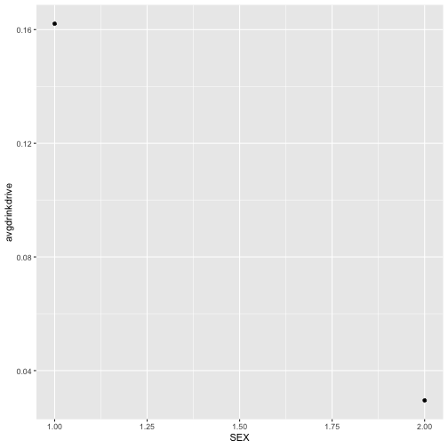

## Question1:

Which (base R) functions do you know that support the split-apply-combine strategy? In your opinion, are these sufficient - state why or why not?.


#Some of the base R "plyr functions that I know that support the split-apply-combine strategy are: ddply, ldply, apply, and replicate. 
#Some of the base R "dplyr" functions that I know that support the split-apply-combine strategy are:filter, arrange, select, mutate, group_by, and summarize.
#In my opinion, I think these functions are pretty sufficient...but depending on what an individual is trying to accomplish it may not be powerful enough.
#"plyr" then "dplyr" are packages that provide a set of tools to manipulate datasets in R. I think "dplyr" functions are sufficient because it runs the commands fast, has simple syntax which makes it easier to write code, and basic descriptive commands/functions that are easy to remember.


## Question2:

Using a dataset of your choice, show (by including the split-apply-combine command(s) in your answer) how you can use the split-apply-combine strategy for a part of the data analysis.

## Using the Behavioral Risk Factor Surveillance System 

A subset of the data concentrating on Iowa with records for 2012 is given at [http://www.hofroe.net/data/iowa-brfss-2012.csv]()

The following code reads the data into my R session:


iowa <- read.csv("http://www.hofroe.net/data/iowa-brfss-2012.csv")
library(tidyverse)


A codebook describing the survey and a listing of all variables is available at [http://www.cdc.gov/brfss/annual_data/2012/pdf/CODEBOOK12_LLCP.pdf]().

## The following lines of codes use the split-apply-combine concept by using base R functions: mutate, group_by, and summarize to split apart the data, then change the data, and lastly find new results that are combined and added with the original dataset.


library(dplyr)

iowa <- iowa %>% mutate(drinkdrive = ifelse(DRNKDRI2 == 88, 0, ifelse(DRNKDRI2 == 77|DRNKDRI2 == 99, NA, DRNKDRI2)))
#creates new variable column called 'drinkdrive' that replaces values of 88 with 0 and values of 77 or 99 with NA with the iowa dataset, then "mutates" or changes the data by creating a new column variable for analysis 

mean(iowa$drinkdrive, na.rm = TRUE) #takes the average of the respondents' responses within the variable--removes any NA values



## [1] 0.09304207



sum(!is.na(iowa$drinkdrive)) #adds up how many people responded and ignores all NA values



## [1] 3708



iowa %>%
  group_by(SEX) %>% #group_by function splits the data, while the summarize function (next line) combines results back together
  summarize(
    avgdrinkdrive = mean(drinkdrive, na.rm=TRUE))



## # A tibble: 2 x 2
##     SEX avgdrinkdrive
##   <int>         <dbl>
## 1     1        0.162 
## 2     2        0.0295



iowa %>%
  group_by(SEX) %>% #group_by function splits the data, while the summarize function (next line) combines results back together
  summarize(
    avgdrinkdrive = mean(drinkdrive, na.rm=TRUE)
  ) %>%
  ggplot(aes(x = SEX, y = avgdrinkdrive )) + geom_point()



#1 = male and 2 = female

