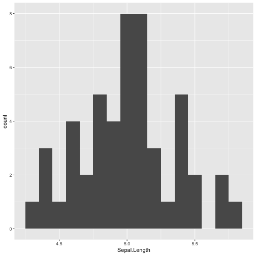
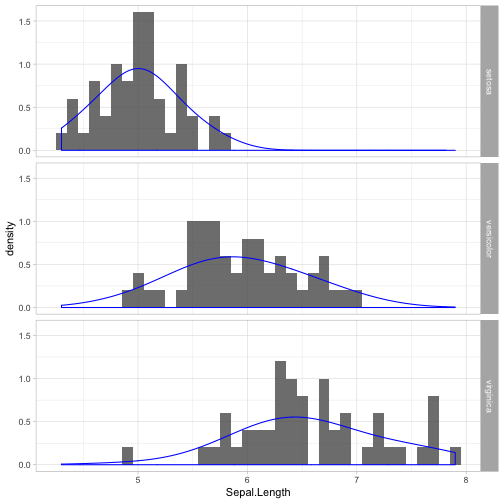

## Background:

## Prompt:

The `plyr` package has by now been replaced by other, even faster packages, but the idea of *Split, apply, combine* is as relevant as ever.

Read the paper [The Split-Apply-Combine Strategy for Data Analysis](https://www.jstatsoft.org/article/view/v040i01) by Hadley Wickham.

Write a blog post addressing the questions: 

1. **Which (base R) functions do you know that support the split-apply-combine strategy? In your opinion, are these sufficient - state why or why not?**. 

In base R, the set of apply functions support the split-apply-combine strategy. Depending on your needed output, there might be some addition "book-keeping" code necessary to recast the data into your desired structure. I do think that apply is sufficient for most data analysis needs and its speed makes it very useful. However, the syntax is not easily understand by outside users and when you start getting into arrays with several dimensions, it can be difficult to be sure that you are applying the function across the correct margin. Being able to split along a named variable aids not only readability but also supports ease of use.

2. **Using a dataset of your choice, show (by including the split-apply-combine command(s) in your answer) how you can use the split-apply-combine strategy for a part of the data analysis.**

Using the iris dataset, we first explore the species of Setosa. We are interested in the distribution of Sepal Length. To that end, we plot a histogram. Noticing that due to our choice in bin width the distribution is not very smooth, we add a density line.


setosa <- subset(iris, Species == "setosa")
ggplot(data = setosa, aes(x = Sepal.Length)) + 
  geom_histogram(binwidth = 0.1)



ggplot(data = setosa, aes(x = Sepal.Length)) + 
  geom_histogram(aes(y = ..density..), binwidth = 0.1, alpha = 0.8) + 
  geom_density(color = "blue", adjust = 2) + theme_light()


Now we want to repeat this analysis for each iris species. We could either write a function that will build the histogram for each iris species separately or we can take advantage of the natural split-apply-combine functions in the tidyverse. Here we will use faceting in ggplot. Notice the very minimal changes necessary to the code.


ggplot(data = iris, aes(x = Sepal.Length)) + 
  geom_histogram(aes(y = ..density..), binwidth = 0.1, alpha = 0.8) + 
  geom_density(color = "blue", adjust = 2) + theme_light() +
  facet_grid(Species ~ .)


