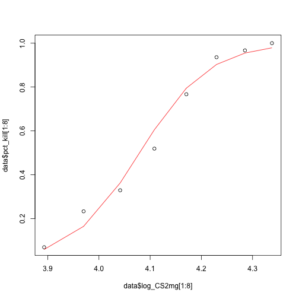
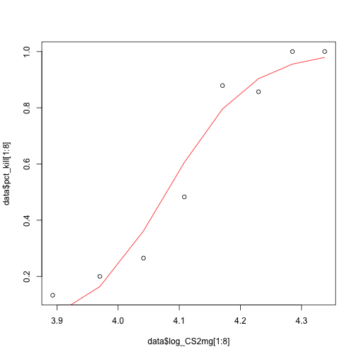

1. ** Which (base R) functions do you know that support the split-apply-combine strategy? In your opinion, are these sufficient - state why or why not?.**
There are quite many R built-in (or base R) specialized tools to split data into pieces, apply some function to each individual piece and finally combine back together whatever the results are. These are the family of `apply` functions such as `apply`, `lapply`, `sapply`, `rep`, `mapply`, `aggregate`, `sweep` etc. These functions are used to manipulate pieces of data from matrices, arrays, lists and dataframes in a repetitive way. These function work simply and can consider only one aspect of the data summary at a time. 

In my opinion, these functions are much nicer and more straightforward than writing one's own codes, and they are readable and easy to catch by one look. So, in most cases they are my favorites to easily use because I can remember how they function even months or years later. The disadvatange of these base R functions is that they do not always give us the best solutions possible. One case is that we cannot manipulate  what output to get and what our desired dimensions are for the output. However, with `plyr` package we have more options for the input and output of our data based on different split-apply-combine strategies. 

2. **Using a dataset of your choice, show (by including the split-apply-combine command(s) in your answer) how you can use the split-apply-combine strategy for a part of the data analysis **

The data set is acute toxicity experiments data to conduct an analysis first using a generalized linear model with binomial random component and different link function. AS a part of the analysis, it is required to fit the two glm model to the two series of the data set called `s1` and `s2`. The data set is as follow:


## -------------------------------------------------------------------------



## You have loaded plyr after dplyr - this is likely to cause problems.
## If you need functions from both plyr and dplyr, please load plyr first, then dplyr:
## library(plyr); library(dplyr)



## -------------------------------------------------------------------------



## 
## Attaching package: 'plyr'



## The following objects are masked from 'package:plotly':
## 
##     arrange, mutate, rename, summarise



## The following object is masked from 'package:maps':
## 
##     ozone



## The following object is masked from 'package:lubridate':
## 
##     here



## The following objects are masked from 'package:dplyr':
## 
##     arrange, count, desc, failwith, id, mutate, rename, summarise,
##     summarize



## The following object is masked from 'package:purrr':
## 
##     compact



##    series no_insects log_CS2mg pct_kill no_kill
## 1       1         29  3.893044    0.069       2
## 2       1         30  3.970103    0.233       7
## 3       1         28  4.041471    0.329       9
## 4       1         27  4.108247    0.519      14
## 5       1         30  4.170688    0.767      23
## 6       1         31  4.229604    0.936      29
## 7       1         30  4.285103    0.967      29
## 8       1         29  4.337813    1.000      29
## 9       2         30  3.893044    0.133       4
## 10      2         30  3.970103    0.200       6
## 11      2         34  4.041471    0.265       9
## 12      2         29  4.108247    0.483      14
## 13      2         33  4.170688    0.879      29
## 14      2         28  4.229604    0.857      24
## 15      2         32  4.285103    1.000      32
## 16      2         31  4.337813    1.000      31

In order to avoid repeating fitting different models to the data, we can use the `plyr` package to fit the  glm to the two series by defining a list of the two seris and then applying the funcion `llpy` to get a list of coefficients, residuals and fitted values as well as the plots for the fitted values. This can be done faster this  way. The advantage of using split-combine strategy is to get a list of all desired output by applying the split-combine functions. 


glmmodel<- function(data){ 
  out<-glm(cbind(no_kill, no_insects-no_kill) ~ log_CS2mg, data = data,
                    family = binomial(link = "logit"))
  return( list(out$coefficients, out$residuals, out$fitted.values,
  plot(data$log_CS2mg[1:8], data$pct_kill[1:8]),
  lines(data$log_CS2mg[1:8], out$fitted.values, col = "red")
  ))
  }

data<-list(bliss_data[1:8,], bliss_data[9:16,])
llply(.data = data, .fun = glmmodel)



## [[1]]
## [[1]][[1]]
## (Intercept)   log_CS2mg 
##   -60.61810    14.85913 
## 
## [[1]][[2]]
##          1          2          3          4          5          6 
##  0.1811638  0.5017491 -0.1769495 -0.3624771 -0.1731616  0.3714693 
##          7          8 
##  0.2716574  1.0215357 
## 
## [[1]][[3]]
##          1          2          3          4          5          6 
## 0.05892023 0.16440504 0.36231130 0.60513147 0.79489808 0.90292364 
##          7          8 
## 0.95498963 0.97891834 
## 
## [[1]][[4]]
## NULL
## 
## [[1]][[5]]
## NULL
## 
## 
## [[2]]
## [[2]][[1]]
## (Intercept)   log_CS2mg 
##   -60.82280    14.90924 
## 
## [[2]][[2]]
##          9         10         11         12         13         14 
##  1.3631705  0.2659058 -0.4205099 -0.5133979  0.5115740 -0.5325926 
##         15         16 
##  1.0466627  1.0212651 
## 
## [[2]][[3]]
##          9         10         11         12         13         14 
## 0.05838791 0.16361253 0.36180218 0.60540421 0.79559339 0.90355484 
##         15         16 
## 0.95541764 0.97917770 
## 
## [[2]][[4]]
## NULL
## 
## [[2]][[5]]
## NULL


