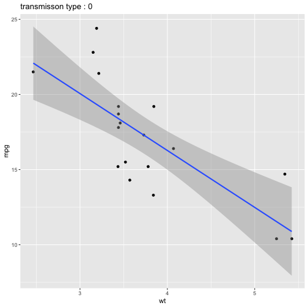
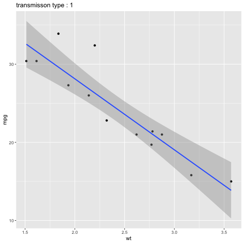

## R Markdown

**1. Which (base R) functions do you know that support the split-apply-combine strategy? In your opinion, are these sufficient - state why or why not?**

In base R, *lapply* family use the split-apply-combine strategy. These functions are fast, convenient, and extract the important idea from loop and replace *for loop* in many cases. But they are not sufficient, because:

1. They are not consistent. Most functions have the first argument as data, however, *Map* has the first argument as a function. And there are other incosistencies too in the sense of *simplify* and *sapply-vapply* variant.

2. They only accept limited input types and produce limited output types. And this was made up in *plyr* package.

**2. Using a dataset of your choice, show (by including the split-apply-combine command(s) in your answer) how you can use the split-apply-combine strategy for a part of the data analysis.**

First, I'm going to scale *mpg*, *wt* according to their transmission type using functions within *plyr* package. (Note: when *scale* is applied to data.frame, it is appied to every colmun and return  a data.frame, so I didn't further write a new function. )


library(tidyverse)
library(plyr)
data(mtcars)

mtcars %>%
  select(mpg, wt, am) %>%
  ddply(.variables = .(am2 = factor(am)), .fun = scale) %>%
  mutate(am = am2) %>%
  select(-am2) %>%
  head()



## Error in select(., mpg, wt, am): unused arguments (mpg, wt, am)


Second, draw a scatter for *mpg*, *wt* according to transmission type. (detour of ggplot2...TAT; independent from first one)


drawplot <- function(df) {
  ggplot(df, aes(x = wt, y = mpg)) + 
    geom_point() +
    geom_smooth(method = "lm") +
    labs(title = paste("transmisson type :",unique(df$am)))
}

mtcars %>%
  d_ply(.variable = .(am), .fun = drawplot, .print = TRUE)


