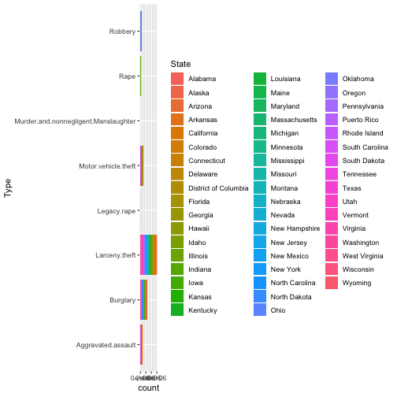

## Background:

The `plyr` package has by now been replaced by other, even faster packages, but the idea of *Split, apply, combine* is as relevant as ever.

Read the paper [The Split-Apply-Combine Strategy for Data Analysis](https://www.jstatsoft.org/article/view/v040i01) by Hadley Wickham.

Write a blog post addressing the questions: 

1. **Which (base R) functions do you know that support the split-apply-combine strategy? In your opinion, are these sufficient - state why or why not?**. 
  From the article that wirtten by Hadley, many R function actually can replace the split-apply-combine strategy such as aggregate(), rbind(), split(), group_by and summarise() combo and so on.But not sufficient because the  readability problem.

2. **Using a dataset of your choice, show (by including the split-apply-combine command(s) in your answer) how you can use the split-apply-combine strategy for a part of the data analysis.**


library(tidyverse)
fbi <- classdata::fbi
a=fbi %>% group_by(Type, State) %>% summarise(mean=mean(Count, na.rm = T)) %>% ggplot(aes(Type, weight=mean))+geom_bar(aes(fill=State))+coord_flip()
a


## Instructions:

Update your forked 'blog-2019' repository.

Save a **copy** of this file, replacing "Lastname" and "Firstname" with your own and *leave the original unedited*.

In **your copy**, replace the `title:` and `author:` fields in the YAML above, while leaving the remaining fields intact. Remove the background and the instructions sections and write your blog post! 

Once you are done, **create a pull request** to upload your changes to the original repository. Do not commit the compiled HTML file to the repository.
