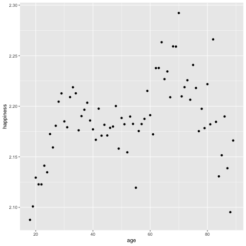

1-Which (base R) functions do you know that support the split-apply-combine strategy? In your opinion, are these sufficient - state why or why not?.
    
    
we can use subset to to spliting , for apply , all apply group function depending on stucture of the data works(lapply,sapply,mapply) adn for combining rbind and cbind makes the row combination and coloumn combination. The problem with these functions is that they work with lists and arrays and most return atomic structure which makes everything hard.
    
    
2-Using a dataset of your choice, show (by including the split-apply-combine command(s) in your answer) how you can use the split-apply-combine strategy for a part of the data analysis.


library(classdata)
happy %>% mutate(
  nhappy = as.numeric(happy)
) %>% select(happy, nhappy) %>% tail(10)



## Error in select(., happy, nhappy): unused arguments (happy, nhappy)



happy <- happy %>% mutate(
  nhappy = as.numeric(happy)
)

happy %>% 
  summarize(
    happiness = mean(nhappy, na.rm=TRUE)
  )



##   happiness
## 1  2.186969



# how does average happiness change over the course of a life time? 

byage <- happy %>% 
  group_by(age) %>%
  summarize(
    happiness = mean(nhappy, na.rm=TRUE)
  )  
byage %>% ggplot(
  aes(x = age, y = happiness)
) + geom_point()



## Warning: Removed 1 rows containing missing values (geom_point).


