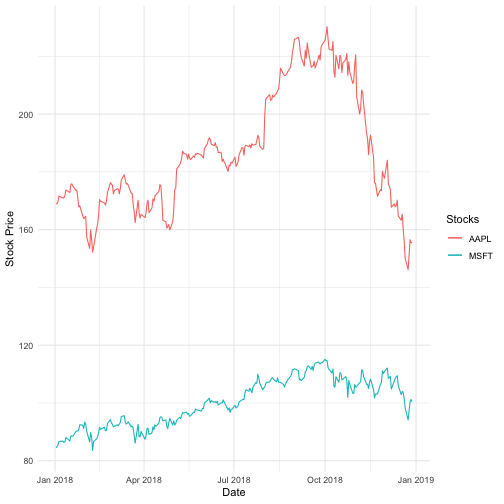

## Describe what intervals, durations, periods, and instants are, and give one example for each that shows why we need these distinctions.

*Instants* represent a point in time. On the other hand,  *Intervals* represent a span of time with a specific beginning instant and a specific end instant. *Durations* refer to length of time recorded in seconds. *Periods* refer to a span of time in a unit larger than a second. Periods are not of a consistent length since periods such as months and years are not of a consistent length. Without these distinctions, arithmetic with date-time data would be very difficult. For example, the length of an interval can vary depending on whether the duration or the period was recorded. The inconsistencies in lengths of time spans can occur for many reasons such as leap years/seconds, varying number of days in different months, or daylight savings time.  

## The `ggplot2` package works seamlessy with lubridate. Find a data set with dates and/or times, use lubridate to work with the dates/times, then plot a time-related aspect of the data and describe it.  

I used stock data related to Apple and Microsoft during 2018.


stocks.data <- read.csv('https://raw.githubusercontent.com/oscarm524/DataSets/master/stock_data.csv')

## Here we conver factor into date
stocks.data <- stocks.data %>% mutate(Date = as.Date(as.character(Date)))
stocks.data %>% head



##         Date AAPL.Adjusted MSFT.Adjusted
## 1 2018-01-02      168.9873      84.48741
## 2 2018-01-03      168.9579      84.88061
## 3 2018-01-04      169.7427      85.62768
## 4 2018-01-05      171.6753      86.68930
## 5 2018-01-08      171.0376      86.77776
## 6 2018-01-09      171.0180      86.71879


We first plot the adjusted close price over time for both stocks. 


ggplot(stocks.data, aes(Date)) + 
  geom_line(aes(y = AAPL.Adjusted, color = "AAPL")) +    
  geom_line(aes(y = MSFT.Adjusted, color = 'MSFT')) + 
  labs(color = 'Stocks') + labs(y = 'Stock Price')


From the above plot, it seems that there is a positive correlation between the two stocks. Let's find the correlation between them. 


cor(stocks.data$AAPL.Adjusted, stocks.data$MSFT.Adjusted)



## [1] 0.7910725


From the above, it is clear that there is a moderate strong correlation between the two stocks. Next, we create a day variable to study the relationship between day of the week and adjusted stock price.


stocks.data <- stocks.data %>% mutate(Day = wday(Date, label = T, abbr = T))

## Apple data
stocks.data %>% select(AAPL.Adjusted, Day) %>% group_by(Day) %>% summarise(Avg.Price = mean(AAPL.Adjusted))



## # A tibble: 5 x 2
##   Day   Avg.Price
##   <ord>     <dbl>
## 1 Mon        187.
## 2 Tue        187.
## 3 Wed        187.
## 4 Thu        187.
## 5 Fri        187.



## Microsoft data
stocks.data %>% select(MSFT.Adjusted, Day) %>% group_by(Day) %>% summarise(Avg.Price = mean(MSFT.Adjusted))



## # A tibble: 5 x 2
##   Day   Avg.Price
##   <ord>     <dbl>
## 1 Mon       100. 
## 2 Tue       100. 
## 3 Wed       100.0
## 4 Thu       100. 
## 5 Fri       100.


From the above output, there is an obvious relationship betweent the average adjusted closing price and the day of the week. 

