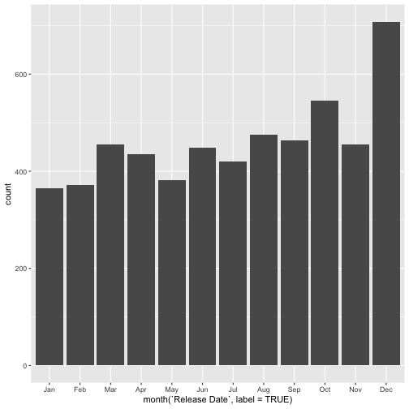
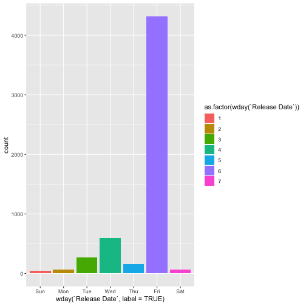

## Background:

Dates and times can be difficult to work with. Watch [this video](https://www.youtube.com/watch?v=-5wpm-gesOY) to appreciate all of the fun scenarios that date/time libraries have to accommodate. 

Luckily, the `lubridate` package makes working with dates and times in R pretty straightforward. The package has been described in the paper [Working with date and time](http://www.jstatsoft.org/v40/i03/) by Garrett Grolemund and Hadley Wickham, an updated version of an intro to lubridate can be found in chapter 16 of [R for Data Science](https://r4ds.had.co.nz/dates-and-times.html). Read one of the two sources.

Write a blog post addressing the questions:

- Describe what intervals, durations, periods, and instants are, and give one example for each that shows why we need these distinctions.

instants: the exact date/time that you are in


date()



## [1] "Tue Feb 12 09:49:44 2019"


durations: an exact number of seconds. eg 


dyears(6)



## [1] "189216000s (~6 years)"


periods: human units like weeks and months.


years(6)



## [1] "6y 0m 0d 0H 0M 0S"


intervals: a starting and ending point.


years(6) / days(1)



## estimate only: convert to intervals for accuracy



## [1] 2191.5

It is important to distinguish between these things because they give you all different output for the same input. 

- The `ggplot2` package works seamlessy with lubridate. Find a data set with dates and/or times, use lubridate to work with the dates/times, then plot a time-related aspect of the data and describe it.  


head(budget)



##   Release Date                                       Movie
## 1   2009-12-18                                      Avatar
## 2   2011-05-20 Pirates of the Caribbean: On Stranger Tides
## 3   2015-05-01                     Avengers: Age of Ultron
## 4   2015-12-18        Star Wars Ep. VII: The Force Awakens
## 5   2018-04-27                      Avengers: Infinity War
## 6   2007-05-24    Pirates of the Caribbean: At World’s End
##   Production Budget Domestic Gross Worldwide Gross
## 1         425000000      760507625      2783918982
## 2         410600000      241063875      1045663875
## 3         330600000      459005868      1408218722
## 4         306000000      936662225      2058662225
## 5         300000000      552716088      1638216088
## 6         300000000      309420425       963420425



budget %>% ggplot(aes(x = month(`Release Date`, label=TRUE))) + geom_bar()



budget %>% 
  ggplot(aes(x = wday(`Release Date`, label=TRUE))) + geom_bar(aes(fill=as.factor(wday(`Release Date`))))



budget %>% 
  group_by(year(`Release Date`))%>%
  ggplot(aes(x = year(`Release Date`))) + geom_histogram()



## `stat_bin()` using `bins = 30`. Pick better value with `binwidth`.


## Instructions:
Update your forked repo of `blog-2019`. 

To make your life easier, create an RStudio project on your local machine that is linked to your github repo. 

Save a **copy** of this file, replacing "Lastname" and "Firstname" with your own and *leave the original unedited*.

In **your copy**, replace the `title:` and `author:` fields in the YAML above, while leaving the remaining fields intact. Remove the background and the instructions sections and write your blog post!

Push the changes from your local machine to your github repo. 

Once you are done, **create a pull request** to upload your changes to the original repository!

