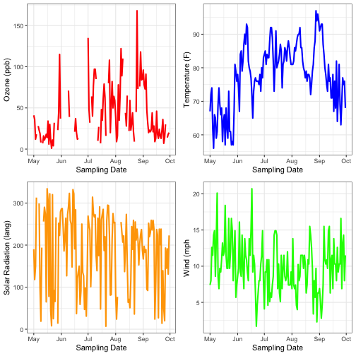

#### 1. Describe what intervals, durations, periods, and instants are, and give one example for each that shows why we need these distinctions. 

In order to manipulate date/time values with arithmatic operations we need to understand what kind of units we desire - exact or relative. Relative time units exist because clock times need to be readjusted periodically. 

Instants are specific moments in time, like the time right now. An interval, by contrast is time spanning two instants, such as yesterday at noon and the time right now. The time span is exact because it's bounded by two instants. 

Durations and periods are time spans that are not bounded by instants, e.g. 1 week. Durations are measured in seconds, whereas periods are measured in minutes, hours, days, etc. all of which are not exact time units since they need to be periodically adjusted. If you added a 1 week period vs. a 1 week duration over the end of February during a leap year you would end up with different results. 

#### 2. The `ggplot2` package works seamlessy with lubridate. Find a data set with dates and/or times, use lubridate to work with the dates/times, then plot a time-related aspect of the data and describe it.
Here I'll be using the dataset `airquality` which has Daily air quality measurements in New York for 5 months in 1973.


data("airquality")
library(tidyverse)
library(lubridate)


I'll transform the Year and Month columns into a date and then plot each of the variables measured (Ozone, Temperature, Solar Radiation, and Wind) along the sampling season.


AQ2 <- airquality %>%
  mutate(Year = 1973) %>%
  mutate(sample_date = mdy(paste(Month, Day, Year, sep = "/"))) %>%
  select(-c(Month, Day, Year))



## Error in select(., -c(Month, Day, Year)): unused argument (-c(Month, Day, Year))



p1<- AQ2 %>%
  ggplot(aes(x = sample_date)) +
  geom_line(aes(y = Ozone), colour = "red", size = 1)+
  xlab("Sampling Date") +
  ylab("Ozone (ppb)")+
  theme_bw()
p2 <- AQ2 %>%
  ggplot(aes(x = sample_date)) +
  geom_line(aes(y = Temp), colour = "blue", size = 1)+
  xlab("Sampling Date") +
  ylab("Temperature (F)")+
  theme_bw()
p3 <- AQ2 %>%
  ggplot(aes(x = sample_date)) +
  geom_line(aes(y = Solar.R), colour = "orange", size = 1)+
  xlab("Sampling Date") +
  ylab("Solar Radiation (lang)")+
  theme_bw()
p4 <- AQ2 %>%
  ggplot(aes(x = sample_date)) +
  geom_line(aes(y = Wind), colour = "green", size = 1)+
  xlab("Sampling Date") +
  ylab("Wind (mph")+
  theme_bw()

I've downloaded the `patchwork` package to put the plots together more seamlessly.


devtools::install_github("thomasp85/patchwork") 
library(patchwork)
(p1|p2)/(p3|p4) 


It doesn't look like there are many patterns here, except that temperature increases in the middle of the summer, unsuprisingly. Not the most exciting dataset but simple to plot!

We can also get average values for all 4 variables by sample month.


library(knitr)
kable(AQ2 %>%
  mutate(sample_month = month(AQ2$sample_date, label = TRUE)) %>%
  group_by(sample_month) %>%
  summarize_all(mean, na.rm = TRUE) %>%
  select(-sample_date))



## Error in select(., -sample_date): unused argument (-sample_date)

