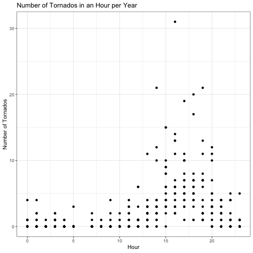
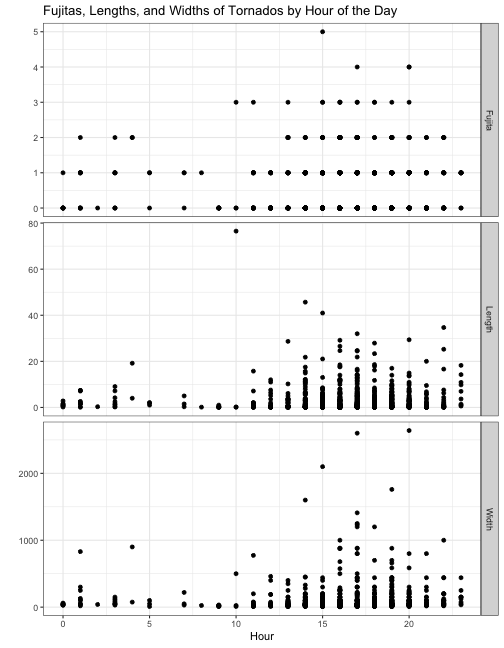


# Load libraries
library(tidyverse)
library(lubridate)


## Question 1

**Describe what intervals, durations, periods, and instants are, and give one example for each that shows why we need these distinctions.**

#### Intervals

An interval is an amount of time represented by the starting point and the ending point. This is helpful when we talk about the number of days in a year. We often say that there are 365 days in a year, but this is not really the case. It may be easier for us to characterize the length of a year as the time between January 1 and December 31.


# Number of days in a year
years(1) / days(1)



## [1] 365.25


#### Durations

A duration is an amount of time represented by the number of seconds. This way of talking a about the amount of time can be helpful when one needs to know the exact amount of time of an event. For example, this could be helpful if I want to know how long it takes a loop to run.


# Amount of time it takes for my loop to run
start <- now()
for(i in 1:100000){
  i^2
}
end <- now()
as.duration(end - start)



## [1] "0.0135669708251953s"


#### Periods

A period is an amount of time represented in "human" units (such as days, weeks, or months). This characterization of the amount of time is helpful when we want to communicate in an amount of time that is intuitive to other humans. For example, when I want to know how far away my birthday is.


# Amount of time until my birthday (quite a ways a way!)
ymd_hms("2019-09-08 00:00:00") - now()



## Time difference of 206.886 days


## Question 2

**The `ggplot2` package works seamlessy with lubridate. Find a data set with dates and/or times, use lubridate to work with the dates/times, then plot a time-related aspect of the data and describe it.**

For some reason, tornadoes were on my mind, so I went in search of a dataset with information on tornadoes in Iowa. The website [tornado history project](http://www.tornadohistoryproject.com/) has downloadable datasets with historical records of tornadoes in the United States. I downloaded the dataset recording all observed tornadoes in Iowa from 1950 to 2017. I extracted the data from the years 2000 to 2017 and the variables I was interested in. I also cleaned the data a bit. This code and the data can be found in my GitHub repository called [datafun](https://github.com/goodekat/datafun) in the folder titled "iowa_tornado".

### Iowa Tornado Data (2000-2017)

The cleaned and subsetted data is read in below. A table of the first six rows of the data is included. An explanation of the variables in the full dataset can be found [here](https://www.spc.noaa.gov/wcm/data/SPC_severe_database_description.pdf). The definitions for the variables I have included in the data are as follows.

- Date: date of the tornado in mm/dd/yy format
- Time: time of tornado in hh:mm:ss format
- Fujita: F-scale values indicating the intensity of the tornado (0 is low, 5 is high)
- Fatalities: number of fatalities
- Injuries: number of injuries
- Width: width of tornado in yards
- Length: length of distance traveled by tornado in miles


# Read in my cleaned data on tornados in Iowa from 2000 to 2017 
# (remove the damage variable)
iowa_tornados <- read_csv("https://raw.githubusercontent.com/goodekat/datafun/master/iowa_tornadoes/data/iowa_tornadoes_2000_2017.csv") %>%
  select(-Damage)


 


## Error in loadNamespace(name): there is no package called 'gt'


 

I used functions from lubridate below to change the `Date` and `Time` variables to date and time formats, respectively, and to create variables of `Year`, `Month`, `Day`, and `Hour`.


iowa_tornados <- iowa_tornados %>%
  mutate(Date = mdy(Date),
         Year = year(Date), 
         Month = month(Date, label = TRUE),
         Day = day(Date),
         Time = hms(Time),
         Hour = hour(Time)) %>%
  select(Date, Year:Day, Time, Hour, Fatalities, 
         Injuries, Fujita, Width, Length)


 

### Number of Tornados by Month

First of all, I wanted to see if there was a trend in the occurrence of tornadoes across the year. Each point in the plot below represents the number of tornadoes in a month for a particular year from 2000 to 2017. The months with the most tornadoes were April through June, but there was quite a bit of variability in the number of tornadoes between years. It also appears that it is common to have tornadoes occur from March through November in Iowa. The months of January, February, and December had very few or zero tornadoes from 2000 to 2017.


iowa_tornados %>%
  count(Year, Month) %>%
  complete(Year, Month, fill = list(n = 0)) %>%
  ggplot(aes(x = Month, y = n)) +
  geom_point() +
  theme_bw() + 
  labs(y = "Number of Tornados", 
       title = "Number of Tornados in a Month per Year")


 

### Number of Tornados by Hour of the Day

Next, I wanted to see if there was a trend in the occurrence of tornadoes based on the time of day. Each point in the plot below represents the number of tornadoes during the hour of the day for a particular year between 2000 and 2017. The data shows that tornadoes occurred at any time of the day in Iowa between 2000 and 2017, but they had higher frequencies between 1 pm and 8 pm. However, there is a good deal of variation between the years during this time period.


iowa_tornados %>%
  count(Year, Hour) %>%
  complete(Year, Hour, fill = list(n = 0)) %>%
  ggplot(aes(x = Hour, y = n)) +
  geom_point() +
  theme_bw() + 
  labs(y = "Number of Tornados",
       title = "Number of Tornados in an Hour per Year")


 

### Fujita, Width, and Length by Hour of the Day

I was also curious to see if there was a relationship between time of day and the characteristics of the tornado. The plots below show the value on the F-scale (`Fujita`), the distance traveled (`Length`), and the width (`Width`) for each tornado in Iowa from 2000 to 2017 versus the hour of the day when the tornado occurred. The tornadoes that occurred during the peak occurrence time of 1 pm to 8 pm discovered in the previous plot reached higher intensities, traveled further lengths, and had larger widths than tornadoes during the other times of the day. However, there was also larger variability in the tornado characteristics measured during this time of day.


iowa_tornados %>%
  select(Date, Year, Time, Hour, Fujita:Length) %>%
  gather(Variable, Quantity, 5:7) %>%
  ggplot(aes(x = Hour, y = Quantity)) +
  geom_point() +
  facet_grid(Variable ~ ., scales = "free") +
  theme_bw() + 
  labs(y = "",
       title = "Fujitas, Lengths, and Widths of Tornados by Hour of the Day")


 

### Fatalities and Injuries by Year

Lastly, I wanted to look at the number of fatalities and injuries by year. Below is a plot of the total number of fatalities and injuries caused by tornadoes per year from 2000 to 2017. The total number of fatalities is usually close to 0, and the total number of injuries is usually less than 50. However, 2008 stands out as having a high number of fatalities (13) and injuries (133). There must have been one or several very bad tornadoes that year.


iowa_tornados %>%
  select(Date, Year, Time, Fatalities, Injuries) %>%
  gather(Variable, Count, 4:5) %>%
  group_by(Year, Variable) %>%
  summarise(Total = sum(Count)) %>%
  ggplot(aes(x = factor(Year), y = Total)) + 
  geom_point() +
  facet_grid(Variable ~ ., scales = "free") + 
  theme_bw() + 
  labs(x = "Year", 
       y = "Total Number",
       title = "Total Number of Fatalities and Injuries by Year") + 
  theme(axis.text.x = element_text(angle = 45, hjust = 1))


