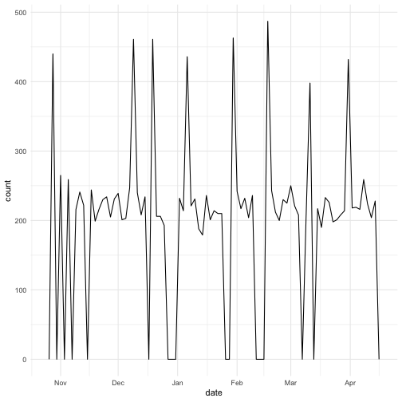
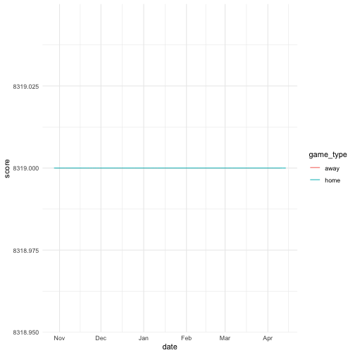

1. **Describe what intervals, durations, periods, and instants are, and give one example for each that shows why we need these distinctions.**

- Instant: is an infinitesimal measure of the moment of time. It is a specific moment in timem like: now, today, etc.
What is the time right now -- instant:


now() #returns time in hours, minutes and seconds as well as the today's date



## [1] "2019-02-15 12:13:00 CST"


- Duration: is the amount of time elapsed between two events. Events might be measured in different ways: centuries, years, months, weeks, hours, minutes, second or even milliseconds. Depending on the case, one may choose a specific measurement. However, it may cause difficulties (eg. in DS research). To avoid this, we can utilize lubridate’s approach: duration measurement in seconds.

Calculate the duration of the STAT585 class:


dhours(x = 5.5 - 4.167) #seconds



## [1] "4798.8s (~1.33 hours)"


- Period: is also a time span, but compared to duration it does not have fixed length in seconds. It’s rather a “human” measure of time, rather than physical (scientific). A period may represent a day, month, year, hour or even their linear combination. It is most useful in dealing with timezone conflicts.

Create a new period consisting of 28 days:


w_cycle <- days(28)
w_cycle #this data structure probably is used in mobile App: flo



## [1] "28d 0H 0M 0S"


- Interval: is time span with a starting and ending point. It is similar to duration but is used for more “human” measure of time. If one wants to obtain how many periods were in a specific time span, it is better to use interval rather than duration. It is also helpful in dealing with leap years/seconds. 

Calculate how many cycles a woman has on average in one year:


next_year <- today() + years(1)
(today () %--% next_year) / w_cycle #on average 13 cycles



## [1] 13.03571


2. **The `ggplot2` package works seamlessy with lubridate. Find a data set with dates and/or times, use lubridate to work with the dates/times, then plot a time-related aspect of the data and describe it.**

 I chose lakers data from the lubridate package. 


# first take a look at the dataset
lakers %>% glimpse



## Observations: 34,624
## Variables: 13
## $ date      <int> 20081028, 20081028, 20081028, 20081028, 20081028, 20...
## $ opponent  <chr> "POR", "POR", "POR", "POR", "POR", "POR", "POR", "PO...
## $ game_type <chr> "home", "home", "home", "home", "home", "home", "hom...
## $ time      <chr> "12:00", "11:39", "11:37", "11:25", "11:23", "11:22"...
## $ period    <int> 1, 1, 1, 1, 1, 1, 1, 1, 1, 1, 1, 1, 1, 1, 1, 1, 1, 1...
## $ etype     <chr> "jump ball", "shot", "rebound", "shot", "rebound", "...
## $ team      <chr> "OFF", "LAL", "LAL", "LAL", "LAL", "LAL", "POR", "LA...
## $ player    <chr> "", "Pau Gasol", "Vladimir Radmanovic", "Derek Fishe...
## $ result    <chr> "", "missed", "", "missed", "", "made", "", "made", ...
## $ points    <int> 0, 0, 0, 0, 0, 2, 0, 1, 0, 2, 2, 0, 0, 2, 2, 0, 0, 2...
## $ type      <chr> "", "hook", "off", "layup", "off", "hook", "shooting...
## $ x         <int> NA, 23, NA, 25, NA, 25, NA, NA, NA, 36, 30, 34, NA, ...
## $ y         <int> NA, 13, NA, 6, NA, 10, NA, NA, NA, 21, 21, 10, NA, 1...


We see that "date" variables is recorded as integer, so we have to convert it to date data type:


lakers %>% mutate_at(1, ymd) -> new_lakers 
# integer is parsed into year-month-day
class(new_lakers$date) #date ds, not integer



## [1] "Date"


We can make new variables such day, month and year separate from date variable. Those variables will be stored as integers:


new_lakers %>% filter(team == "LAL") %>% group_by(date) %>%  mutate(year = year(date), month = month(date), day = day(date), score = sum(points)) -> lal_lakers


Some fun plots:
- We see that there were almost no games in November and December.


# frequency of played games 
lal_lakers %>% group_by(date) %>% ggplot(aes(date)) + geom_freqpoly(binwidth = 2)


LA team scored more mostly when they were playing at home. Interestingly they scored more away from late January to mid February.


lal_lakers %>% ggplot(aes(x = date, y = score, col = game_type)) + geom_line(linejoin = "round")


