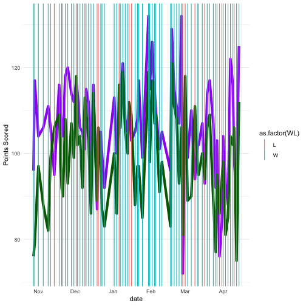
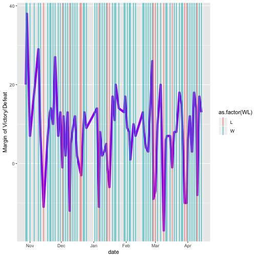
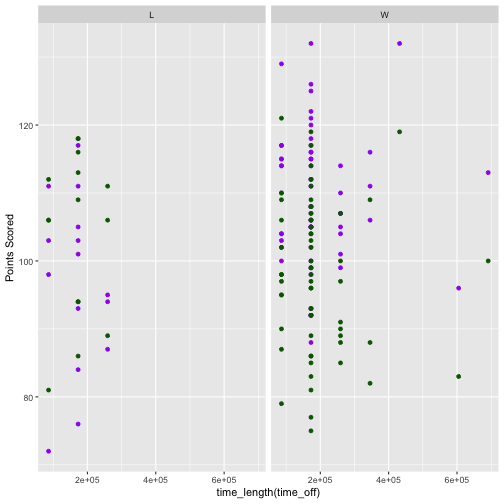
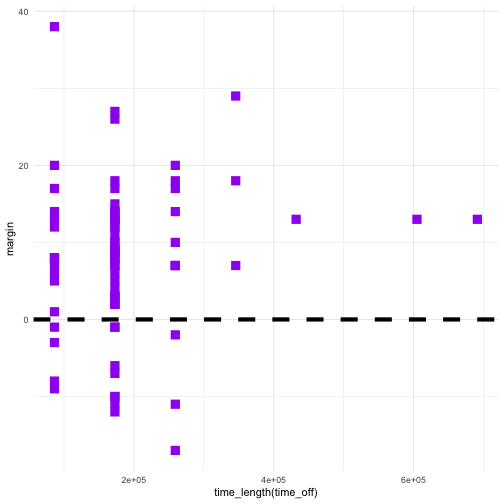

- **Describe what intervals, durations, periods, and instants are, and give one example for each that shows why we need these distinctions.**

From section 16.4 in "R for Data Science", the definition of the first 3 time spans are similar but subtly different. A *duration* is an exact number of seconds (i.e., 30.58 seconds), while a period is just a representation in "human units" (e.g., months, weeks, days) and an *interval* is a representation of time with a distinct starting and ending point.

*Duration* is useful when we need an exact time in seconds that can be added/subtracted/multiplied easily. The lubridate package does this by automatically converting days and other units into exact seconds (or possibly other unit) measurements. So if we had a intercontinental airline flight that was 3 hours and 57 minutes and a intergalactic flight that took 4 years, 3 months, 2 days, 55.3245 seconds, then lubridate could give us an exact total flight time in seconds by converting both flight lengths to an exact value and then adding them

We can also perform arithmetic options with *periods*, except they work like regular "human" times by taking into account things like time zones and daylight savings, or other human nuances of time. Following the example in the book, we can see that using periods is most useful when our dates and times cross these constructs, such as flights that cross time zones or experiments that are taking place on both sides of daylight savings time.

A further nuance from periods is *intervals*, which allow for even more exact adjustments by specifying a starting and ending point for our dates and times. This is useful because some of our units of measurement are not uniform. Some years have more days than others, thus if we add a year to our current date, we may not get what we expect. By specifying which year we're in, lubridate can handle these adjustments for time spans in the form of intervals.

The time spans described above are just collections of *instants*, which describe specific points like time, date, or date-time. We would need instants any time we needed a specific time instead of a length of time, such as the arrival time of a flight or the date and time I submit this blog post.

- **The `ggplot2` package works seamlessy with lubridate. Find a data set with dates and/or times, use lubridate to work with the dates/times, then plot a time-related aspect of the data and describe it.**

The "lakers" dataset in the lubridate package contains all of the play-by-play events for the Los Angeles Lakers' 2008-09 season. We can use lubridate to help visually analyze if the Lakers' performance was improved when they had longer times between games. First, we load the data and transform it so that we have the final score for each game. Here we use the "ymd" function from lubridate to convert the game days to formal dates, and the rest of the filtering/summarizing comes from dplyr:


library(tidyverse)
library(ggplot2)
library(lubridate)

data(lakers)
lakersmod <- lakers %>% mutate(date=ymd(date))
totalpointsL <- lakersmod %>% filter(team=='LAL') %>%  group_by(date) %>% summarise(LALscore = sum(points))
totalpointsO <- lakersmod %>% filter(team!='LAL')%>%  group_by(date) %>% summarise(Oppscore = sum(points))
games <- totalpointsL %>% left_join(totalpointsO, by=c("date"="date"))



## Error: `by` can't contain join column `date` which is missing from LHS


Now that we have the final scores, we can get further information about wins/losses and margin of victory/defeat. We can also find the time between games by using the days() function from lubridate to find the length of the period between successive games.


games<- games %>% mutate(margin = LALscore-Oppscore, WL = if_else(LALscore>Oppscore,"W","L"), time_off=days(date-lag(date,1)))


First we can plot the game results over time, but it doesn't tell us much (other than the Lakers won most of their games). One interesting observation is that most of the losses came in pairs (usually back-to-back away games). Another is that it appears that their average margin of victory decreased slightly as the season progressed.


#First, plot both teams' scores over time
ggplot(data=games, mapping=aes(x=date)) + geom_line(aes(y=LALscore), colour = "purple",size=2) +
  geom_line(aes(y=Oppscore),colour="dark green",size=2) +
  geom_vline(aes(xintercept=date,col=as.factor(WL))) + labs(x="date", y="Points Scored")



#Then plot margin of victory over time
ggplot(data=games, mapping=aes(x=date)) + geom_line(aes(y=margin), colour = "purple",size=2) +
  geom_vline(aes(xintercept=date,col=as.factor(WL))) + labs(x="date", y="Margin of Victory/Defeat")


Next, we can look at how their performance was affected by time between games. As we might expect, the Lakers won all of their games when they had a longer rest, and their average margin of victory increased as well. They tended to score more points when they had longer rest.


#plot scores vs. time between games, separated by W/L and team
ggplot(data=games, mapping=aes(x=time_length(time_off))) + geom_point(aes(y=LALscore), colour="purple") +
  geom_point(aes(y=Oppscore), colour="dark green") + facet_grid(.~WL) + labs(y="Points Scored")



#plot margin of victory vs. time between games
ggplot(data=games, mapping=aes(x=time_length(time_off))) + geom_point(aes(y=margin), colour="purple",pch=15,size=4) + geom_hline(aes(yintercept=0),lty=2,size=2)


