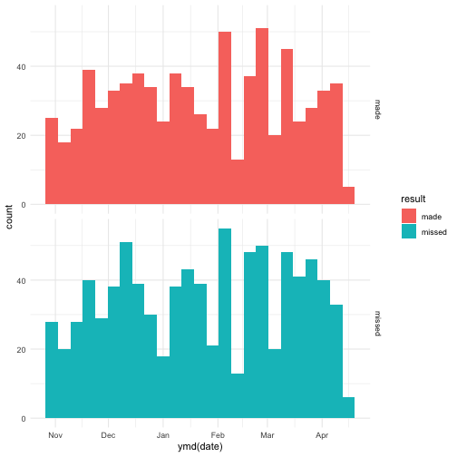

## Background:

Dates and times can be difficult to work with. Watch [this video](https://www.youtube.com/watch?v=-5wpm-gesOY) to appreciate all of the fun scenarios that date/time libraries have to accommodate. 

Luckily, the `lubridate` package makes working with dates and times in R pretty straightforward. The package has been described in the paper [Working with date and time](http://www.jstatsoft.org/v40/i03/) by Garrett Grolemund and Hadley Wickham, an updated version of an intro to lubridate can be found in chapter 16 of [R for Data Science](https://r4ds.had.co.nz/dates-and-times.html). Read one of the two sources.

Write a blog post addressing the questions:

- Describe what intervals, durations, periods, and instants are, and give one example for each that shows why we need these distinctions.
###Intervals: represent a starting and ending point.
It can be helpful when finding out how many days are contained in one specific year.


library(lubridate)
#An estimate of how many days in a year
years(1) / days(1)



## estimate only: convert to intervals for accuracy



## [1] 365.25



#find out how many days in this year
next_year <- today() + years(1)
(today() %--% next_year) / ddays(1)



## [1] 365


###Durations: number of seconds.
It is straight forward to add, subtract, multiply with time represented as intervals.


2 * dyears(1)



## [1] "63072000s (~2 years)"



dyears(1) + dweeks(12) + dhours(15)



## [1] "38847600s (~1.23 years)"



tomorrow <- today() + ddays(1)
last_year <- today() - dyears(1)

###Periods: human units like weeks and months.
Avoid the problems caused by calculating non-standard human time unit such as days that are not 24 hours due to the time zone.


one_pm <- ymd_hms("2016-03-12 13:00:00", tz = "America/New_York")
one_pm



## [1] "2016-03-12 13:00:00 EST"



#wrong result using duration
one_pm + ddays(1)



## [1] "2016-03-13 14:00:00 EDT"



#correct result using period
one_pm + days(1)



## [1] "2016-03-13 13:00:00 EDT"

###Instants: the specific time point, a date, a time within a day or a date-time. 
It show the time piont in a formated way.


today()



## [1] "2019-02-12"



now()



## [1] "2019-02-12 20:44:13 CST"


- The `ggplot2` package works seamlessy with lubridate. Find a data set with dates and/or times, use lubridate to work with the dates/times, then plot a time-related aspect of the data and describe it.  
Plot the shotting attempt made by Kobe Bryant from 2008 to 2009, facet by shot that been missed and made for every 7 days. Date been converted to time instant and ploted with ggplot.


library(tidyverse)
attach(lakers)
str(lakers)



## 'data.frame':	34624 obs. of  13 variables:
##  $ date     : int  20081028 20081028 20081028 20081028 20081028 20081028 20081028 20081028 20081028 20081028 ...
##  $ opponent : chr  "POR" "POR" "POR" "POR" ...
##  $ game_type: chr  "home" "home" "home" "home" ...
##  $ time     : chr  "12:00" "11:39" "11:37" "11:25" ...
##  $ period   : int  1 1 1 1 1 1 1 1 1 1 ...
##  $ etype    : chr  "jump ball" "shot" "rebound" "shot" ...
##  $ team     : chr  "OFF" "LAL" "LAL" "LAL" ...
##  $ player   : chr  "" "Pau Gasol" "Vladimir Radmanovic" "Derek Fisher" ...
##  $ result   : chr  "" "missed" "" "missed" ...
##  $ points   : int  0 0 0 0 0 2 0 1 0 2 ...
##  $ type     : chr  "" "hook" "off" "layup" ...
##  $ x        : int  NA 23 NA 25 NA 25 NA NA NA 36 ...
##  $ y        : int  NA 13 NA 6 NA 10 NA NA NA 21 ...



lakers %>% 
  filter(player=="Kobe Bryant", etype=="shot") %>% 
  ggplot(aes(ymd(date),fill=result))+
  geom_histogram(binwidth = 7)+ facet_grid(result~.)


