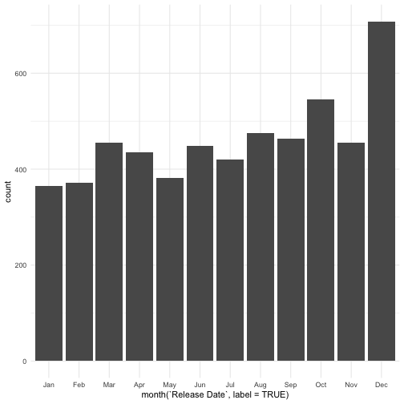
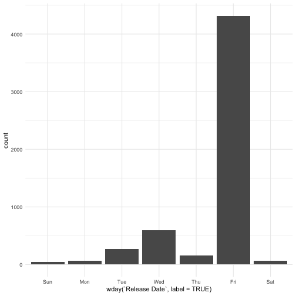
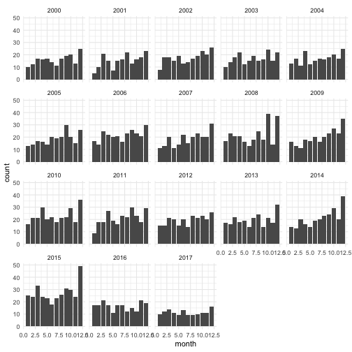

- Describe what intervals, durations, periods, and instants are, and give one example for each that shows why we need these distinctions.


library(lubridate)
library(tidyverse)
library(classdata)


An **instant** is a specific moment in time, such as the current time. There are three types refer to an instant: a date, a time within a day, and a date-time.


now()



## [1] "2019-02-15 12:13:08 CST"


Intervals, durations, periods are all ways of recording timespans.    

**Durations** represent an exact number of seconds. Since durations always record the time span in seconds, the lengh of a duration is invariant to leap years, leap seconds, and DST. Durations are appropriate to compare time based attributes.


dyears(1)



## [1] "31536000s (~52.14 weeks)"

**Periods** represent human units like weeks and months. Different from durations, periods don't have a fixed length in seconds. They work in a more intuitive way. In the following example, using years(1) we can get "2017-01-01", which is what we expect. But using durations dyears(1) we will get "2016-12-31". Because 2016 is a leap year, adding 31536000s (365d) will get 2016-12-31.


ymd("2016-01-01") + dyears(1)



## [1] "2016-12-31"



ymd("2016-01-01") + years(1)



## [1] "2017-01-01"

**Intervals** represent a starting and ending point. An interval is a span of time that occurs between two specific instants.


start_2019 <- ymd_hms("2019-01-01 12:00:00")
start_2018 <- ymd_hms("2018-01-01 12:00:00")
span <- start_2019 - start_2018

So we should pay attention to these distinctions when we work with datas and times. Using different type will get different result. We should carefully pick the data type according to our research purpose.

- The `ggplot2` package works seamlessy with lubridate. Find a data set with dates and/or times, use lubridate to work with the dates/times, then plot a time-related aspect of the data and describe it.  


budget %>% ggplot(aes(x=month(`Release Date`, label=TRUE))) + geom_bar()



budget %>% ggplot(aes(x=wday(`Release Date`, label=TRUE))) + geom_bar()


December had the largest number of movies released during a year. The majority of movies were released on Friday in a week.


budget %>% 
  mutate(year = year(`Release Date`),
         month = month(`Release Date`),
         wday = wday(`Release Date`, label=TRUE)) %>%
  filter(between(year, 2000, 2017)) %>%
  ggplot(aes(x = month)) + geom_bar() +
  facet_wrap(~year)


In generally, December had the largest number of movies released during 2000-2017, especially in 2015. Surprisedly, the number of movies was decreased in 2016 and 2017.

