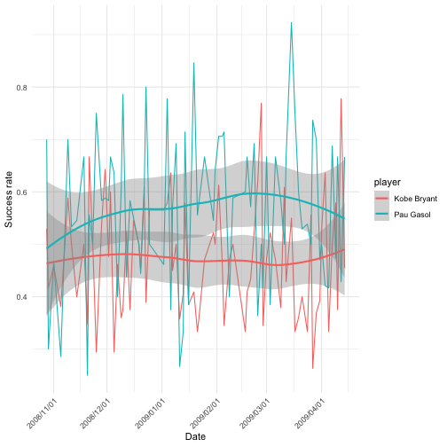
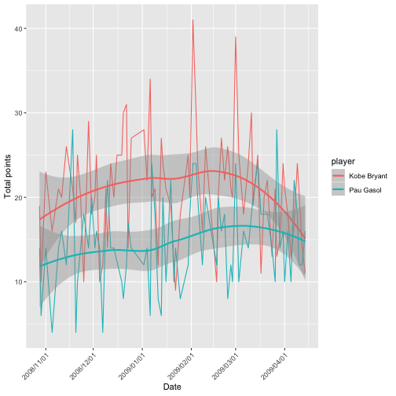

- Describe what intervals, durations, periods, and instants are, and give one example for each that shows why we need these distinctions.

**Instant**: is a specific moment of time. It's a very short of time.


(time_now <- now())



## [1] "2019-02-15 12:13:14 CST"



is.instant(time_now)



## [1] TRUE


**Interval**: is a time span between two specific instants.


(span <- interval(ymd_hms("2019-02-10 08:00:00"),ymd_hms("2019-02-12 08:30:20")) )



## [1] 2019-02-10 08:00:00 UTC--2019-02-12 08:30:20 UTC


**Duration**: is a time span that is recorded in seconds.


duration(minute=3)



## [1] "180s (~3 minutes)"


**Period**: is a time span that is recorded in larger units than seconds, such as minutes, hours, years.


as.period(span)



## [1] "2d 0H 30M 20S"


I think the reason we want to distinguish these is they have different advantanges. For example, duration can show the time span in exact length but it is not easily readable when a timespan is large. Period can make large time spans easy to read. Interval can provide us with the start and end of the time span. Different demands require different usage, that's why we need to distinguish them.

- The `ggplot2` package works seamlessy with lubridate. Find a data set with dates and/or times, use lubridate to work with the dates/times, then plot a time-related aspect of the data and describe it.  

The data I used is statistics of each Los Angeles Lakers basketball game in the 2008-2009 season in `lubridate` package.


data("lakers")
lakers %>% filter(player %in% c("Pau Gasol","Kobe Bryant"),etype=="shot") %>% mutate(Date=ymd(date)) %>% dplyr::select(Date,player,points) %>% group_by(Date,player) %>% summarise(rate=sum(points>0)/n(),Total_points=sum(points))-> lakers_summ



## Error: This function should not be called directly



lakers_summ %>% ggplot(aes(x=Date, y=rate)) + geom_line(aes(color=player))+ geom_smooth(aes(color=player)) + scale_x_date(date_labels = '%Y/%m/%d') +  theme(axis.text.x = element_text(angle = 45, hjust = 1)) + labs(y="Success rate")



lakers_summ %>% ggplot(aes(x=Date, y=Total_points)) + geom_line(aes(color=player))+ geom_smooth(aes(color=player)) + scale_x_date(date_labels = '%Y/%m/%d') +  theme(axis.text.x = element_text(angle = 45, hjust = 1)) + labs(y="Total points")


From the success rate plot we can see there is huge fluctuation for both players but I do not see any temporal pattern in this plot. On average, I think Gasol had higher success rate than Bryant. In the total points plot, Bryant seemed to have more total points than Gasol in general. And Bryant seemed to be unstable in scores from 2009-01-01 to 2009-03-01. So we may infer that although Bryant had relative lower success rate than Gasol, he had more shoting oppotunities.

