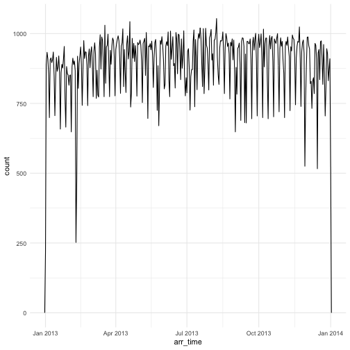

Write a blog post addressing the questions:

- Describe what intervals, durations, periods, and instants are, and give one example for each that shows why we need these distinctions.

An Instant is a specific moment in time (e.g.,January 1st, 2012)
durations, which represent an exact number of seconds (e.g.,120s)
periods, which represent human units like weeks and months (e.g.,3 months and 2 days)
intervals, which represent a starting and ending point (e.g.,2010-01-01 12:00:00 -- 2011-01-01 12:00:00)
If you only care about physical time, use a duration; 
if you need to add human times, use a period; 
if you need to figure out how long a span is in human units, use an interval.

- The `ggplot2` package works seamlessy with lubridate. Find a data set with dates and/or times, use lubridate to work with the dates/times, then plot a time-related aspect of the data and describe it.  

I use the same dataset from the paper.


library(tidyverse)
library(lubridate)
library(nycflights13)
##write function to datetime
make_datetime_100 <- function (year,month,day,time){
  make_datetime(year,month,day,time %/% 100,time %%100)
}
flights_dt <-flights %>% 
  filter (!is.na(dep_time),!is.na(arr_time)) %>% 
  mutate(
    dep_time=make_datetime_100(year,month,day,dep_time),
    arr_time=make_datetime_100(year,month,day,arr_time)
  ) %>% 
  select (origin,dest,ends_with("delay"),ends_with("time"))
##check arrive time across all time
flights_dt %>% 
  ggplot(aes(arr_time))+
  geom_freqpoly(binwidth = 86400)



##check for certain time.
flights_dt %>% 
  filter(arr_time < ymd(20130107),arr_time > ymd(20130102)) %>% 
  ggplot(aes(arr_time))+
  geom_freqpoly



## Error: Don't know how to add geom_freqpoly to a plot

