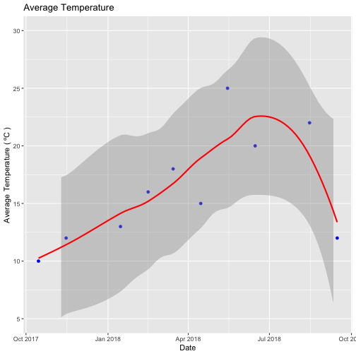

## Background:

Dates and times can be difficult to work with. Watch [this video](https://www.youtube.com/watch?v=-5wpm-gesOY) to appreciate all of the fun scenarios that date/time libraries have to accommodate. 

Luckily, the `lubridate` package makes working with dates and times in R pretty straightforward. The package has been described in the paper [Working with date and time](http://www.jstatsoft.org/v40/i03/) by Garrett Grolemund and Hadley Wickham, an updated version of an intro to lubridate can be found in chapter 16 of [R for Data Science](https://r4ds.had.co.nz/dates-and-times.html). Read one of the two sources.

Write a blog post addressing the questions:

- Describe what intervals, durations, periods, and instants are, and give one example for each that shows why we need these distinctions.

Interval () makes an interval object that specified start and end dates. If the start date happens before the end date, the interval is positive, otherwise, it is negative. For example, I plan to go to a conference in Europe during the summer. In the same time, I plan to visit a friend in the US. I can check whether my plans overlapped or not. Or, I shift the start and end dates of my plans. Also, adjust my second plan (visiting the friend) based on the attending the conference. 

Duration() provides mathematically precise results. For example, we can find 90 days equal with how many weeks and seconds.  Also, we can add a number of days to a specific day/days to a period. 
Period() creates a period object with an specific value. For example, I can calculate how long I will be in the conference. 
Instants is an specific moment in time. There some common date-time objects s (e.g, POSIXct, POSIXlt,
and Date objects). 

- The `ggplot2` package works seamlessy with lubridate. Find a data set with dates and/or times, use lubridate to work with the dates/times, then plot a time-related aspect of the data and describe it.  


library(lubridate)

### Interval
plan1_conference <- interval(ymd(20190601, arr="Arrive"), ymd(20190606, lea="leave"))



## Warning: 1 failed to parse.



## Warning: 1 failed to parse.



plan2_friend <- interval(ymd(20190601, arr="Arrive"), ymd(20190615, lea="leave"))



## Warning: 1 failed to parse.



## Warning: 1 failed to parse.



# checking overlap
int_overlaps(plan1_conference,plan2_friend)



## [1] TRUE   NA



### Duration 
duration(90, "seconds")



## [1] "90s (~1.5 minutes)"



duration(day = 90)



## [1] "7776000s (~12.86 weeks)"



# leap year
leap_year(2013) 



## [1] FALSE



ymd(20190201) + dyears(2)



## [1] "2021-01-31"



### Period
minutes(2)



## [1] "2M 0S"



plan1_conference / minutes(1)



## [1] 7200   NA



plan1_conference / days(1)



## [1]  5 NA



### Instant 
is.instant(as.Date("2019-08-03"))



## [1] TRUE



library(tidyverse)
library(ggplot2)
library(nycflights13)

# Arbitrary rainfall  
weather <- read.csv("~/weather.csv")



## Warning in file(file, "rt"): cannot open file '/Users/heike/weather.csv':
## No such file or directory



## Error in file(file, "rt"): cannot open the connection



weather_date <- weather %>% 
  mutate(data = make_datetime(year, month, day))

date <- ymd(20171015,20171115,20171215,20180115,20180215,20180315,
           20180415,20180515,20180615,20180715,20180815,20180915)

Temp <- c(10,12,1,13,16,18,15,25,20,32,22,12)
  
weather_df <- data.frame(Temp,date)



# Plot 
ggplot(weather_df,aes(x = date,y = Temp)) +
  geom_point(colour = "blue") +
  geom_smooth(colour = "red",size = 1)+
  scale_y_continuous(limits = c(5,30), breaks = seq(5,30,5)) +
  ggtitle ("Average Temperature") +
  xlab("Date") +  ylab ("Average Temperature ( ºC )")



## `geom_smooth()` using method = 'loess' and formula 'y ~ x'



## Warning: Removed 2 rows containing non-finite values (stat_smooth).



## Warning: Removed 2 rows containing missing values (geom_point).


