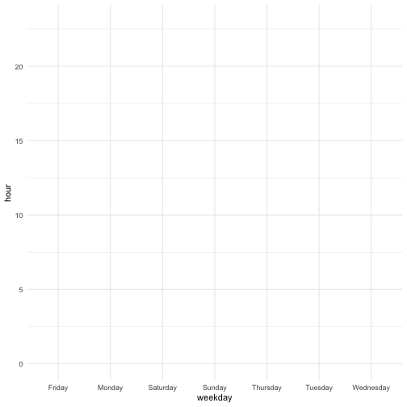
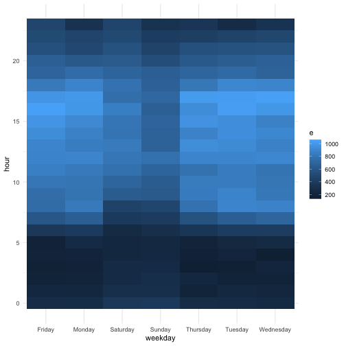
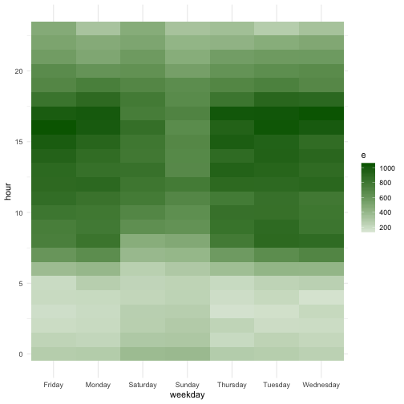

##  Describe what intervals, durations, periods, and instants are, and give one example for each that shows why we need these distinctions.

  * intervals, which represent a starting (instant) and ending point. since we have 2 exact points in date/time, 
      we are able to calculate the interval by using period and duration.
  
    * example: you can start practicing for an exam in May,10 2019 at 12:00:00 pm and end in May,11 2019 at 12:00:00 pm
    
  * durations, which represent an exact number of seconds. Durations represent an exact number of seconds.
  
    * example: the duration of writing my blog #3 was 120*360 seconds.
    
  * periods, which represent human units like weeks and months. Periods are time spans but don’t have a fixed length in seconds, 
      instead they work with “human” times, like days and months.
  
    * example: June has 30 days while July has 31 days. February has 28 days except for leap years when it has 29 days.
      With the Period class, we can add 1 month to February 1 and get March 1.
  
  * instants, a specific date-time point  
  
    * example:the date and time of your birthday like 2011-12-29 at 12:33:00 pm.

##  The `ggplot2` package works seamlessy with lubridate. Find a data set with dates and/or times, use lubridate to work with the dates/times, then plot a time-related aspect of the data and describe it. 

   I am going to create a heatmap of 911 dataset[1]. We use lubricate to extract time ,hour and weekday of time stamps and 
    plot a heat map of weekday and hour.


#installing  packages

#install.packages("plyr")
#install.packages("ggplot2")
#install.packages("dplyr")
#install.packages("lubricate")

#loading packages
library(plyr)
library(ggplot2)
library(dplyr)
library(lubridate)


#### read data


#read 911 data
#reading the data
# data from githup repository
fn <- "https://raw.githubusercontent.com/shoaibb/911-Calls-Data-Analysis/master/911.csv"
download.file(fn,destfile="short911.csv")
#read csv
call911<- read.csv("short911.csv")
#checking the data 
head(call911)



##        lat       lng
## 1 40.29788 -75.58129
## 2 40.25806 -75.26468
## 3 40.12118 -75.35198
## 4 40.11615 -75.34351
## 5 40.25149 -75.60335
## 6 40.25347 -75.28324
##                                                                                  desc
## 1           REINDEER CT & DEAD END;  NEW HANOVER; Station 332; 2015-12-10 @ 17:10:52;
## 2 BRIAR PATH & WHITEMARSH LN;  HATFIELD TOWNSHIP; Station 345; 2015-12-10 @ 17:29:21;
## 3                          HAWS AVE; NORRISTOWN; 2015-12-10 @ 14:39:21-Station:STA27;
## 4               AIRY ST & SWEDE ST;  NORRISTOWN; Station 308A; 2015-12-10 @ 16:47:36;
## 5    CHERRYWOOD CT & DEAD END;  LOWER POTTSGROVE; Station 329; 2015-12-10 @ 16:56:52;
## 6               CANNON AVE & W 9TH ST;  LANSDALE; Station 345; 2015-12-10 @ 15:39:04;
##     zip                   title           timeStamp               twp
## 1 19525  EMS: BACK PAINS/INJURY 2015-12-10 17:40:00       NEW HANOVER
## 2 19446 EMS: DIABETIC EMERGENCY 2015-12-10 17:40:00 HATFIELD TOWNSHIP
## 3 19401     Fire: GAS-ODOR/LEAK 2015-12-10 17:40:00        NORRISTOWN
## 4 19401  EMS: CARDIAC EMERGENCY 2015-12-10 17:40:01        NORRISTOWN
## 5    NA          EMS: DIZZINESS 2015-12-10 17:40:01  LOWER POTTSGROVE
## 6 19446        EMS: HEAD INJURY 2015-12-10 17:40:01          LANSDALE
##                         addr e
## 1     REINDEER CT & DEAD END 1
## 2 BRIAR PATH & WHITEMARSH LN 1
## 3                   HAWS AVE 1
## 4         AIRY ST & SWEDE ST 1
## 5   CHERRYWOOD CT & DEAD END 1
## 6      CANNON AVE & W 9TH ST 1


#### Extracting hour and weekday from the datetime column


#extracting hour from the timestamp column
call911$hour<- hour(call911$timeStamp)

#extracting weekday from the timestamp column
call911$weekday<- weekdays.POSIXt(as.Date(call911$timeStamp))


#### Finding the number of calls of Weekday and hour pair


#Finding the count of hour and weekday pair using aggregate function
heatmap <- aggregate(e~ hour+weekday, data= call911, length)


#### Plot heatmap


#basic background
plot <- ggplot(data = heatmap, aes(x=weekday, y=hour, fill=e,label= e))
plot



#adding layer
plot_tile <- plot + geom_tile()
plot_tile



#adding color
plot_fill_color <- plot_tile + scale_fill_gradient2(low = "#98FB98",high ="#006400")
plot_fill_color


### References
  1- https://www.analytics-tuts.com/correlation-matrix-heatmap-r/
  2- https://r4ds.had.co.nz/dates-and-times.html

