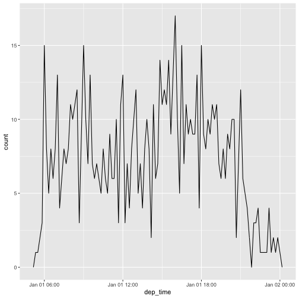

1. Describe what intervals, durations, periods, and instants are, and give one example for each that shows why we need these distinctions.

- Intervals: The paper says intervals, durations and periods have the same purpose, which is describing timespans. The simplest one would be the intervals. Ex: 06/17/1989 ~ 02/10/2019. If we calculate the length of time between the intervals, that would create an duration. 

- Durations: Length of time in an interval. Useful when it comes to calculating speeds, rates, or lifetimes. EX: 47 minutes

- Periods: Duration with larger units. Ex: 29 years and 3 months

- Instants: A specific moment in time. Good example would be June 17th, 1989. This could be created by parsing a date in to R. It tells us when the period occurs, which allows us to calculate its exact length in seconds.

2. The `ggplot2` package works seamlessy with lubridate. Find a data set with dates and/or times, use lubridate to work with the dates/times, then plot a time-related aspect of the data and describe it.  

- I will use "nycflights13" dataset, a dataset on Airline on-time data for all flights departing NYC in 2013.


library(tidyverse)
library(nycflights13)
library(lubridate)
flights %>%
  select (year, month,day, hour, minute, arr_time)



## Error in select(., year, month, day, hour, minute, arr_time): unused arguments (year, month, day, hour, minute, arr_time)



flights %>%
  select(year, month, day, hour, minute) %>%
  mutate(departure = make_datetime(year, month,day, hour, minute)
        )



## Error in select(., year, month, day, hour, minute): unused arguments (year, month, day, hour, minute)



make_datetime_100 <-  function(year, month, day, time){
  make_datetime(year, month, day, time %/% 100, time %% 100)
}
flights_dt <-  flights %>%
  filter(!is.na(dep_time), !is.na(arr_time)) %>%
  mutate(
    dep_time = make_datetime_100(year, month, day, dep_time),
    arr_time = make_datetime_100(year, month, day, arr_time),
    sched_dep_time = make_datetime_100(year, month, day, sched_dep_time),
    sched_arr_time = make_datetime_100(year, month, day, sched_arr_time)
  ) 
flights_dt %>%
  select(origin, dest, ends_with("delay"), ends_with("time"))



## Error in select(., origin, dest, ends_with("delay"), ends_with("time")): unused arguments (origin, dest, ends_with("delay"), ends_with("time"))



## Visualizing a time series!

flights_dt %>%
filter(dep_time < ymd(20130102)) %>%
  ggplot(aes(dep_time)) +
  geom_freqpoly(binwidth = 600)


