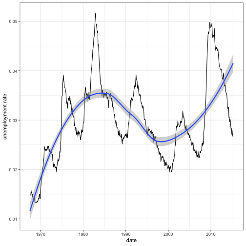
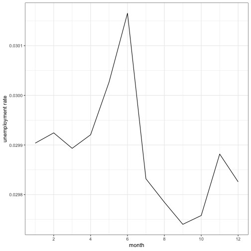

Write a blog post addressing the questions:

- Describe what intervals, durations, periods, and instants are, and give one example for each that shows why we need these distinctions.
    
    - Intervals: Intervals represent specific intervals of the timeline, bounded by start and end instants. E.g. we want to check if some date falls within the interval.
    - Durations: Durations track the passage of physical time, which deviates from clock time when irregularities occur. E.g. we want to calculate the sleeping time during the night of starting day of daylight saving.
    - Periods: Periods track changes in clock times, which ignore time line irregularities. E.g. we want to get the date of 1 year after 2020-01-01 (including the leap day), which should be 2021-01-01.
    - Instants: An instant is a specific moment in time. E.g. we want to get the current moment.
  
- The `ggplot2` package works seamlessy with lubridate. Find a data set with dates and/or times, use lubridate to work with the dates/times, then plot a time-related aspect of the data and describe it.
    
    I use the `economics` dataset in `ggplot2` package. This dataset was produced from US economic time series data available from http://research.stlouisfed.org/fred2.
    


    library(lubridate)
    library(dplyr)
    library(ggplot2)
    
    dat <- mutate(economics, unemployrate = unemploy / pop, date = ymd(date), month = month(date))
    
    ggplot(dat, aes(x = date, y = unemployrate)) +
      geom_line() +
      stat_smooth() +
      labs(y = "unemployment rate") +
      theme_bw()



    group_by(dat, month) %>%
      summarise(unemployrate = mean(unemployrate)) %>%
      ggplot(aes(x = month, y = unemployrate)) +
      geom_line() +
      labs(y = "unemployment rate") +
      scale_x_continuous(breaks = scales::pretty_breaks()) +
      theme_bw()


    
    We plot the unemployment rate vs. date. From the plot, we can see the trend of unemployment rate, increasing before 1985, decreasing between 1985 and 2000, then incresing after 2000. And we can also see the monthly unemployment rate from the 2nd plot, which has the highest unemployment rate in June.
