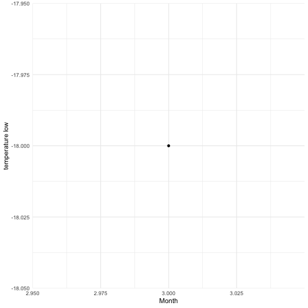


library(lubridate)
library(tidyverse)


## Background:

Dates and times can be difficult to work with. Watch [this video](https://www.youtube.com/watch?v=-5wpm-gesOY) to appreciate all of the fun scenarios that date/time libraries have to accommodate. 

Luckily, the `lubridate` package makes working with dates and times in R pretty straightforward. The package has been described in the paper [Working with date and time](http://www.jstatsoft.org/v40/i03/) by Garrett Grolemund and Hadley Wickham, an updated version of an intro to lubridate can be found in chapter 16 of [R for Data Science](https://r4ds.had.co.nz/dates-and-times.html). Read one of the two sources.

Write a blog post addressing the questions:

- Describe what intervals, durations, periods, and instants are, and give one example for each that shows why we need these distinctions.

> "An instant is a specific moment in time." 


my_bday <- ymd("1980-10-01")

Any date-time object that refers to a moment of time is an instant. An example of an instant is my birthday 1980-10-01.

> "An interval is a span of time that occurs between two specific instants."


lifespan <- interval(my_bday,today())

An example of an interval is my lifespan
1980-10-01 UTC--2019-02-15 UTC

> A duration is a generic timespan with an exact, fixed length measured in seconds.

An example of a duration is a span of 60 seconds.


duration(60)



## [1] "60s (~1 minutes)"

> "Periods record a time span in units larger than seconds, such as years, months, weeks, days,
hours, and minutes."

The length of a period in seconds might change depending on when the period begins. For example, we can find the date one month from today by adding the period of one month.


next_month <- today() + months(1)
next_next_month <- next_month + months(1)
days(next_month-today())



## [1] "28d 0H 0M 0S"



days(next_next_month - next_month)



## [1] "31d 0H 0M 0S"

In this case, the period of one month that we added is 28 days. However, if we add a period of one month to 2019-03-15 we are adding 31 days.

- The `ggplot2` package works seamlessy with lubridate. Find a data set with dates and/or times, use lubridate to work with the dates/times, then plot a time-related aspect of the data and describe it.  


## Error: '/Users/Stephanie/STAT585/Ames_weather_2017-2018.csv' does not exist.


I chose to use the Ames weather data, Ames_weather_2017-2018.csv, that was introduced in lecture. I plotted the daily temperature lows by month over the time period. As we might expect, the temperature lows trend to be higher in the summer months and lower in the winter months. But I was surprised how many days in the winter had lows above freezing. The next plot shows the number of days per month over the two years that the temperature low was above 32 degrees.


start_day <- min(ames_weather_daily$day)



## Warning in min(ames_weather_daily$day): no non-missing arguments to min;
## returning Inf



end_day <- max(ames_weather_daily$day)



## Warning in max(ames_weather_daily$day): no non-missing arguments to max;
## returning -Inf



int <- interval(start_day, end_day)



## Error in as.POSIXct.numeric(x, tz = tz): 'origin' must be supplied



total_days <- time_length(int, "day")



## Error in time_length(int, "day"): object 'int' not found



ames_weather_daily %>% 
  filter(temp_low > 32) %>%
  mutate(month=month(day)) %>%
  group_by(month) %>%
  summarize(count=n()) %>%
  ggplot(aes(month,count)) + geom_col()



## Error in `[[<-.data.frame`(`*tmp*`, col, value = 3): replacement has 1 row, data has 0


