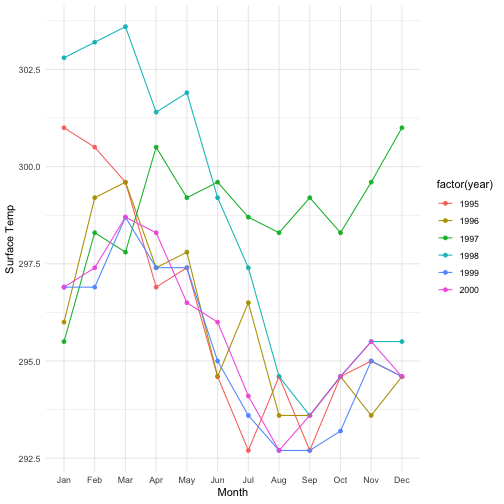
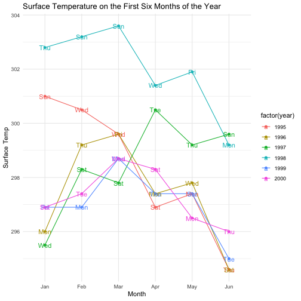
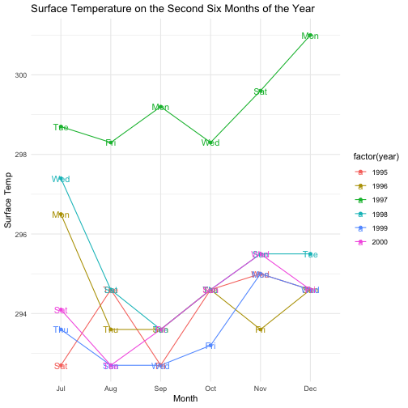

1. ** Describe what intervals, durations, periods, and instants are, and give one example for each that shows why we need these distinctions.**

- An interval is a span of time that occurs between two specific instants where an instant is a specific point in time such as todays's date or New Year (January first).  The length of an interval is never ambiguous, because we know when it occurs. An example of an interval is the span of today ("2019-02-11") and a year from now ("2020-02-11"). An interval is always recognized by its start and end time so that we can measure the interval as we have the start and end time.
- A duration is an interval without the start and end date. When recording a time span in seconds, there will be an exact length since seconds alyas have the same length and such time spancs are durations. Periods are similar to durations, but in larger units such as minutes or years. Since the length of these units varies over time, the exact length of the time span will depend on when it begins and they are called periods. An example is the seconds in three years from now on which might be changing due to leap year. An example for period is that to add two years to Janurary 1st in any year. Now if one of the following years happens to be a leap year, the answer will be different. Because, if we add  31,536,000 seconds ( the seconds of a usual year) to a leap year, we will get December 31st. But, using periods, we will exactly get a year from Janurary 1st.

2. **The ggplot2 package works seamlessy with lubridate. Find a data set with dates and/or times, use lubridate to work with the dates/times, then plot a time-related aspect of the data and describe it. **

I use the data set `nasa` which exists in R. This data comes from the ASA 2007 data expo, http://stat-computing.org/dataexpo/2006/. The data are geographic and atmospheric measures on a very coarse 24 by 24 grid covering Central America. The variables are: temperature (surface and air), ozone, air pressure, and cloud cover (low, mid, and high). All variables are monthly averages, with observations for Jan 1995 to Dec 2000. These data were obtained from the NASA Langley Research Center Atmospheric Sciences Data Cente.\
To get started with the data set and play around with the variable time, I picked two randomly chosen location x=10 and y=10 which are associated with longtitude and latitude (1.26087,	-91.26087). The variable time is in `POSIXct` format. So, I used `lubridate` and turned the dates into month of the year and days of the week by functions `month` and `wday` respectively. Note that, in this data set, the months already exist	in numeric format, but I need more than that in alphabetical format so that I can interpret the date more easily.
The plot of the surface temprature over time for the chosen location is as follows.\ 


data(nasa, package="GGally")
library(tidyverse)
library(lubridate)
nasa %>% filter(x==10, y==10) %>% 
  mutate(myear= month(date, label=TRUE), 
         wday=wday(date, label = TRUE)) %>% 
  ggplot(aes( x= myear, y = surftemp, group=year, colour = factor(year))) + 
  geom_point()+ geom_line()+
    xlab("Month")+ ylab("Surface Temp")


As seen in the plot, there is a natural drop in the surface temperature in the second half of each year. Therefore, it is noticeable to take a closer look on the first and second half of each year and see the variation in the surface temperature over time. Using `lubridate`, I can now easily filter over names of the months to get the first and second half of the year. We can also see which day of the week the data was recorded. 


nasa %>% mutate(myear= month(date, label=TRUE),
         wday=wday(date, label = TRUE)) %>% 
  filter(x == 10, y == 10, myear<= "Jun") %>%
  ggplot(aes( x= myear, y = surftemp, colour = factor(year), group=year)) + 
  geom_point()+geom_line()+
  geom_text(aes(x = myear, y = surftemp, label= wday))+ 
  ggtitle("Surface Temperature on the First Six Months of the Year")+
  xlab("Month")+ ylab("Surface Temp")


As we can see, the surface temperature over time usually tend to drop as approaching the cold months of the year, but in 1997 things were different and the surface temperature increased in the first six months. Looking at the plot for the surface temperature in the second half of the year, we see that in 1997 there was probably a climate change so that the surfae temperature was increasing. 


nasa %>% mutate(myear= month(date, label=TRUE),
         wday=wday(date, label = TRUE)) %>% 
  filter(x == 10, y == 10, myear> "Jun") %>%
  ggplot(aes( x= myear, y = surftemp, colour = factor(year), group=year)) + 
  geom_point()+geom_line()+
  geom_text(aes(x = myear, y = surftemp, label= wday))+ 
  ggtitle("Surface Temperature on the Second Six Months of the Year")+
  xlab("Month")+ ylab("Surface Temp")


