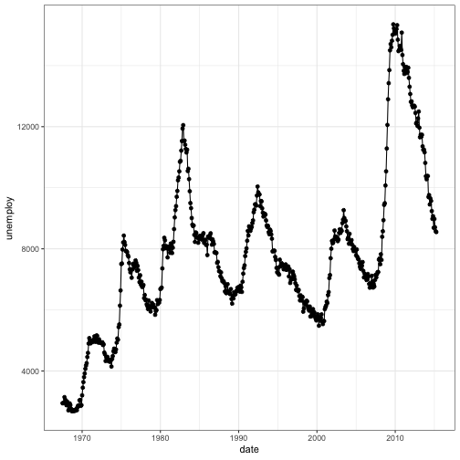
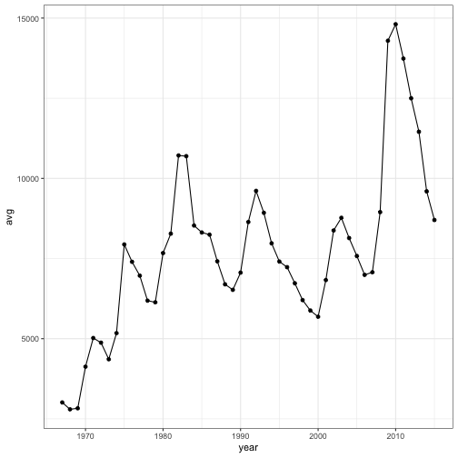

- Describe what intervals, durations, periods, and instants are, and give one example for each that shows why we need these distinctions.

*An instant is a specific point in time, like my date and time of birth, 7:38 pm on July 26th, 1995. An interval is the time between two specific instants. An example of an interval is the time I spent watching Grey's Anatomy last week, which started on February 8th at 8:30 pm and ended at 9:15 pm on the same date. An interval is always tied to a specific start and end time. In this case, we can measure the interval using a duration or a period since we know the exact beginning and end.*

*A duration and a period are similar, in that they are a length of time that is not necessarily associated with a given start or end time, but a duration is always of fixed length and a period may differ. For example, the musical RENT declares that a year is 525,600 minutes, but during some leap year or other unusual events, a minute may not always be 60 seconds, so that same 525,600 minutes may not be 525,600 x 60 = 3.1536 &times; 107 seconds depending on whether one of those minutes contained a leap second. We only know how many seconds are in a year if we know exactly which year to which we are referring.*

- The `ggplot2` package works seamlessy with lubridate. Find a data set with dates and/or times, use lubridate to work with the dates/times, then plot a time-related aspect of the data and describe it.

We use the economics dataset built into ggplot2 and plot the unemployment rate by month and by yearly average.


library(lubridate)
library(magrittr)



## 
## Attaching package: 'magrittr'



## The following object is masked from 'package:purrr':
## 
##     set_names



## The following object is masked from 'package:tidyr':
## 
##     extract



library(tidyverse)

data <- economics
data %<>% mutate(year = year(date))

ggplot(data, aes(x = date, y = unemploy)) +
  geom_point() + geom_line() +theme_bw()



data %>% group_by(year) %>% summarise(avg = mean(unemploy)) %>%
  ggplot(., aes(x = year, y = avg)) + geom_point() + geom_line() +theme_bw()


