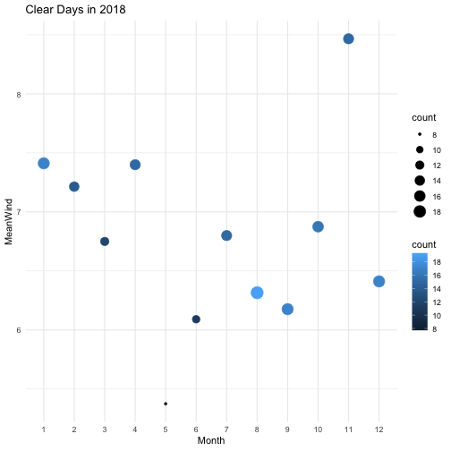

- Describe what intervals, durations, periods, and instants are, and give one example for each that shows why we need these distinctions.
-Instant: a specific time


library(lubridate)
library(tidyverse)
example_instant <- ymd_hms("2019-01-01 18:00:00")
is.instant(example_instant)



## [1] TRUE


-Intervals: the time between two specific times.


example_interval <- ymd_hms("2019-02-01 17:00:00") - ymd_hms("2019-01-01 18:00:00")
example_instant + example_interval



## [1] "2019-02-01 17:00:00 UTC"


-Durations: time span (interval) in specific unit "seconds".


example_duration <- as.duration(example_interval)
example_duration



## [1] "2674800s (~4.42 weeks)"


-Periods: time span (interval) in other units which are larger than seconds.


example_period <- as.period(example_interval)
example_period



## [1] "30d 23H 0M 0S"


- The `ggplot2` package works seamlessy with lubridate. Find a data set with dates and/or times, use lubridate to work with the dates/times, then plot a time-related aspect of the data and describe it.  


ames_weather <- read_csv("https://raw.githubusercontent.com/Stat585-at-ISU/materials-2019/master/data/Ames_weather_2017-2018.csv")



## Parsed with column specification:
## cols(
##   date = col_date(format = ""),
##   time = col_character(),
##   icon = col_integer(),
##   wind = col_integer(),
##   temp_low = col_integer(),
##   temp_high = col_integer(),
##   weather = col_character()
## )



ames_weather <- ames_weather %>%
  na.omit() %>%
  mutate(date = ymd(date),
         year = year(date),
         month = month(date),
         day = day(date))

ames_18 <-ames_weather %>%
  filter(year == 2018) %>%
  filter(weather == "Clear.") %>% 
  group_by(month) %>%
  summarize(
        count = n(),
        mean_wind = mean (wind))
ames_18 %>%
  ggplot(aes(x=as.factor(month),y=mean_wind,size = count,color = count)) + geom_point(position = "dodge") + labs (title = "Clear Days in 2018", x = "Month", y = "MeanWind" ) 



## Warning: Width not defined. Set with `position_dodge(width = ?)`


It looks like there is no relationship between the mean wind speed and the amount of clear days in every month.

