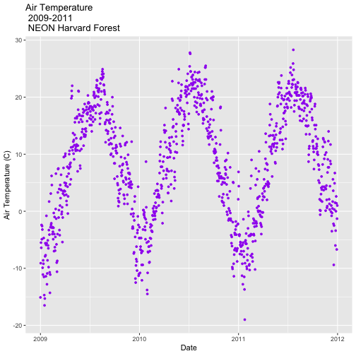

## Background:

Dates and times can be difficult to work with. Watch [this video](https://www.youtube.com/watch?v=-5wpm-gesOY) to appreciate all of the fun scenarios that date/time libraries have to accommodate. 

Luckily, the `lubridate` package makes working with dates and times in R pretty straightforward. The package has been described in the paper [Working with date and time](http://www.jstatsoft.org/v40/i03/) by Garrett Grolemund and Hadley Wickham, an updated version of an intro to lubridate can be found in chapter 16 of [R for Data Science](https://r4ds.had.co.nz/dates-and-times.html). Read one of the two sources.

Write a blog post addressing the questions:

- Describe what intervals, durations, periods, and instants are, and give one example for each that shows why we need these distinctions.


library(lubridate)


**Intervals:** Represent a starting and ending point.

We can create interval objects by subtracting two instants ot by using the command `new_interval()`.


start_2011 <- ymd_hms("2011-01-01 12:00:00")
start_2010 <- ymd_hms("2010-01-01 12:00:00")
span <- start_2011-start_2010
as.interval(difftime(start_2011, start_2010),ymd("2010-03-05"))



## [1] 2010-03-05 UTC--2011-03-05 UTC


**Durations:** Represent an exact number of seconds.

Duration objects can be easily created with the helper functions `dyears()`, `dweeks()`, `ddays()`, `dhours()`,`dminutes()`, and `dseconds()`.


as.duration(span)



## [1] "31536000s (~52.14 weeks)"


**Periods:** Represent human units like weeks or months.

We cannot compue exacrtly how long a period will be in seconds until we know when it occurs.However, we can still perform date-time calculations with periods.

We construct `period` objects with the helper functions `yeara()`, `months()`, `weeks()`, `days()`, `hours()`, `minutes()`, and `seconds()`.


months(3) + days(2)



## [1] "3m 2d 0H 0M 0S"


**Instants:** Represents a specific instant in time.

When we add or subtract a period to an instant, the period becomes anchored to the instant. The instant tells us when the period occurs, which allows us to calculate its exact length in seconds.


start_2012 <- ymd_hms("2012-01-01 12:00:00")
start_2012 + years(1)



## [1] "2013-01-01 12:00:00 UTC"


- The `ggplot2` package works seamlessy with lubridate. Find a data set with dates and/or times, use lubridate to work with the dates/times, then plot a time-related aspect of the data and describe it.  


library(lubridate) 
library(ggplot2)  
library(scales)   
library(gridExtra) 

# daily HARV met data, 2009-2011
harMetDaily.09.11 <- read.csv(
  file="NEON-DS-Met-Time-Series/HARV/FisherTower-Met/Met_HARV_Daily_2009_2011.csv",
  stringsAsFactors = FALSE)

# covert date to Date class
harMetDaily.09.11$date <- as.Date(harMetDaily.09.11$date)

# monthly HARV temperature data, 2009-2011
harTemp.monthly.09.11<-read.csv(
  file="NEON-DS-Met-Time-Series/HARV/FisherTower-Met/Temp_HARV_Monthly_09_11.csv",
  stringsAsFactors=FALSE
  )

# convert datetime from chr to date class & rename date for clarification
harTemp.monthly.09.11$date <- as.Date(harTemp.monthly.09.11$datetime)

# plot Air Temperature Data across 2009-2011 using daily data
AirTempDaily <- ggplot(harMetDaily.09.11, aes(date, airt)) +
           geom_point(na.rm=TRUE, color="purple", size=1) + 
           ggtitle("Air Temperature\n 2009-2011\n NEON Harvard Forest") +
           xlab("Date") + ylab("Air Temperature (C)")

# render the plot
AirTempDaily


