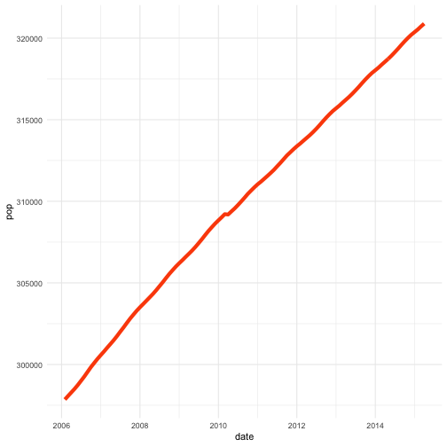
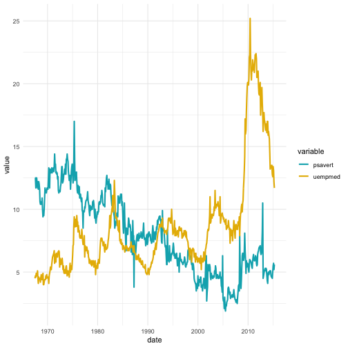

Write a blog post addressing the questions:

- Describe what intervals, durations, periods, and instants are, and give one example for each that shows why we need these distinctions.


# An instant is a specific moment in time. Any date-time object that refers to a moment of time is recognized as an instant.
library(lubridate)

now_dt <- ymd_hms(now(), tz="IST")



## Error in C_force_tz(time, tz = tzone, roll): CCTZ: Unrecognized output timezone: "IST"



now_dt



## Error in eval(expr, envir, enclos): object 'now_dt' not found



is.instant(now_dt)



## Error in is.instant(now_dt): object 'now_dt' not found



## [1] TRUE



# Intervals are simplest way of recording timespans in lubridate. An interval is a span of time that occurs between two specific instants.
today_start <- ymd_hms("2018-07-22 12-00-00", tz="IST")



## Error in C_force_tz(time, tz = tzone, roll): CCTZ: Unrecognized output timezone: "IST"



today_start



## Error in eval(expr, envir, enclos): object 'today_start' not found



## [1] "2016-07-22 12:00:00 IST"
today_end <- ymd_hms("2018-07-22 23-59-59", tz="IST")



## Error in C_force_tz(time, tz = tzone, roll): CCTZ: Unrecognized output timezone: "IST"



today_end



## Error in eval(expr, envir, enclos): object 'today_end' not found



## [1] "2016-07-22 23:59:59 IST"
# create interval using interval() function
span <- interval(today_start, today_end)



## Error in tz(start): object 'today_start' not found



## [1] 2018-07-22 12:00:00 IST--2018-07-22 23:59:59 IST



# Durations measure the exact amount of time that occurs between two instants.
duration(2, "minutes")



## [1] "120s (~2 minutes)"



## [1] "120s (~2 minutes)"
# Durations can be created from intervals.
as.duration(span)



## [1] "31536000s (~52.14 weeks)"



# Periods measure the change in clock time that occurs between two instants.Unlike durations, periods can be used to accurately model clock times without knowing when events such as leap seconds, leap days, and DST changes occur.
period(6, "months")



## [1] "6m 0d 0H 0M 0S"



## [1] "6m 0d 0H 0M 0S"


- The `ggplot2` package works seamlessy with lubridate. Find a data set with dates and/or times, use lubridate to work with the dates/times, then plot a time-related aspect of the data and describe it.  


library(ggplot2)
theme_set(theme_minimal())
head(economics)



## # A tibble: 6 x 6
##   date         pce    pop psavert uempmed unemploy
##   <date>     <dbl>  <int>   <dbl>   <dbl>    <int>
## 1 1967-07-01  507. 198712    12.5     4.5     2944
## 2 1967-08-01  510. 198911    12.5     4.7     2945
## 3 1967-09-01  516. 199113    11.7     4.6     2958
## 4 1967-10-01  513. 199311    12.5     4.9     3143
## 5 1967-11-01  518. 199498    12.5     4.7     3066
## 6 1967-12-01  526. 199657    12.1     4.8     3018



ss <- subset(economics, date > as.Date("2006-1-1"))
a=ggplot(data = ss, aes(x = date, y = pop)) + 
  geom_line(color = "#FC4E07", size = 2)
a



library(tidyverse)
df <- economics %>%
  select(date, psavert, uempmed) %>%
  gather(key = "variable", value = "value", -date)



## Error in select(., date, psavert, uempmed): unused arguments (date, psavert, uempmed)



head(df, 3)



## # A tibble: 3 x 3
##   date       variable value
##   <date>     <chr>    <dbl>
## 1 1967-07-01 psavert   12.5
## 2 1967-08-01 psavert   12.5
## 3 1967-09-01 psavert   11.7



b=ggplot(df, aes(x = date, y = value)) + 
  geom_line(aes(color = variable), size = 1) +
  scale_color_manual(values = c("#00AFBB", "#E7B800")) +
  theme_minimal()
b


## Instructions:
Update your forked repo of `blog-2019`. 

To make your life easier, create an RStudio project on your local machine that is linked to your github repo. 

Save a **copy** of this file, replacing "Lastname" and "Firstname" with your own and *leave the original unedited*.

In **your copy**, replace the `title:` and `author:` fields in the YAML above, while leaving the remaining fields intact. Remove the background and the instructions sections and write your blog post!

Push the changes from your local machine to your github repo. 

Once you are done, **create a pull request** to upload your changes to the original repository!

