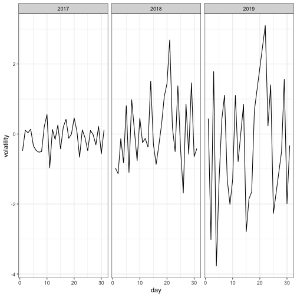
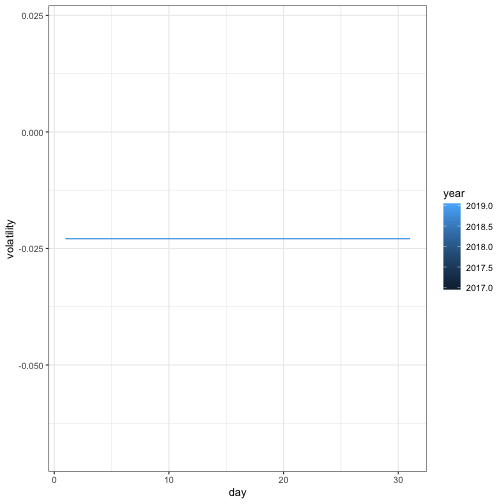

Write a blog post addressing the questions:

- Describe what intervals, durations, periods, and instants are, and give one example for each that shows why we need these distinctions.

    -instants: An instant is a specic moment in time, such as January 1st, 2012. We create an instant each
      time we parse a date into R.
      
    -intervals: An interval is a span of time that occurs between two specic instants. The
      length of an interval is never ambiguous, because we know when it occurs. Moreover, we can
      calculate the exact length of any unit of time that occurs during it
      start_2011 <- ymd_hms("2011-01-01 12:00:00")
      start_2010 <- ymd_hms("2010-01-01 12:00:00")
      span <- start_2011 - start_2010
      2010-01-01 12:00:00 -- 2011-01-01 12:00:00
      
    -Duration: time span in an interval is duration which can be defined in sec, min or hour

    -period: Since the length of DURATION units varies over time, the exact length of
    the time span will depend on when it begins. These non-exact time spans are called periods
  
- The `ggplot2` package works seamlessy with lubridate. Find a data set with dates and/or times, use lubridate to work with the dates/times, then plot a time-related aspect of the data and describe it.


#KAGGLE DATA FOR DOWJONES STOCK PRICES
url = "https://api.iextrading.com/1.0/stock/aapl/chart/5y?format=csv"

x = read.csv(file=url)
X$date <- lubridate::as_date(X$date)



## Error in lubridate::as_date(X$date): object 'X' not found



x$year <- lubridate::year(x$date)
x$month <- lubridate::month(x$date)
x$day <- lubridate::day(x$date)
#price volatility in each day of 2019

x<-x%>%group_by(year,day)%>%mutate(volatility=mean(open-close))
x%>%filter(year %in% c(2017:2019))%>%ggplot(aes(x=day,y=volatility,fill=(year)))+geom_line() +theme_bw()+facet_grid(~year,scales = "free") 



x%>%filter(year %in% c(2017:2019))%>%ggplot(aes(x=day,y=volatility, colour=year,group=year))+geom_line() +theme_bw()



#graoh shows volatility of prices in Dow jones stock market in data set provided by kaggle is highly volatile in 2019

