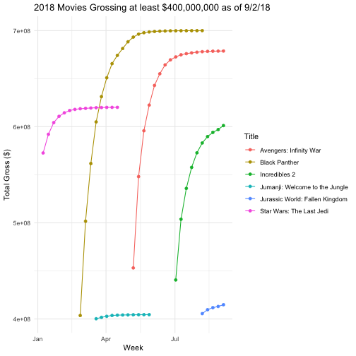

## Background:

The `lubridate` package makes working with dates and times in R pretty straightforward. The package has been described in the paper [Working with date and time](http://www.jstatsoft.org/v40/i03/) by Garrett Grolemund and Hadley Wickham, an updated version of an intro to lubridate can be found in chapter 16 of [R for Data Science](https://r4ds.had.co.nz/dates-and-times.html). Read one of the two sources.

Write a blog post addressing the questions:

- Describe what intervals, durations, periods, and instants are, and give one example for each that shows why we need these distinctions.

  **Intervals:** Represent a starting and ending point. Intervals are useful if we want to know how long a particular span of time is in "human" units (weeks,months,etc). For example, if we wanted to know the number of days between January 1st, 2016 (a leap year) and January 1st, 2017. Durations lack the human unit aspect of intervals while periods lack the knowledge of specific characteristics of the start/end times (e.g., whether they are in a leap year).
  **Durations:** Represent an exact number of seconds. Durations are useful if we care to know the amount of physical time in a span. For example, the number of seconds between today (February 5th, 2019) and 3 years ago. Depending on which 3 year span is being considered, leap years may affect the physical amount of time in the span. Durations take this into account.
  **Periods:** Represent human units like weeks or monthhs. Periods adhere more to our intuition of how "date arithmetic" might work than intervals or durations do. For example, if we were to add one year to January 1st, 2016 0:00, it may make more intuitive sense that we should get back January 1st, 2017 0:00. This is precisely what period arithmetic returns. However, in reality, if we were to treat a year exactly 31,536,000 seconds (as a duration would), then adding a year to January 1st 2016 0:00 would actually return December 31st, 2016 because 2016 was a leap year. This is the key difference between durations and periods.
  **Instants:** Represents a specific instant in time. While intervals, durations, and periods all represent spans of time, it is obviously useful to also be able to work with single times as well. For example, if were interested to know the instant that was exactly 1 year (31,536,000 seconds) after January 1st, 2016 12:00.

- The `ggplot2` package works seamlessy with lubridate. Find a data set with dates and/or times, use lubridate to work with the dates/times, then plot a time-related aspect of the data and describe it.  

  The mojo dataset contains box office data for each week through September 2nd, 2018. Suppose we were interested in looking at the box office trends for the highest growwing movies of 2018. While the original dataset has a separate column for Year and week number (WeekNo), it would be useful for visualization purposes to put this information together as a date dataype. To do so, I first mutated the Year column to include January 1st as the month/day so that it could be convereted into a date datatype. It just so happens that January 1st, 2018 was a Monday. My goal was to then create a column, weekStart, that contained the date of the Monday of the week represented by the WeekNo column (the dataset seems to treat a weekend as Friday-Sunday, so I thought it better to treat Monday as the start of a week). To create this column, I added to the Year column 7 times the week number, which results in the number of days that elapsed between January 1st, 2018 and the Monday of the week represented by the WeekNo column. Following this, I simply filtered the dataset to only include rows whose Total Gross exceeded $400,000,000, a cut-off that was chosen after playing with a few values. Using ggplot(), I plotted the weekStart variable against the Total Gross for each row left in this filtered dataset and colored based on the movie Title for ease of interpretability. As can be seed in the plot, the movie Black Panther visually appears to have changed the most drastically over its time in theaters. However, this plot doesn't show the full picture due to the filtering by year and total gross.


library(tidyverse)
library(lubridate)

library(classdata)
data("mojo")

mojo %>%
  filter(Year == 2018) %>%
  mutate(Year = ymd(paste(Year,"1/1",sep = "/"))) %>% 
  mutate(weekStart = Year + days(7*WeekNo)) %>% #Add a weekStart column representing the Monday of each week
  filter(`Total Gross` > 400000000) %>% #Filter out movies that haven't grossed more than $400,000,000
  ggplot(aes(x=weekStart,y=`Total Gross`,colour=Title)) + 
    geom_point() +
    geom_line() +
    xlab("Week") + 
    ylab("Total Gross ($)") + 
    ggtitle("2018 Movies Grossing at least $400,000,000 as of 9/2/18")


