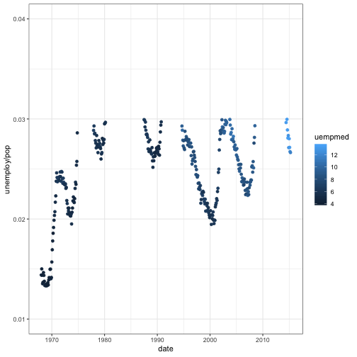

## 1. Describe what intervals, durations, periods, and instants are, and give one example for each that shows why we need these distinctions.

    
Instant: a specific moment in time.


 now <- now()
 now



## [1] "2019-02-15 12:13:54 CST"



 is.instant(now)



## [1] TRUE

  
  
Duration: an exact number of seconds. It is a generic time span measuring the length of time so it can add to any date.


duration <- duration(240)
duration



## [1] "240s (~4 minutes)"



then <- now + duration
then



## [1] "2019-02-15 12:17:54 CST"



is.duration(duration)



## [1] TRUE



is.duration(then)



## [1] FALSE

    
Interval: a specific duration with a starting point. So it is a span of time that occurs between two specific instants and it cannot be used for calculations.


ymd_hms(then) - ymd_hms(now)



## Time difference of 4 mins



is.interval(ymd_hms(then) - ymd_hms(now))



## [1] FALSE



intvl <- interval(ymd_hms("2019-01-01 12:00:00"),ymd_hms("2018-01-01 12:00:00"))
intvl



## [1] 2019-01-01 12:00:00 UTC--2018-01-01 12:00:00 UTC



is.interval(intvl)



## [1] TRUE

    
Period: human units for a time span like weeks and months.


as.period(intvl)



## [1] "-1y 0m 0d 0H 0M 0S"


These different terms may play different roles in our analysis work. Instant is like a basic element to store a specific time, and we can use period to help us read the length of the time. Duration is helpful for calcualtions and interval is directly related to a specific event which has starting and ending time.

## 2. The `ggplot2` package works seamlessy with lubridate. Find a data set with dates and/or times, use lubridate to work with the dates/times, then plot a time-related aspect of the data and describe it. 


data(economics)
head(economics)



## # A tibble: 6 x 6
##   date         pce    pop psavert uempmed unemploy
##   <date>     <dbl>  <int>   <dbl>   <dbl>    <int>
## 1 1967-07-01  507. 198712    12.5     4.5     2944
## 2 1967-08-01  510. 198911    12.5     4.7     2945
## 3 1967-09-01  516. 199113    11.7     4.6     2958
## 4 1967-10-01  513. 199311    12.5     4.9     3143
## 5 1967-11-01  518. 199498    12.5     4.7     3066
## 6 1967-12-01  526. 199657    12.1     4.8     3018



dat <- economics
dat %>% 
  mutate(year = year(date), month = month(date), day = day(date)) %>% 
  filter(year > 1967) %>% 
  filter(unemploy/pop <= mean(unemploy/pop)) %>% 
  ggplot(., aes(x=date, y=unemploy/pop)) + 
  geom_point(aes(colour=uempmed)) +
  theme_bw() + ylim(0.01, 0.04)



  labs(y = "unemployment rate", colour = "Median time for \n unemployment")



## $y
## [1] "unemployment rate"
## 
## $colour
## [1] "Median time for \n unemployment"
## 
## attr(,"class")
## [1] "labels"


We filter out 1967 since it only has data for half of the year. This plot trys to find those times with rather low unemployment rate and short period of unemployment. We can see there are fluctuations for the unemployment rate with the time, and the lasting time for unemployment tends to increase.

