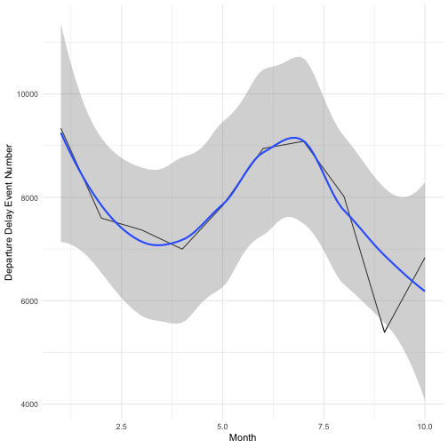
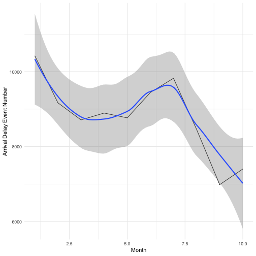

## Background:

Dates and times can be difficult to work with. Watch [this video](https://www.youtube.com/watch?v=-5wpm-gesOY) to appreciate all of the fun scenarios that date/time libraries have to accommodate. 

Luckily, the `lubridate` package makes working with dates and times in R pretty straightforward. The package has been described in the paper [Working with date and time](http://www.jstatsoft.org/v40/i03/) by Garrett Grolemund and Hadley Wickham, an updated version of an intro to lubridate can be found in chapter 16 of [R for Data Science](https://r4ds.had.co.nz/dates-and-times.html). Read one of the two sources.

Write a blog post addressing the questions:

- Describe what intervals, durations, periods, and instants are, and give one example for each that shows why we need these distinctions.

I will explain these definations with some example from the package 'Lubridata'.


library(lubridate)
library(tidyverse)


- Instant is a specific moment in time line.


is.instant(as.Date("2009-08-03"))



## [1] TRUE



is.timepoint(5) 



## [1] FALSE

- Interval is a time range, bounded by a stating time and ending time.


diff <- make_difftime(days = 31) #difftime
as.interval(diff, ymd("2009-01-01"))



## [1] 2009-01-01 UTC--2009-02-01 UTC



as.interval(diff, ymd("2009-02-01"))



## [1] 2009-02-01 UTC--2009-03-04 UTC


- Duration is about the exact time (seconds) in a time span.


span <- interval(ymd("2009-01-01"), ymd("2009-08-01")) #interval
as.duration(span)



## [1] "18316800s (~30.29 weeks)"


- Period is a specified measurement unit for time, such as one year, one month etc.


leap <- interval(ymd("2016-01-01"), ymd("2017-01-01"))
as.period(leap, unit = "days")



## [1] "366d 0H 0M 0S"



as.period(leap, unit = "years")



## [1] "1y 0m 0d 0H 0M 0S"


- The `ggplot2` package works seamlessy with lubridate. Find a data set with dates and/or times, use lubridate to work with the dates/times, then plot a time-related aspect of the data and describe it.  

I use the NYC-flights14 data from https://raw.githubusercontent.com/Rdatatable/data.table/master/vignettes/flights14.csv


dat<-read.csv(file='https://raw.githubusercontent.com/Rdatatable/data.table/master/vignettes/flights14.csv')
dat %>% mutate(date = ymd(sprintf('%04d%02d%02d', year, month, day))) %>%  select(-year,-month,-day) %>% mutate(month = month(date)) -> dat


We set the delay time above 5 as an event. Then we compare the departure delay event and arrival delay event among the monthes.


dat %>% mutate(Dep_delay_event = dep_delay>5, Arr_delay_event = arr_delay>5) -> dat
dat %>% group_by(month) %>% summarise(Dep_delay_event_number = sum(Dep_delay_event)) -> Dep_Event
dat %>% group_by(month) %>% summarise(Arr_delay_event_number = sum(Arr_delay_event)) -> Arr_Event
ggplot(Dep_Event,aes(x=month,y=Dep_delay_event_number)) + geom_line()+stat_smooth()+ xlab('Month') + ylab('Departure Delay Event Number')



## `geom_smooth()` using method = 'loess' and formula 'y ~ x'



ggplot(Arr_Event,aes(x=month,y=Arr_delay_event_number)) + geom_line()+stat_smooth()+ xlab('Month') + ylab('Arrival Delay Event Number')



## `geom_smooth()` using method = 'loess' and formula 'y ~ x'


From the plots, we can see for both delay events, Jan. and July are two peak months, while in Sept. and Oct. there are fewer delay events
