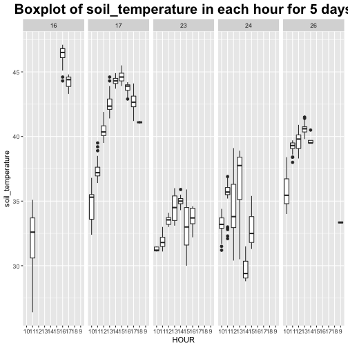
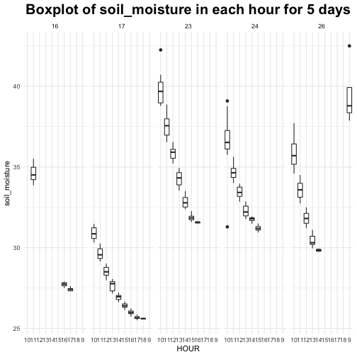


library(tidyverse)
library(lubridate)


 

#### **Describe what intervals, durations, periods, and instants are, and give one example for each that shows why we need these distinctions.**

- **intervals**
  
  Intervals represent a starting and ending point. An interval is a duration with a starting point: that makes it precise so you can determine exactly how long it is. An example for intervals is `"2019-02-07 UTC--2020-02-07 UTC"`


next_year <- today() + years(1)
today() %--% next_year



## [1] 2019-02-15 UTC--2020-02-15 UTC


- **durations**

  Durations represent an exact number of seconds. An example for durations is `"1814400s (~3 weeks)"`


dweeks(3)



## [1] "1814400s (~3 weeks)"


- **periods**

  Periods represent "human" times, like hours, days and months. An example for periods is `"60m 10d 0H 0M 0S"`


10 * (months(6) + days(1))



## [1] "60m 10d 0H 0M 0S"


- **instants**

  Instants represent a point in time. There are three types of date/time data: a date, a time within a day and data-time. An example for instants is  `"2017-01-31 20:11:59 UTC"`


ymd_hms("2017-01-31 20:11:59")



## [1] "2017-01-31 20:11:59 UTC"


#### **The `ggplot2` package works seamlessy with lubridate. Find a data set with dates and/or times, use lubridate to work with the dates/times, then plot a time-related aspect of the data and describe it.**  

I will apply `lubridate` and `ggplot2` to plot some summay plots based on the data  "Hyperspectral benchmark dataset on soil moisture"  

This dataset was measured in a five-day field campaign in May 2017 in Karlsruhe, Germany. An undisturbed soil sample is the centerpiece of the measurement setup. The soil sample consists of bare soil without any vegetation and was taken in the area near Waldbronn, Germany. It contains 679 obs. of 129 variables. Column 2 is datetime: date and time of the measurement; Column 3 is soil moisture; Column 4 is soil temperature; Column 5- 129 is the data for 125 spectral bands, respectively.

 
Reference:

Riese, Felix M. and Keller, Sina. (2018). Hyperspectral benchmark dataset on soil moisture (Version v1.0.3) [Data set]. Zenodo. http://doi.org/10.5281/zenodo.1227836

https://github.com/felixriese/hyperspectral-soilmoisture-dataset


#Hyperspectral benchmark dataset on soil moisture

dataurl <- "https://raw.githubusercontent.com/felixriese/hyperspectral-soilmoisture-dataset/master/soilmoisture_dataset.csv"

soil <- read_csv(dataurl)



## Parsed with column specification:
## cols(
##   .default = col_double(),
##   index = col_integer(),
##   datetime = col_datetime(format = "")
## )



## See spec(...) for full column specifications.



mydata <- soil %>%
  mutate(HOUR = as.factor(as.character(hour(datetime)))) %>%
  mutate(DAY = as.factor(as.character(day(datetime)))) %>% 
  select(HOUR, DAY, soil_temperature, soil_moisture)



## Error in select(., HOUR, DAY, soil_temperature, soil_moisture): unused arguments (HOUR, DAY, soil_temperature, soil_moisture)



mydata %>% ggplot(aes(y=soil_temperature, x = HOUR)) +
  geom_boxplot()+ facet_grid(cols = vars(DAY))  +
  ggtitle("Boxplot of soil_temperature in each hour for 5 days") +
  theme(plot.title = element_text(hjust = 0.5,size = 20, face = "bold"))



mydata %>% ggplot(aes(y=soil_moisture, x = HOUR)) +
  geom_boxplot()+ facet_grid(cols = vars(DAY))  +
  ggtitle("Boxplot of soil_moisture in each hour for 5 days") +
  theme(plot.title = element_text(hjust = 0.5,size = 20, face = "bold"))


