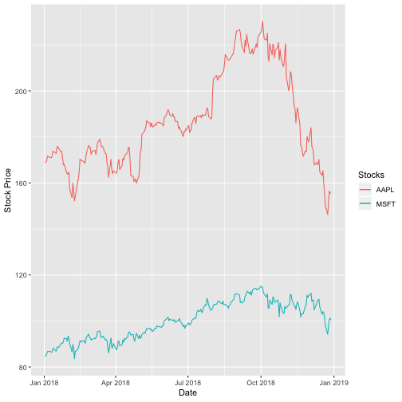
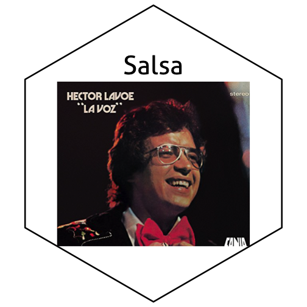

## Background:

Image files come in all kinds of formats. There's png, tiff, svg, pdf, just to name a few. What's the difference, and how can we work with them?

Reading: 

  - Identify online sources to read up on differences between image file formats. 

  - The `magick` package allows us to work with raster images in R. Read through the  [magick vignette](https://cran.r-project.org/web/packages/magick/vignettes/intro.html) to learn about the package's functionality.

Write a blog post answering the following questions and detailing the progress: 

1. **Describe the difference between formats png, svg, and pdf. State your sources with (working!) links (take a look at the RMarkdown cheatsheet for RStudio to learn how to make working links). Make one plot in ggplot2 and save it (using R code) in each of the three file formats you discussed. Comment on the differences you observe in their usage.**

I use the source, which can be found [here](https://www.95visual.com/blog/svg-pdf-jpg-png-whats-the-difference)

*SVG*
Scalable Vector Graphics (SVG), is an XML-based vector image format for two-dimensional graphics with support for interactivity and animation. SVG images can be open in any web browser and this format is suitable for web pages such as smart phone.

*PDF*
Portable Document File (PDF), is a file format that includes text formatting and images, in a manner independent of application software, hardware, and operating systems. The link can be embedded in the document and the file size are usually smaller than other graphic files.

*PNG*
Portable Network Graphics (PNG), is an open format that could be an alternative to the GIF format, but with  better quality than GIF. It is widely used on websites.


## Here we read the data
stocks.data <- read.csv('https://raw.githubusercontent.com/oscarm524/DataSets/master/stock_data.csv')

## Here we convert factor into date
stocks.data <- stocks.data %>% mutate(Date = as.Date(as.character(Date)))
stocks.data %>% head



##         Date AAPL.Adjusted MSFT.Adjusted
## 1 2018-01-02      168.9873      84.48741
## 2 2018-01-03      168.9579      84.88061
## 3 2018-01-04      169.7427      85.62768
## 4 2018-01-05      171.6753      86.68930
## 5 2018-01-08      171.0376      86.77776
## 6 2018-01-09      171.0180      86.71879


We first plot the adjusted close price over time for both stocks. 


plot <- ggplot(stocks.data, aes(Date)) + 
        geom_line(aes(y = AAPL.Adjusted, color = "AAPL")) +    
        geom_line(aes(y = MSFT.Adjusted, color = 'MSFT')) + 
        labs(color = 'Stocks') + labs(y = 'Stock Price')
plot        


Here we save the plot using the three different formats.


## Here we save the plot as pdf file
ggsave(file = 'plot.pdf')



## Saving 7 x 7 in image



## Here we save the plot as png file
ggsave(file = 'plot.png')



## Saving 7 x 7 in image



## Here we save the plot as svg file
ggsave(file =  'plot.svg')



## Saving 7 x 7 in image


2. **Use `magick` functionality to create an image to be used for a hex sticker.**  package `hexSticker` can help you to get started on dimensions of the sticker. **Include all code necessary to produce your sticker.** In case you are using local images, post those in a folder on **your** website and use the URL to link to them.

I decided to create a sticker with a picture of Hector Lavoe one of the best Puerto Rican salsa singers.


library(magick)
library(tidyverse)
library(hexSticker)

hector <- image_read('https://oscarm524.github.io/hector1.jpg') %>% image_crop(geometry_area(480, 410))

hector_sticker <- sticker(hector, package = "Salsa", p_size = 15, p_color = 'black', p_y = 1.6, s_x = 1, s_y = 0.93, s_width = 1.3, s_height = 1.4, h_fill = "white", h_color = "black")

hector_sticker



## Here we include the sticker just in case
knitr::include_graphics('https://oscarm524.github.io/salsa.png')


