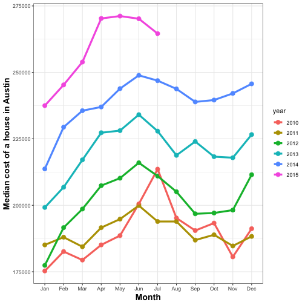
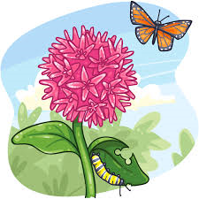
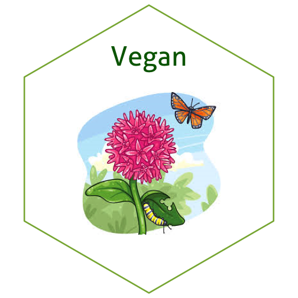

## Background:

Image files come in all kinds of formats. There's png, tiff, svg, pdf, just to name a few. What's the difference, and how can we work with them?

Reading: 

  - Identify online sources to read up on differences between image file formats. 

  - The `magick` package allows us to work with raster images in R. Read through the  [magick vignette](https://cran.r-project.org/web/packages/magick/vignettes/intro.html) to learn about the package's functionality.

Write a blog post answering the following questions and detailing the progress: 

1. **Describe the difference between formats png, svg, and pdf. State your sources with (working!) links (take a look at the RMarkdown cheatsheet for RStudio to learn how to make working links). Make one plot in ggplot2 and save it (using R code) in each of the three file formats you discussed. Comment on the differences you observe in their usage.**

  PNG, SVG, and PDF are all different file formats for saving images. PNG (Portable Netowrk Graphics) files are a type of raster image. Raster images are made up of a rectangular grid of pixels or color dots. This means that the quality of the PNG image is dependent on its resolution of its pixels (i.e. how many pixels make up the image) and that the image cannot be scaled to a higher resolution without losing quality.  
  
  SVG (Scalable Vector Graphics) files, conversely, are a type of vector image, which are made up of points, lines, and equations underlying those shapes. This means SVG files can have a smooth resolution at any size ([Source](https://guides.lib.umich.edu/c.php?g=282942&p=1885352) for information on both file formats). 
  
  PDF (Portable Document Format) files are formatted to be able to display equally across various software platforms. PDFs can store both raster and vector graphics by saving the location of each item on the page. Usually pdf files are not created from scratch, but rather are generated from other applications like Microsoft Word ([Source](https://techterms.com/definition/pdf)). 
  


#example of a ggplot saved to each file format
library(tidyverse)
library(ggplot2)
library(lubridate)

# plot of median house prices in Austin, Texas for 2010-2015

tx <- txhousing %>%
  mutate(month_year = make_date(year = year, month = month))%>%
  mutate(month = month(month_year, label = TRUE))%>%
  mutate(year = as.factor(year))%>%
  filter(city == "Austin", year %in% c(2010:2015))%>%
  ggplot(aes(x = month, y = median, color = year, group = year))+
  geom_point(size = 3)+
  geom_path(size = 1.5)+
  theme_bw()+
  xlab("Month")+
  ylab("Median cost of a house in Austin")+
  theme(axis.title = element_text(size = 14, face = "bold"))
tx



# saving to different formats - assuming this saves to the working directory
# I'm commenting this out so that they don't clog up your file directory

# ggsave("tx.pdf")
# ggsave("tx.png")
# library(svglite)
# ggsave("tx.svg")


It appears that the pdf is the smallest file while the png is 10x larger. The svg file is somewhere in the middle. This is good information to know - depending on my purpose it'll change what time of file I send to collegues. 

2. **Use `magick` functionality to create an image to be used for a hex sticker.**  package `hexSticker` can help you to get started on dimensions of the sticker. **Include all code necessary to produce your sticker.** In case you are using local images, post those in a folder on **your** website and use the URL to link to them.


library(magick)
butterfly <- image_read('https://lydiapenglish.github.io/butterfly.png')
print(butterfly)



## # A tibble: 1 x 7
##   format width height colorspace matte filesize density
##   <chr>  <int>  <int> <chr>      <lgl>    <int> <chr>  
## 1 PNG      225    225 sRGB       TRUE    103507 57x57



library(hexSticker)
p <- sticker(butterfly, package = "Vegan", p_color = "darkgreen", h_fill = "white", s_width = 1.2, s_height = 1, s_x = 1, s_y = 0.9, p_x = 1, p_y = 1.65, p_size = 16)
plot(p)


