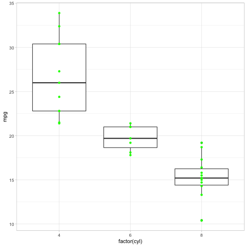

**1. Describe the difference between formats png, svg, and pdf. State your sources with (working!) links (take a look at the RMarkdown cheatsheet for RStudio to learn how to make working links). Make one plot in ggplot2 and save it (using R code) in each of the three file formats you discussed. Comment on the differences you observe in their usage.**

My reference: <https://www.95visual.com/blog/svg-pdf-jpg-png-whats-the-difference>

The format **SVG** is vector image which doesn't lose quality when compressed or streched. Format **PDF** can be both vector image or raster image. **PNG** is roster image.

**PDF** and **PNG** tend to produce larger files than other formats. However, when the element of image increases, the file size can increase rapidly for **SVG**. Different sub-formats of PNG also have different sizes.(However, my PDF file is quite small...)

**PDF** files can be friendly to be printed. **SVG** is suited for high pixel density device and can be edited by CSS when creating a website. **PNG** supports transparency and fading effect etc.

**PDF** format don't compress image. And it's suitable for text and graphic mixed document.And it is easy to share.


library(tidyverse)
library(magick)
library(hexSticker)

p <- mtcars %>%
  ggplot(aes(x = factor(cyl), y = mpg)) + 
  geom_boxplot() + 
  geom_point(color = "green") + 
  theme_light()

p



#ggsave(file="p.svg", plot=p, width=10, height=10)
#ggsave(file="p.png", plot=p, width=10, height=10)
#ggsave(file="p.pdf", plot=p, width=10, height=10)


Acoording to my plot and its saved files, the size of the file increases in the order: PDF, SVG, PNG (5-45KB). And I can't distinguish the quality diferences. But obviously, vector image is quite stable when stretched and PDF is suitable for print and share.

**2. Use magick functionality to create an image to be used for a hex sticker. package hexSticker can help you to get started on dimensions of the sticker. Include all code necessary to produce your sticker. In case you are using local images, post those in a folder on your website and use the URL to link to them.**

My blog site: <https://yaweige.github.io>


picture <- image_read("https://yaweige.github.io/post/2019-03-11-picture-for-blog8_files/picture.jpg")

picture <- picture %>% 
  image_crop("700x800+0+600") %>%
  image_scale("400x400") %>%
  image_convolve('Sobel') %>%
  image_negate() 

#sticker(picture, s_x = 1, s_width = 0.95, s_height = 0.95, package = "elephant", p_color = "black", p_size = 15, h_color = "black", h_fill = "white")
knitr::include_graphics("https://yaweige.github.io/post/stickers/elephant.png")


