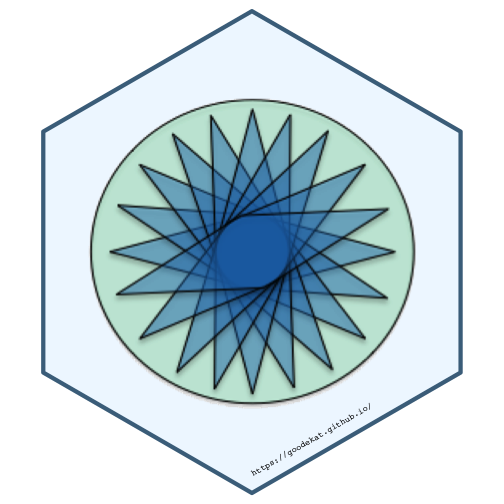

### Question 1 

**Describe the difference between formats png, svg, and pdf. State your sources with (working!) links (take a look at the RMarkdown cheatsheet for RStudio to learn how to make working links). Make one plot in ggplot2 and save it (using R code) in each of the three file formats you discussed. Comment on the differences you observe in their usage.**

I read through the articles at [logaster](https://www.logaster.com/blog/jpg-png-svg-pdf-formats/) and [95visual](https://www.95visual.com/blog/svg-pdf-jpg-png-whats-the-difference) about the differences between file formats. In general, the file formats differ based on the way in which the image is created and the detail in which the image is captured.

##### png

png files are a type of raster image, which means that they are made up of pixels. They are a high quality file, and as a result, they  take up a decent amount storage. They also support transparency in parts of the image. png files are often used for images on websites.

##### svg

svg files are a type of vector image, which are composed of control points with curves in between them instead of pixels. This makes svg files not as good at showing transitions of colors, but it does allow for the quality of the image to remain the same if the size of the image changes. It also means that the file size is not as large as an image in a raster format. svg files are often used for logo graphics.

##### pdf

pdf files can contain either raster or vector images, and text can be included in them. They can be recognized by many software problems. When an image is embedded in a pdf, the file size is often smaller than when the image is saved on its own. In general, pdf files are very versatile.

##### Creating and Saving a Plot in R

The code below creates an image based on a random sample of 900 draws from the values 1, 2,..., 10. The rendering of the plot is shown below.


# Load the tidyverse
library(tidyverse)

# Set a seed
set.seed(20190311)

# Create a vector of probabilities to assign to the values of 1 to 10
probs <- c(0.1, 0.0525, 0.1, 0.00625, 0.3, 0.3, 0.0125, 0.00625, 0.5, 0.175)

# Sample the values and create the plot
plot <- data.frame(fill = sample(factor(1:10), 900, replace = TRUE, prob = probs), 
           xgroup = factor(1:30),
           ygroup = factor(rep(1:30, each = 30))) %>%
  ggplot(aes(x = xgroup, y = ygroup, fill = fill)) + 
  geom_tile() + 
  theme_void() +
  theme(legend.position = "none") +
  gretchenalbrecht::scale_fill_gretchenalbrecht(palette = "last_rays", discrete = TRUE)



## Error in loadNamespace(name): there is no package called 'gretchenalbrecht'



# View the plot
plot


The code below saves the image as png, svg, and pdf files. I have set it not to compile (anymore). When I tried opening the files on my computer, I could view both the png and pdf files, but the svg file opened in RStudio as a file with a lot of text that was meaningless to me. The size of the files were as follows.

- png: 139.2 KB
- svg: 122.3 KB
- pdf: 7.6 KB

The png file was the largest, and the pdf was much smaller than the other two files.


# Save the plot as png, svg, and pdf files
ggsave(file = "plot.png", plot = plot, width = 10, height = 8)
ggsave(file = "plot.svg", plot = plot, width = 10, height = 8)
ggsave(file = "plot.pdf", plot = plot, width = 10, height = 8)


### Question 2

**Use [`magick`](https://cran.r-project.org/web/packages/magick/vignettes/intro.html) functionality to create an image to be used for a hex sticker. package `hexSticker` can help you to get started on dimensions of the sticker. Include all code necessary to produce your sticker. In case you are using local images, post those in a folder on your website and use the URL to link to them.**

I made a logo for my website, and I created a sticker using this logo.


# Load libraries
library(hexSticker)
library(magick)

# Load in the logo
star <- knitr::include_graphics("https://goodekat.github.io/images/star.png") %>% 
  image_read() %>%
  image_convert("svg")

# Make the sticker
star_sticker <- sticker(star, 
                        package = "",
                        s_x = 1, s_y = 1, 
                        s_width = 1.5,
                        s_height = 1.5, 
                        h_fill = "aliceblue",
                        h_color = "skyblue4",
                        h_size = 2,
                        url = "https://goodekat.github.io/",
                        u_size = 3,
                        u_family = "mono")

# Print the sticker
star_sticker


