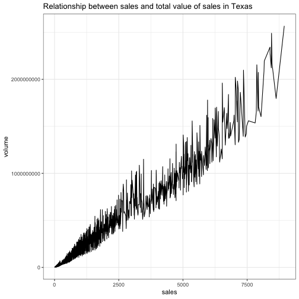

1. Describe the difference between formats png, svg, and pdf. State your sources with (working!) links (take a look at the RMarkdown cheatsheet for RStudio to learn how to make working links). Make one plot in ggplot2 and save it (using R code) in each of the three file formats you discussed. Comment on the differences you observe in their usage.

- Here is the link where I got all the necessary information about for this post: [95 Visual](https://www.95visual.com/blog/svg-pdf-jpg-png-whats-the-difference)  
  Before describing the difference between png, svg and pdf image formats, I want to introduce new terms like “raster” and “vector” image. Raster images are bitmaps, which is a grid of individual pixels. A vector image is a collection of countless tiny squares. While png is raster image, svg is a vector image and pdf can have the characteristics of both. One advantage of svg being raster is that it weighs less than other types of images. Png images have two types: png_8 and png_24, where png_8 has a smaller size as svg. Although svg has a smaller size, it supports high quality as well as png_24 and pdf. Both svg and png can be compressed, except pdf. Although the only svg supports CSS editing, all three types of images can be used in the websites.
  Here are examples of three image types:


library(ggplot2)
plot <- ggplot(txhousing, aes(x = sales, y = volume)) + geom_line() + theme_bw() + ggtitle("Relationship between sales and total value of sales in Texas")
plot



## Warning: Removed 568 rows containing missing values (geom_path).


  Now we have to save this plot using three different image formats:


# to save plot in png format
png(filename = "blog8_gk.png", width = 480, height = 480, units = "px")
plot



## Warning: Removed 568 rows containing missing values (geom_path).



dev.off()



## quartz_off_screen 
##                 2



# to save plot in svg format
svg(filename = "blog8_gk.svg", width = 8, height = 8, pointsize = 12)
plot



## Warning: Removed 568 rows containing missing values (geom_path).



dev.off()



## quartz_off_screen 
##                 2



# to save plot in pdf format
pdf(file = "blog8_gk.pdf", width = 8, height = 8)
plot



## Warning: Removed 568 rows containing missing values (geom_path).



dev.off()



## quartz_off_screen 
##                 2

 Personally, I did not see any significant difference. Only quality of pdf image appears to be higher. Also mac does support svg format images, so I could not open it.

2. Use magick functionality to create an image to be used for a hex sticker. package hexSticker can help you to get started on dimensions of the sticker. Include all code necessary to produce your sticker. In case you are using local images, post those in a folder on your website and use the URL to link to them.


# read the image
stat_cat <- image_read('https://img.icons8.com/metro/100/000000/github.png') 

# create sticker 
stat_cat_sticker <- sticker(subplot = stat_cat,
                            s_x = 1,
                            s_y = 1,
                            s_width = 2,
                            s_height = 1.5,
                            h_size = 3.4,
                            h_color = "#FFCE00",
                            h_fill = "#DD0000",  
                            package = "stat_cat",
                            p_size = 3,
                            p_y = 0.22,
                            p_color = "#000000",
                            dpi = 200)
stat_cat_sticker


  I always wanted to create my own logo or sticker. So this assignment was really helpful. Actually I have my own image I wanted to depict in sticker, but R insisted on that it's corrupted.. So I borrowed github logo for this post. [Colors](https://www.schemecolor.com/germany-flag-colors.php) are chosen specially for this post.

