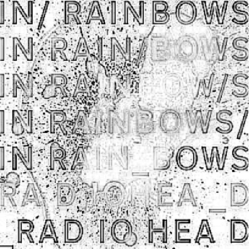
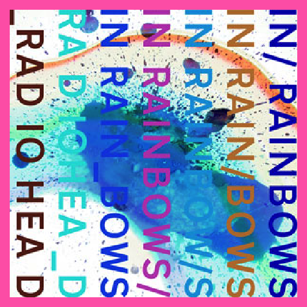

##1.
**Describe the difference between formats png, svg, and pdf. Make one plot in ggplot2 and save it (using R code) in each of the three file formats you discussed.**

SVG is the newest of the three types, and according to [this](https://www.pagecloud.com/blog/web-images-png-vs-jpg-vs-gif-vs-svg) article, allows for clearer images at any resolution because it is derived from shapes within the images rather than individual pixels (like a traditional raster). However, SVG files are not always supported on certain devices because it was developed then abandoned by Adobe and later picked up by Microsoft, so it wasn't always ubiquitous in the late 2000s. [SVG is apparently coming back](https://www.siliconpublishing.com/blog/2015/12/the-fall-and-rise-of-svg) and is being supported by many increasingly popular webdev technologies like d3.js, HTML, CSS, and Canvas.

PDFs [create exact replicas of the image](https://www.shutterstock.com/blog/jpg-vs-png-vs-pdf) and are ideal for storage/downloading from online sources. Because they are exact replicas, the users do not have to worry about loss of information across devices/software. This makes them ideal if we want high quality documents without resizing. However, PDFs are going to be larger than SVGs because they are keeping all of the data, while SVGs can be scaled down.

PNGs [can also be resized like SVGs](https://builtbytophat.com/file-guide-differences-between-jpg-png-eps-pdf-psd-ai-gif-tiff/), and are a lossless type like PDFs. However, PNGs [are pixel images](http://asiapacific.anu.edu.au/mapsonline/faq/what-difference-between-png-file-raster-image-and-svg-file-vector-image) and thus trying to increase the size of a PNG file results in a loss of more information than with vector images like SVGs, which remain more clear at every resolution and size.

As an example, I will use the cover for the Radiohead album 'In Rainbows' which, as one might expect, has many colors on it. I borrowed the image from Wikipedia, the url is in the code.


library(magick)
library(tidyverse)
library(svglite)

#read the image
inrainbows <- image_read('https://upload.wikimedia.org/wikipedia/en/2/2e/In_Rainbows_Official_Cover.jpg')
image_info(inrainbows)



## # A tibble: 1 x 7
##   format width height colorspace matte filesize density
##   <chr>  <int>  <int> <chr>      <lgl>    <int> <chr>  
## 1 JPEG     300    300 sRGB       FALSE    50132 100x100



#make it in ggplot
image_ggplot(inrainbows)



#modulate the colors
image_charcoal(inrainbows) %>% image_ggplot



#what about this one?
image_negate(inrainbows) %>% image_rotate(90) %>% image_border("hotpink") %>% image_ggplot



#save the image in three different formats
ggsave(file='inrainbows.svg')



## Saving 7 x 7 in image



ggsave(file='inrainbows.pdf')



## Saving 7 x 7 in image



ggsave(file='inrainbows.png')



## Saving 7 x 7 in image


Based on the results, there are not too many noticeable differences. Perhaps it is because the image was already low resolution, so we may not see the advantages of one format over the other. Moreover, I didn't resize it at all. That being said, it does look like the pdf version is a little bit more clear even if there is no way to easily edit/resize it.

##2. 
I just borrowed a free use tornado image to create my hex sticker


library(hexSticker)
#read the image
tornado <- image_read('https://cdn.pixabay.com/photo/2014/04/02/10/14/tornado-303208_1280.png')
#make the sticker
cycloner <- sticker(tornado, package='CycloneR', h_fill='#CC0000', h_color = '#666666', s_x=1, s_y=.75, s_width=1.5, s_height=1.5,
        p_color='#FFCC00', p_family = 'mono', p_size = 16)
cycloner


