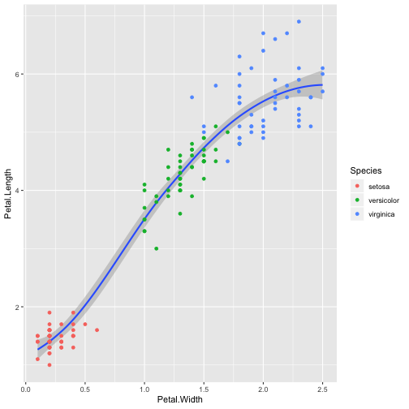
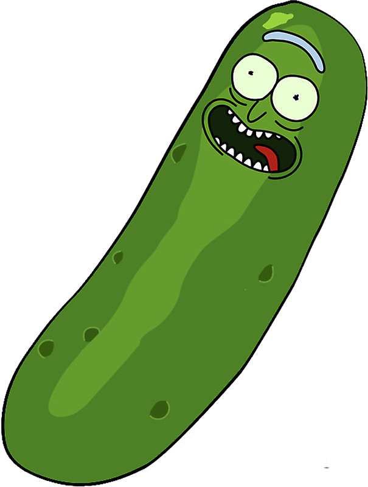
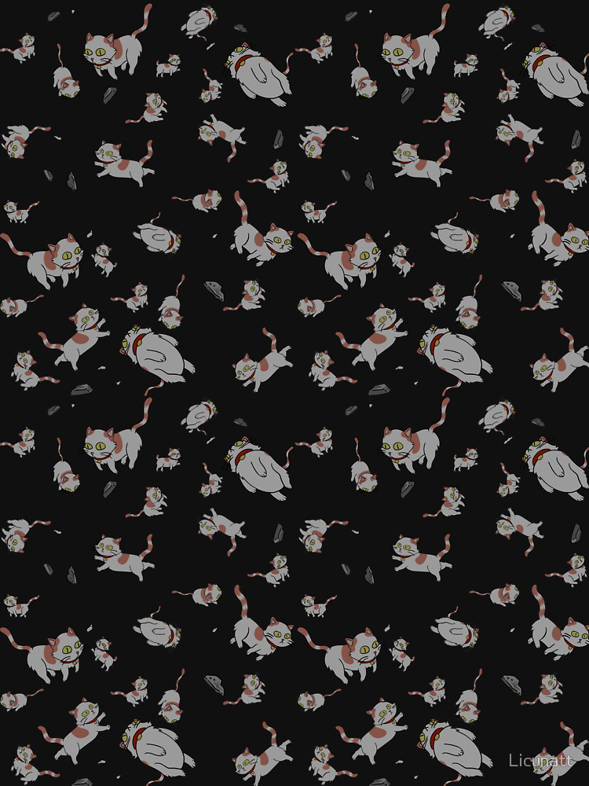
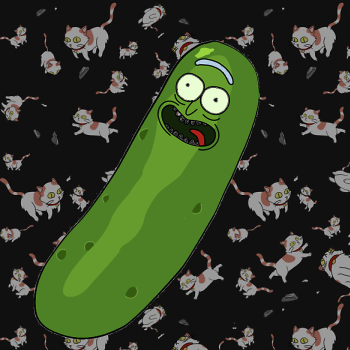
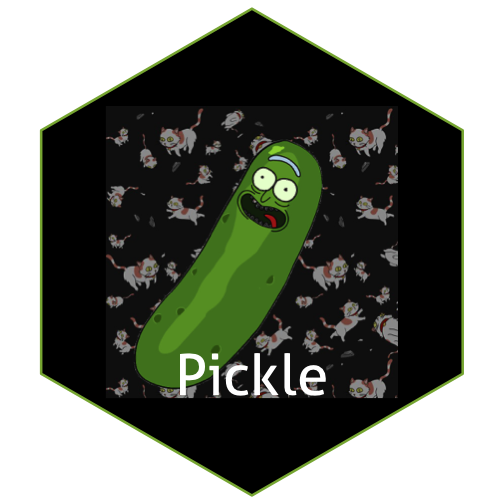

## Background:

Image files come in all kinds of formats. There's png, tiff, svg, pdf, just to name a few. What's the difference, and how can we work with them?

Reading: 

  - Identify online sources to read up on differences between image file formats. 

  - The `magick` package allows us to work with raster images in R. Read through the  [magick vignette](https://cran.r-project.org/web/packages/magick/vignettes/intro.html) to learn about the package's functionality.

Write a blog post answering the following questions and detailing the progress: 

1. **Describe the difference between formats png, svg, and pdf. State your sources with (working!) links (take a look at the RMarkdown cheatsheet for RStudio to learn how to make working links). Make one plot in ggplot2 and save it (using R code) in each of the three file formats you discussed. Comment on the differences you observe in their usage.**
An article explained the differences between those farmats.[SVG, PDF, JPG, PNG; WHAT'S THE DIFFERENCE?](https://www.95visual.com/blog/svg-pdf-jpg-png-whats-the-difference)

**pgn**
The PNG format is an open format that was created as an alternative to the GIF format, which required a licensing fee through the company that held a patent for the format. The PNG format offers a better quality graphic than a GIF with better compression and a wider range of color without loss of detail. Most newer browsers can view PNG formats without any problems.
PNG is used almost exclusively for images used on websites. Because of the size of a PNG file, this format is not recommended for photos as JPG is unless file size is not an issue. If you have a mixture of images that have line art and text, the PNG format will make the image look sharper instead of appearing bitmapped. The higher levels of PNG support transparency like GIFs do. This makes the PNG format suitable for web images like logos that you want to include transparency and fading effects too.

**svg**
This type of graphic file can be opened in any browser. SVG is used to create icons that are used on websites. An SVG image can be compressed or stretched without loss of image quality.
This format suitable for web pages that are viewed on devices that have a high pixel density, like smartphones or tablets. You can edit the file in an editor to change graphic settings on a website when you use CSS.
SVG image element files are smaller than if the image were present in a raster format. However, when using SVG, you need to remember that if an object in the image contains many small elements, the size of the file can grow very fast. A potential issue with SVG is that you cannot read only a part of the graphic object.
The entire object must load and it could slow things down with your website.

**pdf**
Developed by Adobe, PDF is a file format that can be used to provide an electronic image of text or text and graphic that looks the same as a printed document. A PDF file can be viewed, printed or electronically transmitted by uploading, downloading or attaching it to a message or email. The benefit of using a PDF format is that links can be embedded in the document and the file sizes are usually smaller than if you saved a document in its native format including its graphic files.
PDF files adhere to ISO 32000 standards for electronic document exchange. PDF files can be password protected to restrict access and prevent copying or tampering. They can also be used in instances where a legally binding electronic signature is needed. PDF files can be viewed by all browsers with the help of a plug-in.


library(magick)
attach(iris)
library(tidyverse)
library(ggplot2)
iris %>% 
  ggplot(aes(Petal.Width,Petal.Length)) + 
  geom_smooth()+
  geom_point(aes(color= Species))



  ggsave("irisWvsL.png")
  ggsave("irisWvsL.svg")
  ggsave("irisWvsL.pdf")

All saved file looked similar, but pdf format has much smaller size than the other two files, the png format has the largest size. 

2. **Use `magick` functionality to create an image to be used for a hex sticker.**  package `hexSticker` can help you to get started on dimensions of the sticker. **Include all code necessary to produce your sticker.** In case you are using local images, post those in a folder on **your** website and use the URL to link to them.


library(magick)
library(hexSticker)
pickle<-image_read("https://vignette.wikia.nocookie.net/rickandmorty/images/1/19/Pickle_rick_transparent.png")
cats<-image_read("https://ih0.redbubble.net/image.378606813.7322/raf,750x1000,075,t,101010:01c5ca27c6.jpg")
#pickle<-image_read("/Users/qinghe/Desktop/R/version control/5Bucks/STAT585/Pickle_rick.png")
#cats<-image_read("/Users/qinghe/Desktop/R/version control/5Bucks/STAT585/cats.jpg")
print(pickle)



## # A tibble: 1 x 7
##   format width height colorspace matte filesize density
##   <chr>  <int>  <int> <chr>      <lgl>    <int> <chr>  
## 1 PNG      605    800 sRGB       TRUE    208799 28x28



print(cats)



## # A tibble: 1 x 7
##   format width height colorspace matte filesize density
##   <chr>  <int>  <int> <chr>      <lgl>    <int> <chr>  
## 1 JPEG     750   1000 sRGB       FALSE   157467 72x72



pickle <- image_scale(pickle, "x300")
cats <- image_scale(cats, "x600")
img<-c(cats,pickle)
picklecats<- image_composite(cats, pickle, offset = "+33+40")
picklecats<-image_crop(picklecats, "350x350")
picklecats



sticker <- sticker(picklecats, package="Pickle", s_x = 1,s_y = 1,s_width = 1.2, s_height = 1.2, p_y = 0.5, p_size=20, h_fill = "black")
sticker


