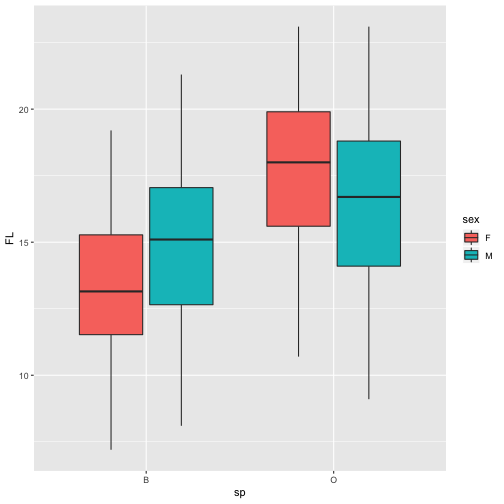

Write a blog post answering the following questions and detailing the progress: 

1. **Describe the difference between formats png, svg, and pdf. State your sources with (working!) links (take a look at the RMarkdown cheatsheet for RStudio to learn how to make working links). Make one plot in ggplot2 and save it (using R code) in each of the three file formats you discussed. Comment on the differences you observe in their usage.**

Raster images use many colored pixels or individual building blocks to form a complete image. Vector images are constructed by using mathematical formulas rather than individual colored blocks.  
**SVG** (Scalable Vector Graphics) is a vector image type that can scale to any size without losing quality. SVG image element files are smaller than if the image were present in a raster format. Besides, SVG can be exported as code.  
**PNG** is a raster image type. It can have a transparent background and is generally larger and higher quality.  
**PDF** (Portable Document File) can be used to provide an electronic image of text or text and graphic that looks the same as a printed document. A PDF is generally a vector file. It can also be a raster file depending how it is originally created.  
My sources:  
[VECTOR, RASTER, JPG, EPS, PNG – WHAT’S THE DIFFERENCE?](https://modassicmarketing.com/understanding-image-file-types)    
[SVG, PDF, JPG, PNG; WHAT'S THE DIFFERENCE?](https://www.95visual.com/blog/svg-pdf-jpg-png-whats-the-difference)  
[SVG vs. PNG, Which is the Best in 2017?](https://blog.mrdaniels.ch/warz/png-vs-svg-2017/)


library(ggplot2)
library(MASS)
crab<-ggplot(data = crabs, aes(x = sp, y = FL, fill = sex)) + geom_boxplot()
crab



ggsave("crab.png", height = 5,width = 5)
ggsave("crab.svg", height = 5,width = 5)
ggsave("crab.pdf", height = 5,width = 5)


I can't tell the quality difference with the naked eyes. But the storage size can be seen: pdf < svg < png. 

2. **Use `magick` functionality to create an image to be used for a hex sticker.**  package `hexSticker` can help you to get started on dimensions of the sticker. **Include all code necessary to produce your sticker.** In case you are using local images, post those in a folder on **your** website and use the URL to link to them.


library(magick)
library(hexSticker)
cat<-image_read("https://ya-webdesign.com/images/pusheen-computer-png.png")
pusheen<-sticker(cat, package="Busy", p_size=8, p_color="black", p_x=1, p_y=1.6, s_x=1, s_y=.9, s_width=1.2, s_height=1, h_fill="aquamarine3")
pusheen


