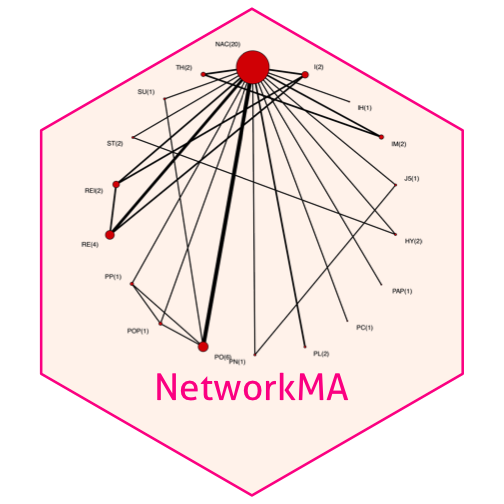

Write a blog post answering the following questions and detailing the progress: 

1. **Describe the difference between formats png, svg, and pdf. State your sources with (working!) links (take a look at the RMarkdown cheatsheet for RStudio to learn how to make working links). Make one plot in ggplot2 and save it (using R code) in each of the three file formats you discussed. Comment on the differences you observe in their usage.**

**PNG**: A PNG (Portable Network Graphics) file is a raster or bitmap image file format which is made up of a fixed number of pixels. The image cannot be enlarged without distortion occuring. It is a format that is used almost exclusively for images used on websites. Most newer browsers can view PNG formats without any problems.

**SVG**: A SVG (Scalable Vector Graphics) file is a vector image file format which uses geometric forms such as points, curves to represent different parts of the image. It won't be distorted or blur at and any resolution or size. One disadvantange is you cannot read only a part of the image, the entire image must load and it could slow things down with your website.

**PDF**: A PDF (Portable Document File) is an open file format that can be used to provide an electronic image of text or text and graphic that looks the same as a printed document. It is a format that can be used in print. PDF files can be viewed by all browsers with the help of a plug-in.

Source: [ANU](http://asiapacific.anu.edu.au/mapsonline/faq/what-difference-between-png-file-raster-image-and-svg-file-vector-image), [95visual](https://www.95visual.com/blog/svg-pdf-jpg-png-whats-the-difference), [stackoverflow](https://stackoverflow.com/questions/26548042/png-file-or-pdf-file-which-offers-better-quality)


data("lakers")
lakers %>% filter(player %in% c("Pau Gasol","Kobe Bryant"),etype=="shot") %>% mutate(Date=ymd(date)) %>% dplyr::select(Date,player,points) %>% group_by(Date,player) %>% summarise(rate=sum(points>0)/n(),Total_points=sum(points))-> lakers_summ

p <- lakers_summ %>% ggplot(aes(x=Date, y=rate)) + geom_line(aes(color=player))+ geom_smooth(aes(color=player)) + scale_x_date(date_labels = '%Y/%m/%d') +  theme(axis.text.x = element_text(angle = 45, hjust = 1)) + labs(y="Success rate")

ggsave("plot.png")
ggsave("plot.svg")
ggsave("plot.pdf")


The file sizes are png>>svg>pdf. 

The png file will blur when I zoom in. The pdf file remains the sharpness as I zoom in. 

2. **Use `magick` functionality to create an image to be used for a hex sticker.**  package `hexSticker` can help you to get started on dimensions of the sticker. **Include all code necessary to produce your sticker.** In case you are using local images, post those in a folder on **your** website and use the URL to link to them.


NMA_plot <- image_read("https://dapengh.github.io/figure/Network_plot.png") %>% image_trim %>% image_transparent("#FFFFFF")
sticker(NMA_plot, package = "NetworkMA", p_size=13, p_x = 1, p_y = 0.45, p_color = "#FF1493",
             s_x=1, s_y=1.2, s_width=1.4, s_height = 1.8, 
             h_fill="#FFF5EE", h_color="#FF1493") %>% print


