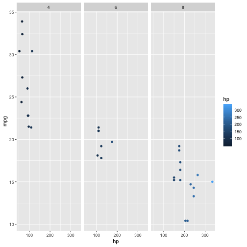
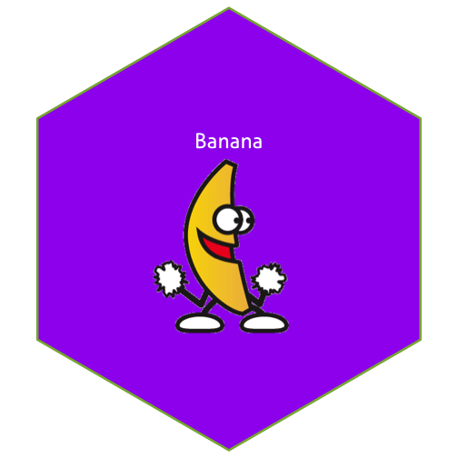

Write a blog post answering the following questions and detailing the progress: 

1. **Describe the difference between formats png, svg, and pdf. State your sources with (working!) links (take a look at the RMarkdown cheatsheet for RStudio to learn how to make working links). Make one plot in ggplot2 and save it (using R code) in each of the three file formats you discussed. Comment on the differences you observe in their usage.**

I use the source to understand the different among format png, svg, and pdf [source link](https://www.95visual.com/blog/svg-pdf-jpg-png-whats-the-difference)

*SVG*
Scalable Vector Graphics (SVG), was developed to be used to represent an image and its elements.It can be open in any browser and keep image quality with either compressed or stretched. This format is suitable for web pages such as smart phone. The potential issue for using SVG is the entire object must be loaded albit you are only interested in partial object.

*PDF*
Portable Document File (PDF), is a file fomat that can be used to provide an electronimc image of text as a printed document. The link can be embedded in the document and the file size are usually smaller than other graphic files.

*PNG*
Portable Network Graphics (PNG), is an open format that could be an alternative to the GIF format, but with  better quality than GIF. It is used extensively on websites.


library(tidyverse)
library(magick)
head(mtcars)



##                    mpg cyl disp  hp drat    wt  qsec vs am gear carb
## Mazda RX4         21.0   6  160 110 3.90 2.620 16.46  0  1    4    4
## Mazda RX4 Wag     21.0   6  160 110 3.90 2.875 17.02  0  1    4    4
## Datsun 710        22.8   4  108  93 3.85 2.320 18.61  1  1    4    1
## Hornet 4 Drive    21.4   6  258 110 3.08 3.215 19.44  1  0    3    1
## Hornet Sportabout 18.7   8  360 175 3.15 3.440 17.02  0  0    3    2
## Valiant           18.1   6  225 105 2.76 3.460 20.22  1  0    3    1



mtcars %>% ggplot() + geom_point(aes(x=hp,y=mpg,color=hp)) + facet_grid(~cyl)



  ggsave("mpg_cyl.pdf") +
  ggsave("mpg_cyl.png") + 
  ggsave("mpg_cyl.svg")



## Saving 7 x 7 in image
## Saving 7 x 7 in image
## Saving 7 x 7 in image



## integer(0)


2. **Use `magick` functionality to create an image to be used for a hex sticker.**  package `hexSticker` can help you to get started on dimensions of the sticker. **Include all code necessary to produce your sticker.** In case you are using local images, post those in a folder on **your** website and use the URL to link to them.


library(magick)
library(hexSticker)
img <- image_read("https://jeroen.github.io/images/banana.gif")
print(img)



## # A tibble: 8 x 7
##   format width height colorspace matte filesize density
##   <chr>  <int>  <int> <chr>      <lgl>    <int> <chr>  
## 1 GIF      365    360 sRGB       TRUE     73623 72x72  
## 2 GIF      365    360 sRGB       TRUE     73623 72x72  
## 3 GIF      365    360 sRGB       TRUE     73623 72x72  
## 4 GIF      365    360 sRGB       TRUE     73623 72x72  
## 5 GIF      365    360 sRGB       TRUE     73623 72x72  
## 6 GIF      365    360 sRGB       TRUE     73623 72x72  
## 7 GIF      365    360 sRGB       TRUE     73623 72x72  
## 8 GIF      365    360 sRGB       TRUE     73623 72x72



sticker <- sticker(img, package = "Banana", s_x = 1, s_y = 1, s_width = 1, s_height = 1, h_fill = "purple")
sticker


