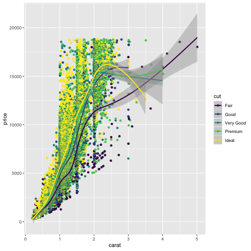
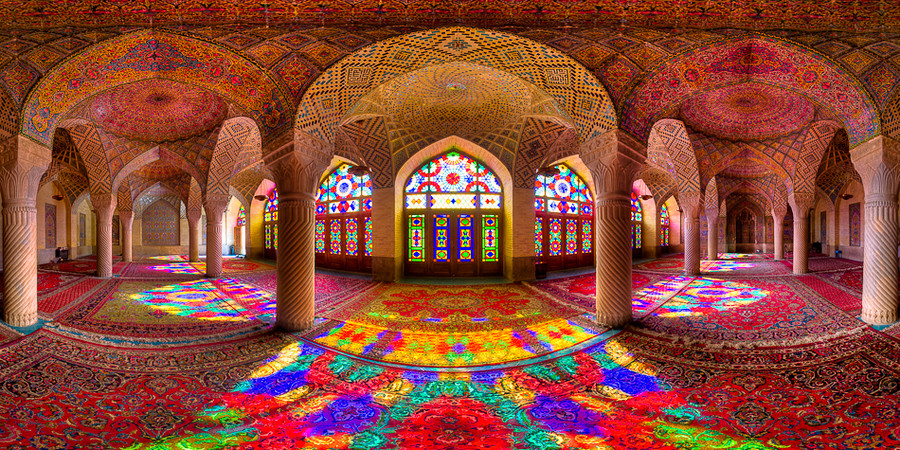
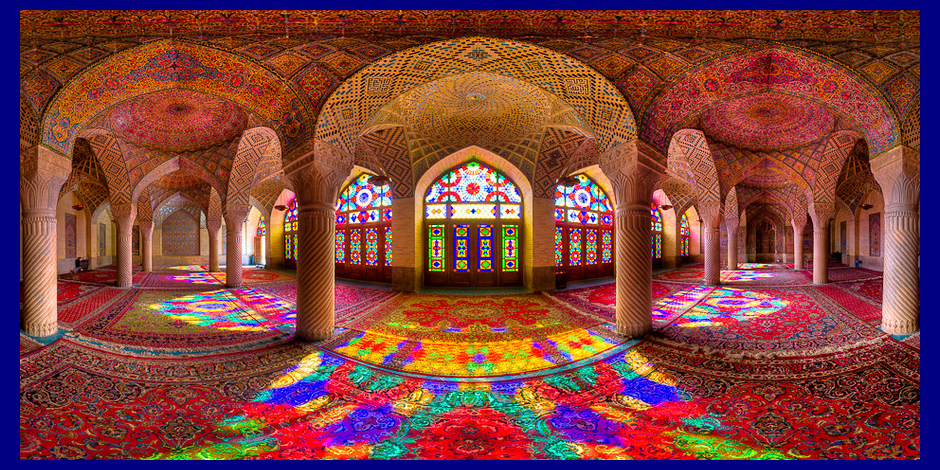
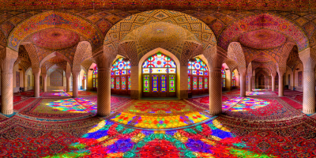
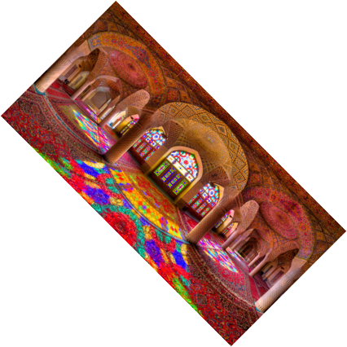
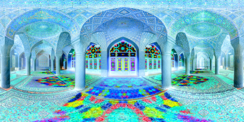
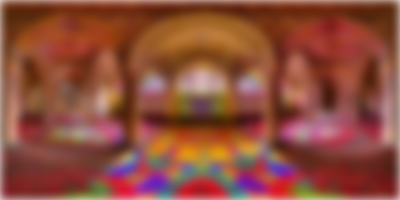
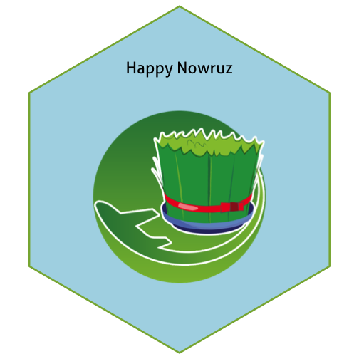

1. **Describe the difference between formats png, svg, and pdf. State your sources with (working!) links (take a look at the RMarkdown cheatsheet for RStudio to learn how to make working links). Make one plot in ggplot2 and save it (using R code) in each of the three file formats you discussed. Comment on the differences you observe in their usage.**

  - png : A  [png](https://searchmicroservices.techtarget.com/definition/PNG-Portable-Network-Graphics) (Portable Network Graphics) file is a raster or bitmap image file format. A raster image is made up of a fixed number of  pixels [or building blocks] that form a complete image.The image cannot be enlarged without distortion occurring. (When you zoom in on a raster image, the pixels become visibly grainy.) Common raster image files include png, jpg and gif formats. The png format developed to replace gif format that has limited license having copy right.

 

  - svg : A [svg](http://asiapacific.anu.edu.au/mapsonline/faq/what-difference-between-png-file-raster-image-and-svg-file-vector-image) (Scalable Vector Graphics) file is a vector image file format. A vector image uses geometric forms such as points, lines, curves and shapes (polygons) to represent different parts of the image as discrete objects. These forms can be individually edited. A vector image remains crisp and clear at any resolution or size.
  
  - pdf : The Portable Document Format [(pdf)](https://en.wikipedia.org/wiki/PDF) is a file format developed by Adobe in the 1990s to present documents, including text formatting and images, in a manner independent of application software, hardware, and operating systems.The pdf format is vector format and does not lose the quality when zoom in.
  


#use ggplot2 to plot and save in 3 different formats in working directory
library(tidyverse)
library(svglite)
diamondimg <- ggplot(diamonds) + geom_point(aes(x=carat, y=price, color=cut)) + geom_smooth(aes(x=carat, y=price, color=cut))

diamondimg



## `geom_smooth()` using method = 'gam' and formula 'y ~ s(x, bs = "cs")'



ggsave("diamondimg.png")



## Saving 7 x 7 in image
## `geom_smooth()` using method = 'gam' and formula 'y ~ s(x, bs = "cs")'



ggsave("diamondimg.svg")



## Saving 7 x 7 in image
## `geom_smooth()` using method = 'gam' and formula 'y ~ s(x, bs = "cs")'



ggsave("diamondimg.pdf")



## Saving 7 x 7 in image
## `geom_smooth()` using method = 'gam' and formula 'y ~ s(x, bs = "cs")'

  
   **comments** 
   
   - png format is fast and since this format is raster, when we zoom in, the pixels loose their quality and we can see pixels mading picture.
   
   - svg was slow and took a few seconds to rendor and create the plot. However, with enlarging the picture, the quality remain high.
   
   - pdf was faster than svg and slower than png in rendering the picture while it is vector format and the quality is not decreased with zooming in.
   
  

2. **Use `magick` functionality to create an image to be used for a hex sticker.**  package `hexSticker` can help you to get started on dimensions of the sticker. **Include all code necessary to produce your sticker.** In case you are using local images, post those in a folder on **your** website and use the URL to link to them.

##### select an image from web and print the properties of it


library(magick)
symphony <- image_read('https://i.imgur.com/8tEc6Yt.jpg')
print(symphony)



## # A tibble: 1 x 7
##   format width height colorspace matte filesize density
##   <chr>  <int>  <int> <chr>      <lgl>    <int> <chr>  
## 1 JPEG     900    450 sRGB       FALSE   405942 72x72


##### USE magick to edit the image


# Add 20px left/right and 10px top/bottom
image_border(image_background(symphony, "hotpink"), "#000080", "20x10")



# Trim margins
image_trim(symphony)



#scale the image
scalimg <-image_scale(symphony, "x200") # height: 300px
scalimg



# Rotate or mirror
rotateimg <-image_rotate(scalimg, 45)
rotateimg



#reverse the colors
negateimg<-image_negate(scalimg)
negateimg



# Add randomness blur effect
image_blur(scalimg, 10, 5)


##### using package hexsticker to make sticker


library(hexSticker)
#read the image
#persia <- image_read('https://media.npr.org/assets/img/2016/03/20/nowruz-turmericsaffron_new-79a80147865e225587877aee6ddb7f82f8b64ef1-s800-c85.jpg')
persia <- image_read('https://s.cafebazaar.ir/1/icons/com.tournowruz.m_512x512.png')
scalimg <-image_scale(persia, "x400") # height: 300px
#make the sticker
library(hexSticker)
p <- sticker(scalimg , package = "Happy Nowruz", p_color = "black", h_fill = "lightblue", s_width = 1.2, s_height = 1, s_x = 1, s_y = 0.9, p_x = 1, p_y = 1.65, p_size = 8)
plot(p)


