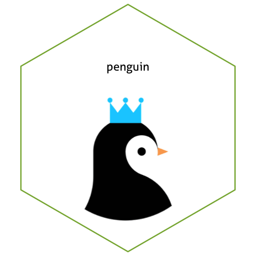

## Background:

Image files come in all kinds of formats. There's png, tiff, svg, pdf, just to name a few. What's the difference, and how can we work with them?

Reading: 

  - Identify online sources to read up on differences between image file formats. 

  - The `magick` package allows us to work with raster images in R. Read through the  [magick vignette](https://cran.r-project.org/web/packages/magick/vignettes/intro.html) to learn about the package's functionality.

Write a blog post answering the following questions and detailing the progress: 

1. **Describe the difference between formats png, svg, and pdf. State your sources with (working!) links (take a look at the RMarkdown cheatsheet for RStudio to learn how to make working links). Make one plot in ggplot2 and save it (using R code) in each of the three file formats you discussed. Comment on the differences you observe in their usage.**

[Click me](https://www.95visual.com/blog/svg-pdf-jpg-png-whats-the-difference)

PNG is an open, higher-quality file format even compared to GIF. More suitable for web images like logos. 

SVG is developed to be used in XML website design. It has a high pixel density and easy to edit. 

PDF is developed by Adobe, and provide an electronic image of test that looks the same as a printed document. 


library(tidyverse)
library(survival)
head(lung)



##   inst time status age sex ph.ecog ph.karno pat.karno meal.cal wt.loss
## 1    3  306      2  74   1       1       90       100     1175      NA
## 2    3  455      2  68   1       0       90        90     1225      15
## 3    3 1010      1  56   1       0       90        90       NA      15
## 4    5  210      2  57   1       1       90        60     1150      11
## 5    1  883      2  60   1       0      100        90       NA       0
## 6   12 1022      1  74   1       1       50        80      513       0



plot <- lung %>% ggplot(aes(time, colour = factor(sex))) + geom_density()

ggsave("plot.png")



## Saving 7 x 7 in image



ggsave("plot.tiff")



## Saving 7 x 7 in image



ggsave("plot.pdf")



## Saving 7 x 7 in image



ggsave("plots.svg")



## Saving 7 x 7 in image

2. **Use `magick` functionality to create an image to be used for a hex sticker.**  package `hexSticker` can help you to get started on dimensions of the sticker. **Include all code necessary to produce your sticker.** In case you are using local images, post those in a folder on **your** website and use the URL to link to them.


library(svglite)
library(magick)
library(hexSticker)

peng2 <- image_read('https://i.imgur.com/uJiJz4u.png') %>%
  image_trim %>% image_transparent("#F9F9F9")

peng_sticker <- sticker(peng2, package = "penguin", s_x = 1, s_width = 0.8, s_height = 1, p_y = 1.5, p_color = "black", h_fill = "white")

peng_sticker


## Instructions:
