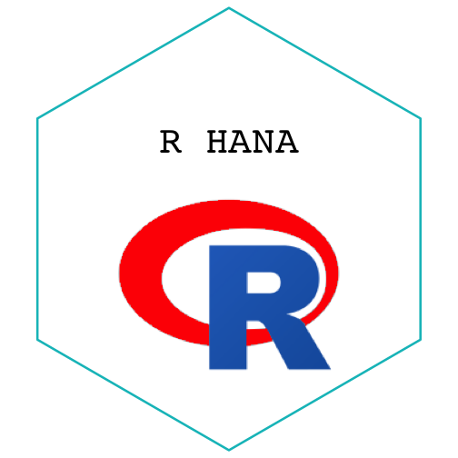

1. **Describe the difference between formats png, svg, and pdf. State your sources with (working!) links (take a look at the RMarkdown cheatsheet for RStudio to learn how to make working links). Make one plot in ggplot2 and save it (using R code) in each of the three file formats you discussed. Comment on the differences you observe in their usage.**

- First of all, I referred to the website with the link [here](https://www.logaster.com/blog/jpg-png-svg-pdf-formats/). To understand the terms, raster and vector graphics, I also read [this](https://www.logaster.com/blog/vector-and-raster-graphics/).

    According to those sources above, the format PNG frequently works for raster graphics, and SVG work for vector graphics while PDF can be used for both type of graphics. Let's take a look what raster and vector images. Raster grapics consist of pixels, small pieces like a mosaic, and take more hard disk space than vector graphics for the same quality of images. Raster images are used to display smooth transition of colors and shades such as photos. On the other hand, vector graphics consist of so-called control points and curves between them instead of pixels, and are often used for printing brocheres, flyers, business cards, and etc. That's because those products does not require accurate transmission as much as raster graphics do. One good feature of vector images is scaling for which the quality of image is maintained.
    
    PNG images can be compressed without a loss of quality, are useful to save graphics with sharp edges, and text graphics. SVG (scalable vector graphics) is utilized to produce and store 2D-vector images and SVG format allows to increase the whole or a part of the images without loss of quality as well as to edit text in the image in any text editor. Lastly, the most familiar one, PDF is printing friendly, and can be understandable by many sofware programs.

- PLOT in the format of PNG, SVG, and PDF

    The three plots appear to show better quality than the plot in R graphic device. As discussed above, PNG image consisting of pixels show the moaics as being increased while PDF and SVG was robust to scaling. PNG format had less bright color than the others. Besides, the size of PDF, SVG, and PNG was 6, 19, and 61 KB, respectively.


library(tidyverse)
PLOT <-
  mtcars %>% 
  ggplot(aes(x=wt, y=mpg), labels = rownames(mtcars)) + 
  xlab("Car Weight") + 
  ylab("Miles Per Gallon") + 
  geom_point(aes(shape = factor(cyl), size = gear, colour = factor(cyl)))

library(svglite)
ggsave("PLOTpng.png", plot=PLOT, device="png")
ggsave("PLOTsvg.svg", plot=PLOT, device="svg")
ggsave("PLOTpdf.pdf", plot=PLOT, device="pdf")


2. **Use `magick` functionality to create an image to be used for a hex sticker.**  package `hexSticker` can help you to get started on dimensions of the sticker. **Include all code necessary to produce your sticker.** In case you are using local images, post those in a folder on **your** website and use the URL to link to them.


library(magick)
library(rsvg)



## Error in library(rsvg): there is no package called 'rsvg'



library(hexSticker)

imageURL <- 'https://www.r-project.org/logo/Rlogo.png'

Rlogo <- image_read(imageURL) %>%
  image_scale("200") %>%
    image_fill("red", "+20+80", fuzz = 15) %>%
    image_fill("red", "+120+125", fuzz = 15)

Rsticker <- sticker(Rlogo, package="R HANA", 
        p_size=15, p_color = "black", p_family = "mono",
        s_x=1, s_y=.75, 
        s_width=1, s_height=0.7775,
        h_fill = "white", h_color = "#00BFC4")

Rsticker


