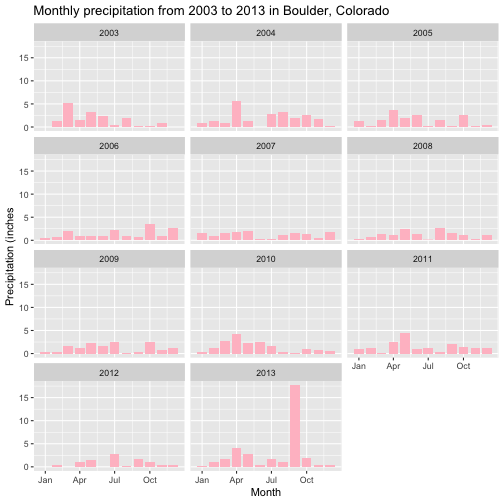
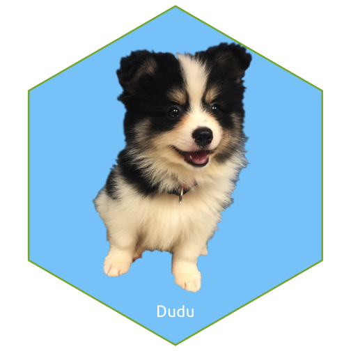


library(ggplot2)
library(tidyverse)
library(lubridate)
library(magick)
library(svglite)


1. **Describe the difference between formats png, svg, and pdf. State your sources with (working!) links (take a look at the RMarkdown cheatsheet for RStudio to learn how to make working links). Make one plot in ggplot2 and save it (using R code) in each of the three file formats you discussed. Comment on the differences you observe in their usage.**
Source: [What is the difference between a png file (raster image) and a svg file (vector image)?](http://asiapacific.anu.edu.au/mapsonline/faq/what-difference-between-png-file-raster-image-and-svg-file-vector-image)

[SVG, PDF, JPG, PNG; WHAT'S THE DIFFERENCE?](https://www.95visual.com/blog/svg-pdf-jpg-png-whats-the-difference)

SVG: It's a vector image file format major used in XML. It uses geometric forms to represent different parts of the image as discrete objects. It has high quality on any size.
PNG: It's a raster or bitmap image file format. The resolution will be decrease when you enlarge the image. It support transparency, and also widely used on Web.
PDF: It can be used to provide an electronic image of text or graphic looks the same as printed document. It has high quality and supports text. But it doesn;t support CSS editing.

Plot size: svg > pdf > png. png has obviously bad quality than other two type. svg and pdf seem have similar quality.


rain <- read.csv("https://ndownloader.figshare.com/files/7283285", header = T, na.strings = 999.99)
rain %>% 
  mutate(DATE=as.Date(DATE, format = "%m/%d/%y")) %>%
  mutate(month=month(DATE)) %>%
  group_by(month,YEAR) %>%
  summarise(max_rain = sum(DAILY_PRECIP, na.rm = T)) %>%
  mutate(month2=as.Date(paste0("2019-",month,"-01"),"%Y-%m-%d")) %>%
  ggplot(aes(x=month2,y=max_rain)) +
  geom_bar(stat = "identity", fill="pink") + 
  facet_wrap(~YEAR, ncol=3) +
  labs(title = "Monthly precipitation from 2003 to 2013 in Boulder, Colorado",
       x = "Month", y= "Precipitation (inches") + 
  scale_x_date(date_labels = "%b")



ggsave(file='rain.svg')



## Saving 7 x 7 in image



ggsave(file='rain.pdf')



## Saving 7 x 7 in image



ggsave(file='rain.png')



## Saving 7 x 7 in image

 

2. **Use `magick` functionality to create an image to be used for a hex sticker.**  package `hexSticker` can help you to get started on dimensions of the sticker. **Include all code necessary to produce your sticker.** In case you are using local images, post those in a folder on **your** website and use the URL to link to them.


dudu <- image_read("http://m.qpic.cn/psb?/V12uiRGn2noirM/2dER84wvTUK2UqCNExHcyV6ylLbV97OBUkEZduneAYU!/b/dLYAAAAAAAAA&bo=sgKYAwAAAAADBwk!&rf=viewer_4")
sticker <- sticker(dudu, package="Dudu", s_x = 1,s_y = 0.9,s_width = 2, s_height = 2, p_y = 0.2, h_fill = "lightskyblue")
sticker


